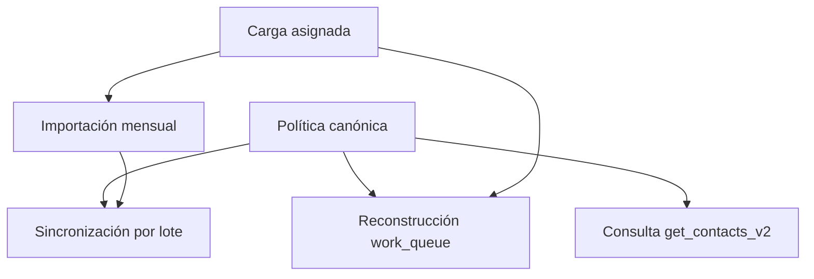

# Política canónica de gestionabilidad de contactos

- Fecha: 2026-07-15
- Estado: Pendiente de revisión
- LCD: LCD-20260715-01
- ADR: ADR-020 y su enmienda
- Issue: #12
- Ambiente implementado: DEV

## Propósito

Representar mediante una sola política ejecutable la regla de negocio que decide qué contactos puede descubrir y gestionar un usuario en APP LLAMADOS.

La gestionabilidad es una **clasificación derivada**. No es un hecho almacenado por sí mismo: se calcula desde apariciones corporativas, estados corporativos válidos, asignaciones vigentes, contactos manuales y el período evaluado.

## Regla canónica

La evaluación respeta el siguiente orden de precedencia:

| Condición | Resultado | Motivo técnico |
|---|---:|---|
| Existe asignación propia vigente | Gestionable | `assigned_current` |
| Aparece en el período activo y no está asignado | No gestionable | `active_unassigned` |
| Está ausente del período activo y su último **estado corporativo válido** fue `No Gestionado` | Gestionable | `latest_no_gestionado` |
| Está ausente del período activo y su último **estado corporativo válido** fue `Gestionado` | No gestionable | `latest_gestionado` |
| Nunca ha aparecido en una campaña corporativa | Gestionable | `manual_contact` |
| Ha aparecido en campañas, pero nunca registra un estado corporativo válido | No gestionable | `latest_status_missing` |

La gestión interna propia es información histórica y operativa. No reemplaza el estado corporativo mensual ni concede gestionabilidad a un contacto vigente no asignado.

## Último estado corporativo válido

La política no utiliza simplemente la fila o aparición más reciente. Busca hacia atrás el último valor válido entre:

```text
Gestionado
No Gestionado
```

Una aparición posterior cuyo estado esté vacío, sea nulo o no pertenezca al catálogo válido no oculta un estado anterior.

Ejemplo:

```text
Mayo:  No Gestionado
Junio: sin estado válido
Julio: no aparece
```

Al evaluar julio, el último estado corporativo válido sigue siendo `No Gestionado`; por tanto, el contacto es gestionable.

La búsqueda está limitada al período evaluado. Una campaña futura no puede alterar retroactivamente la clasificación de un período anterior.

## Contacto manual

Se incorpora el concepto de dominio **Contacto manual**:

> Contacto creado directamente por el usuario y no originado en una aparición corporativa.

En el legacy se reconoce por ausencia total de apariciones en `contact_month_state` hasta el período evaluado. Bajo el modelo operativo actual, esa ausencia implica que el contacto fue creado por el usuario y, por tanto, es gestionable.

Esta inferencia es válida para APP LLAMADOS Legacy. En CRM Patrimonial Next, el origen del contacto deberá almacenarse como un hecho explícito y no deducirse por ausencia de registros.

## Resolución conservadora

Si existen varias filas válidas para un contacto en el mismo último período corporativo válido y discrepan entre `Gestionado` y `No Gestionado`, prevalece `Gestionado`.

Si el contacto sí registra apariciones corporativas, pero ninguna contiene un estado válido, la política aplica **fail-closed** y no lo habilita hasta completar o validar el hecho faltante.

La exclusión por presencia activa no asignada tiene precedencia sobre cualquier estado histórico válido y sobre gestiones internas previas.

## Hechos y proyecciones

### Hechos

- `contacts`: identidad y datos de contacto vigentes;
- `campaigns`: campañas corporativas;
- `contact_month_state`: aparición, período, campaña, estado corporativo y asignación;
- `crm_log` y `crm_events`: gestiones internas realizadas;
- `contact_operational_state`: resumen operativo de gestiones internas.

### Proyecciones

- `work_queue`;
- resultados de `get_contacts_v2`;
- contadores, filtros y estadísticas.

Las proyecciones pueden reconstruirse. Los hechos no deben borrarse ni reinterpretarse para corregir una vista.

## Diseño implementado

La función interna:

```text
contact_eligibility_for_period(period)
```

es la única implementación ejecutable de la regla y es consumida por:



La función separa tres preguntas:

1. ¿aparece o está asignado en el período activo?;
2. ¿cuál es su último estado corporativo válido hasta el período evaluado?;
3. ¿carece completamente de apariciones corporativas y corresponde a un contacto manual?

La función interna no puede ejecutarse desde `anon` ni `authenticated`. Las RPC públicas conservan sus firmas existentes para no romper el frontend.

## Importación

`process_monthly_state_batch` conserva separadamente:

- `estado_origen`: hecho corporativo mensual;
- `is_assigned`: hecho de asignación propia.

La carga asignada normaliza `load_type` como `asignado`, persiste `is_assigned=true` y reconstruye la proyección mediante la política canónica.

Un `Gestionado` proveniente de la base corporativa no crea una gestión interna en `contact_operational_state`. Puede representarse en `work_queue` como estado importado, pero no se atribuye al usuario.

## Reversibilidad

La migración base aplica un **Strangler interno**:

1. renombra las cinco RPC anteriores con sufijo `_legacy_lcd20260715`;
2. revoca su acceso desde la API;
3. crea reemplazos con las mismas firmas;
4. conserva un rollback que elimina los reemplazos y restaura exactamente las RPC previas.

Las migraciones posteriores del mismo LCD refinan únicamente la función canónica. El rollback base restaura la implementación legacy completa.

## Deuda de datos detectada

DEV contiene 443 apariciones visibles y 439 no tienen `estado_origen` válido en esa fila.

La ausencia en una fila no implica automáticamente bloqueo: si existe un estado válido anterior, la política lo utiliza. Sólo permanece bloqueado el contacto corporativo que nunca registra ningún estado válido.

Las bases mensuales originales de abril, mayo, junio y julio fueron localizadas en el RDP. No pueden aplicarse a DEV porque DEV usa identidades ficticias sin correspondencia con los RUT reales.

El backfill real se realizará únicamente mediante coincidencia exacta de:

```text
RUT normalizado + período + campaign_key
```

No se permiten asociaciones por nombre, teléfono, correo, similitud o posición de fila.

## Validación DEV

Después de aplicar el refinamiento:

- 164 contactos;
- 443 apariciones mensuales;
- 13 asignados vigentes;
- 1 contacto gestionable por último estado válido `No Gestionado`;
- 14 gestionables totales;
- 0 vigentes no asignados filtrados como gestionables;
- 0 contactos manuales en el dataset ficticio actual;
- 49 contactos corporativos sin ningún estado válido, bloqueados mediante fail-closed;
- hash de estado, comentarios, ingresos y recordatorios sin cambios después del rebuild.

Los fixtures transaccionales probaron además:

- aparición posterior sin estado que no oculta un `No Gestionado` anterior;
- contacto manual gestionable y proyectable sin campaña ni `cms_id`;
- contacto corporativo sin ningún estado válido no gestionable;
- frontera temporal;
- preservación de gestiones;
- carga asignada.

## Alcance pendiente

- revisar y aprobar ADR-020 y su enmienda;
- ejecutar suite local y smoke test DEV;
- validar el generador con las fuentes mensuales definitivas;
- resolver la condición de fuente desactualizada del archivo de mayo;
- preparar STAGING;
- autorizar explícitamente cualquier migración o backfill en PROD.

PROD no fue consultado ni modificado durante este lote.
