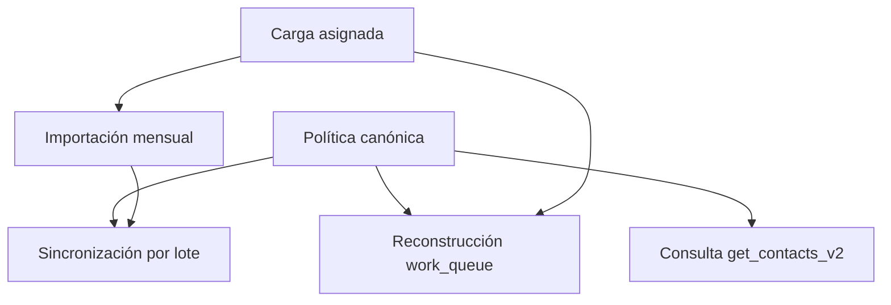

# Política canónica de gestionabilidad de contactos

- Fecha: 2026-07-15
- Estado: Pendiente de revisión
- LCD: LCD-20260715-01
- ADR: ADR-020
- Issue: #12
- Ambiente implementado: DEV

## Propósito

Representar mediante una sola política ejecutable la regla de negocio que decide qué contactos puede descubrir y gestionar un usuario en APP LLAMADOS.

La gestionabilidad es una **clasificación derivada**. No es un hecho almacenado por sí mismo: se calcula desde apariciones corporativas, asignaciones vigentes y el período activo.

## Regla canónica

| Condición | Resultado | Motivo técnico |
|---|---:|---|
| Existe asignación propia vigente | Gestionable | `assigned_current` |
| Aparece en el período activo y no está asignado | No gestionable | `active_unassigned` |
| No aparece en el período activo y la última aparición fue `No Gestionado` | Gestionable | `latest_no_gestionado` |
| No aparece en el período activo y la última aparición fue `Gestionado` | No gestionable | `latest_gestionado` |
| La última aparición no trae un estado corporativo válido | No gestionable | `latest_status_missing` |
| Nunca fue observado en una campaña | No gestionable | `never_observed` |

La gestión interna propia es información histórica y operativa. No reemplaza el estado corporativo mensual ni concede gestionabilidad.

## Resolución conservadora

La política aplica **fail-closed**: ante información insuficiente o contradictoria, no habilita el contacto.

Si existen varias filas para un contacto en el mismo último período y discrepan entre `Gestionado` y `No Gestionado`, prevalece `Gestionado`. Esta precedencia evita descubrir preventivamente un contacto que podría estar siendo atendido por otro vendedor.

## Hechos y proyecciones

### Hechos

- `contacts`: identidad y datos de contacto vigentes;
- `campaigns`: campañas corporativas;
- `contact_month_state`: aparición, período, campaña, estado corporativo y asignación;
- `crm_log` y `crm_events`: gestiones internas realizadas;
- `contact_operational_state`: resumen operativo de gestiones internas.

### Proyecciones

- `work_queue`;
- resultados de `get_contacts_v2`;
- contadores, filtros y estadísticas.

Las proyecciones pueden reconstruirse. Los hechos no deben borrarse ni reinterpretarse para corregir una vista.

## Diseño implementado

La migración `supabase/migrations/20260715_unify_contact_eligibility_policy.sql` introduce la función interna:

```text
contact_eligibility_for_period(period)
```

Esta función es la única implementación ejecutable de la regla y es consumida por:



La función interna no puede ejecutarse desde `anon` ni `authenticated`. Las RPC públicas conservan sus firmas existentes para no romper el frontend.

## Importación

`process_monthly_state_batch` conserva separadamente:

- `estado_origen`: hecho corporativo mensual;
- `is_assigned`: hecho de asignación propia.

La carga asignada normaliza `load_type` como `asignado`, persiste `is_assigned=true` y reconstruye la proyección mediante la política canónica.

Un `Gestionado` proveniente de la base corporativa no crea una gestión interna en `contact_operational_state`. Puede representarse en `work_queue` como estado importado, pero no se atribuye al usuario.

## Reversibilidad

La migración aplica un **Strangler interno**:

1. renombra las cinco RPC anteriores con sufijo `_legacy_lcd20260715`;
2. revoca su acceso desde la API;
3. crea reemplazos con las mismas firmas;
4. conserva un rollback que elimina los reemplazos y restaura exactamente las RPC previas.

No se copió ni reescribió el código legacy para el rollback.

## Deuda de datos detectada

DEV contiene 443 apariciones visibles y 439 no tienen `estado_origen` válido. La política no intenta inferir esos hechos desde gestiones internas y los clasifica conservadoramente.

Las bases mensuales originales de abril, mayo, junio y julio fueron localizadas en el RDP. No pueden aplicarse a DEV porque DEV usa identidades ficticias sin correspondencia con los RUT reales.

El backfill real se realizará únicamente mediante coincidencia exacta de:

```text
RUT normalizado + período + campaign_key
```

No se permiten asociaciones por nombre, teléfono, correo, similitud o posición de fila.

## Validación DEV

Resultado observado después de aplicar la migración:

- 164 contactos;
- 443 apariciones mensuales;
- 13 asignados vigentes;
- 1 contacto gestionable por última aparición `No Gestionado`;
- 14 gestionables totales;
- 0 vigentes no asignados filtrados como gestionables;
- 0 cambios en `crm_log`, `crm_events` o `contact_operational_state`;
- hash de estado, comentarios, ingresos y recordatorios sin cambios después del rebuild.

Los fixtures transaccionales probaron asignación, presencia activa, estados históricos, estado faltante, conflicto conservador, preservación de gestiones y carga asignada.

## Alcance pendiente

- revisar y aprobar ADR-020;
- validar el generador con las fuentes mensuales definitivas;
- resolver la condición de fuente desactualizada del archivo de mayo;
- preparar STAGING;
- autorizar explícitamente cualquier migración o backfill en PROD.

PROD no fue consultado ni modificado durante este lote.
