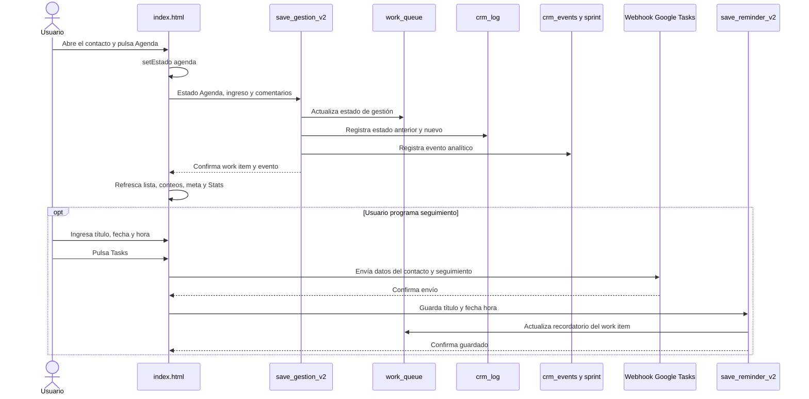
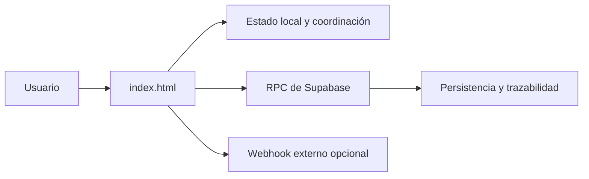
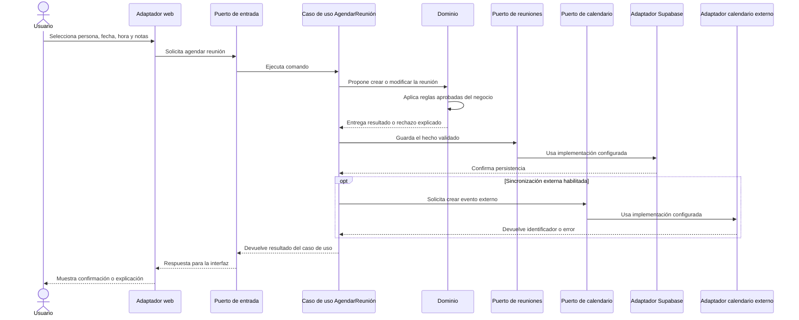
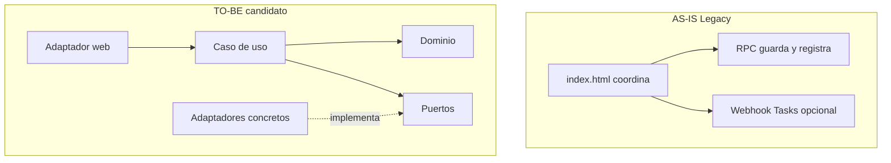

# Caso aplicado · Registrar Agenda y programar seguimiento

- Fecha: 2026-07-14
- Estado: Pendiente de revisión
- LCD: LCD-20260714-02
- Issue: #16

## Propósito

Acompañar la arquitectura conceptual con una operación reconocible del CRM: el usuario conversa con una persona, marca el resultado `Agenda` y, si corresponde, programa un seguimiento con fecha y hora.

Este documento contiene dos vistas paralelas:

1. **AS-IS verificado:** comportamiento observado en APP LLAMADOS Legacy y en sus RPC productivas.
2. **TO-BE candidato:** ejemplo de cómo podrían distribuirse las responsabilidades en CRM Patrimonial Next.

La vista futura es ilustrativa. No aprueba todavía una entidad `Reunión`, un agregado, estados definitivos ni una integración obligatoria con Google Calendar o Google Tasks.

## Distinción necesaria en el producto actual

En APP LLAMADOS, `Agenda` y `Recordatorio` no son hoy el mismo hecho:

- `Agenda` es un estado nuevo de la gestión realizada al contacto;
- el recordatorio contiene título, fecha y hora;
- Google Tasks es una integración opcional mediante webhook;
- marcar `Agenda` no crea por sí solo una cita de calendario.

## AS-IS verificado · Qué ocurre hoy

**Tipo:** diagrama de secuencia operativo.

**Lectura:** de arriba hacia abajo. Las flechas representan llamadas que ocurren durante la ejecución actual.



### Responsabilidades actuales observadas

| Elemento actual | Responsabilidad real |
|---|---|
| `index.html` | Dibuja la interfaz, cambia el estado local, coordina las llamadas y refresca conteos. |
| `save_gestion_v2` | Localiza el work item, actualiza la gestión y crea trazabilidad operacional y analítica. |
| `work_queue` | Conserva el estado vigente, comentarios, ingreso estimado y recordatorio del trabajo actual. |
| `crm_log` | Conserva el cambio desde el estado anterior al estado nuevo. |
| `crm_events` | Registra un evento analítico de gestión guardada. |
| Sprint activo | Incrementa llamadas y agendas cuando corresponde. |
| Webhook de Google Tasks | Recibe opcionalmente los datos para crear una tarea externa. |
| `save_reminder_v2` | Guarda título y fecha hora del recordatorio en el work item. |

### Lectura arquitectónica del AS-IS

El sistema actual funciona, pero las responsabilidades no están separadas en capas hexagonales explícitas:



La regla de negocio `qué significa Agenda` aparece distribuida entre etiquetas de interfaz, JavaScript, funciones SQL y métricas derivadas. El diagrama describe ese hecho; no lo juzga ni lo modifica.

## TO-BE candidato · Cómo podrían separarse las responsabilidades

**Tipo:** ejemplo aplicado de arquitectura hexagonal.

**Lectura:** de izquierda a derecha durante la ejecución. La arquitectura estable continúa leyéndose desde el dominio hacia afuera.

Los nombres `AgendarReunión`, `ReuniónAgendada` y `Puerto de Calendario` son candidatos pedagógicos pendientes de validación en el Modelo del Dominio.



## Correspondencia entre conceptos y el caso aplicado

| Concepto arquitectónico | Ejemplo aplicado candidato |
|---|---|
| Dominio | Decide qué constituye una reunión válida y qué hechos deben conservarse. |
| Aplicación | Coordina el caso de uso completo y sus transacciones. |
| Puerto de entrada | Contrato para solicitar `AgendarReunión`. |
| Puerto de salida | Contrato para guardar la reunión o sincronizar un calendario. |
| Adaptador web | Convierte formulario o clics en un comando de aplicación. |
| Adaptador Supabase | Traduce el puerto de persistencia a tablas, RPC o transacciones concretas. |
| Adaptador externo | Traduce el puerto de calendario a Google Calendar, Tasks u otro proveedor. |
| Composición | Decide al arrancar qué adaptadores concretos satisfacen cada puerto. |

## Comparación resumida



## Decisiones que este ejemplo no toma

- No decide si `Agenda` seguirá siendo un estado, un resultado de gestión o una reunión independiente.
- No decide si una reunión pertenece a Persona, Caso Comercial, Oportunidad u otro agregado.
- No decide si el proveedor externo será Google Tasks, Google Calendar u otro.
- No obliga a sincronizar externamente todas las agendas.
- No define aún reglas de reprogramación, cancelación, asistentes, zona horaria o conflictos.
- No reemplaza el levantamiento formal del dominio.

## Uso esperado

Este patrón debe repetirse para capacidades relevantes:

```text
vista conceptual
+
caso aplicado AS-IS verificado
+
caso aplicado TO-BE candidato
+
explicación de diferencias
```

Los futuros casos pueden incluir importación mensual, evaluación de gestionabilidad, registro de una llamada, creación de una oportunidad y contratación de un producto.