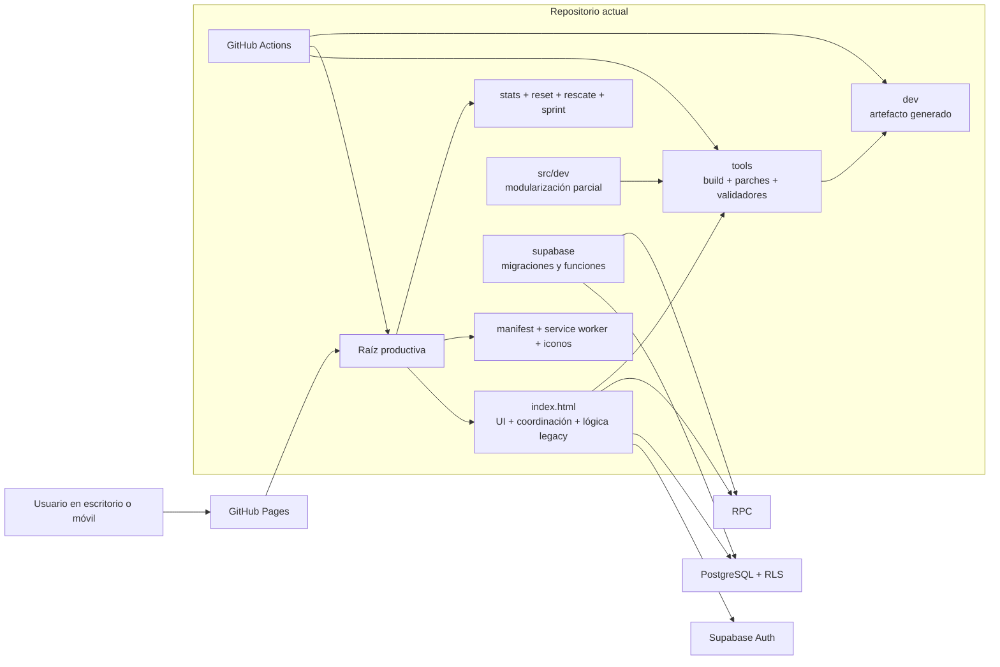
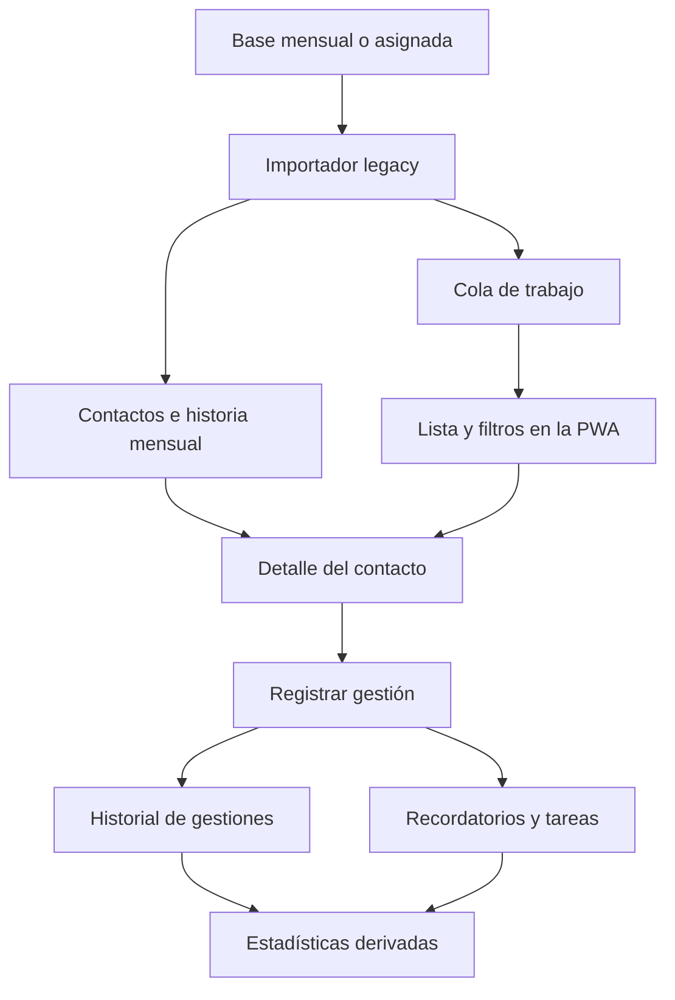
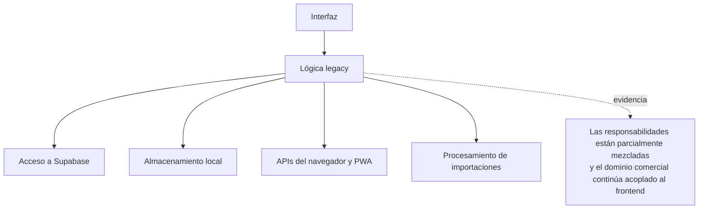

# AS-IS · APP LLAMADOS Legacy

- Fecha: 2026-07-14
- Estado: Pendiente de revisión
- LCD: LCD-20260714-02
- Issue: #16

## Propósito

Representar la arquitectura y el flujo técnico actuales de APP LLAMADOS sin reinterpretarlos como si ya existiera una separación hexagonal.

## Vista general actual

## Flujo operativo simplificado

## Dependencias y acoplamientos relevantes

## Lectura arquitectónica

- La raíz del repositorio es simultáneamente fuente manual y artefacto publicado de PROD.
- `index.html` concentra interfaz, coordinación y parte relevante de la lógica legacy.
- Supabase presta autenticación, persistencia, RLS y RPC.
- `src/dev/` contiene modularización parcial, pero no constituye CRM Patrimonial Next.
- `dev/` es un artefacto construido desde PROD, módulos DEV y herramientas Python.
- Los workflows actuales pueden validar, construir y también confirmar cambios generados en `main`.

## Qué no afirma este diagrama

- No afirma que toda la lógica esté exclusivamente en `index.html`.
- No afirma que la arquitectura actual sea hexagonal.
- No considera `dev/` una aplicación independiente.
- No autoriza mover la raíz productiva.
- No corrige ni redefine reglas de negocio.

## Pendientes de refinamiento

- mapear con mayor detalle las funciones de `stats.html`, `sprint.js`, `reset.html` y `rescate.html`;
- inventariar cada workflow y herramienta con su consumidor;
- representar tablas y RPC críticas después de la auditoría de Supabase;
- agregar el flujo exacto de importación y cálculo de gestionabilidad una vez documentado y validado.
