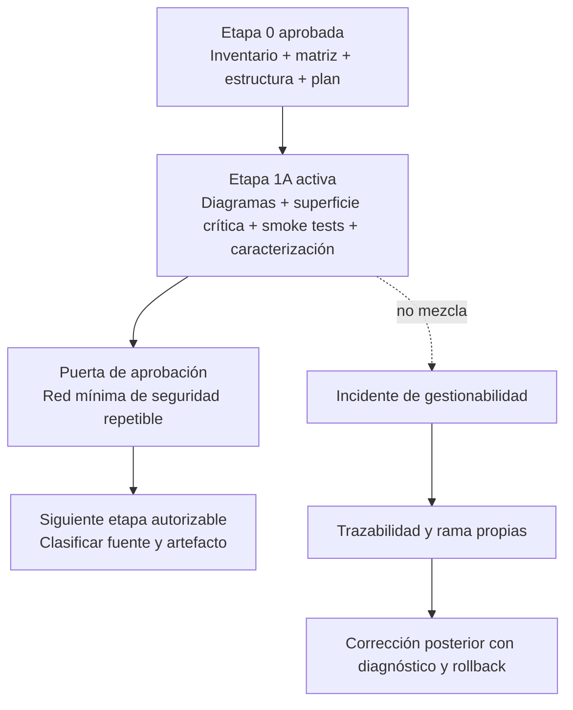
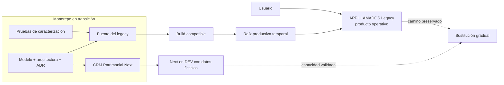
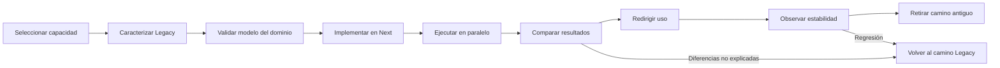
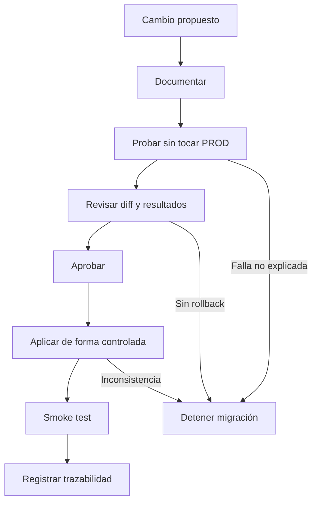

# TRANSICIÓN · APP LLAMADOS Legacy hacia CRM Patrimonial Next

- Fecha: 2026-07-14
- Estado: Pendiente de revisión
- LCD: LCD-20260714-02
- Issue: #16

## Propósito

Mostrar dónde estamos, qué protege cada etapa y cómo coexistirán Legacy y Next durante una sustitución gradual y reversible.

## Mapa general

```mermaid
flowchart LR
    S0["Etapa 0\nInventariar y planificar\nCOMPLETADA"] --> S1["Etapa 1\nProteger comportamiento\nEN CURSO"]
    S1 --> S2["Etapa 2\nClasificar fuente y artefacto"]
    S2 --> S3["Etapa 3\nCrear esqueleto del monorepo"]
    S3 --> S4["Etapa 4\nEncapsular Legacy"]
    S4 --> S5["Etapa 5\nNormalizar automatización"]
    S5 --> S6["Etapa 6\nCrear Next en DEV"]
    S6 --> S7["Etapa 7\nSustitución gradual"]
    S7 --> S8["Etapa 8\nDesacoplar la raíz"]
    S8 --> S9["Etapa 9\nLimpieza y cierre"]
```

## Posición actual

## Coexistencia durante la transición

## Ciclo por capacidad

## Controles que acompañan todas las etapas

## Regla de lectura

- Las etapas describen autorizaciones progresivas, no fechas rígidas.
- Completar una etapa no obliga a ejecutar inmediatamente la siguiente.
- Legacy permanece operativo mientras Next se construye y valida.
- Una capacidad sólo se retira del legacy después de demostrar equivalencia y estabilidad.
- Los incidentes productivos interrumpen la migración, pero no se mezclan documental ni técnicamente con ella.
