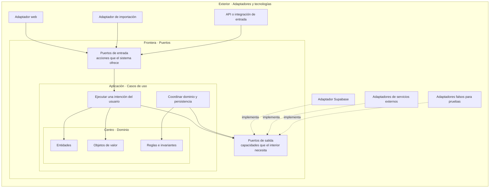
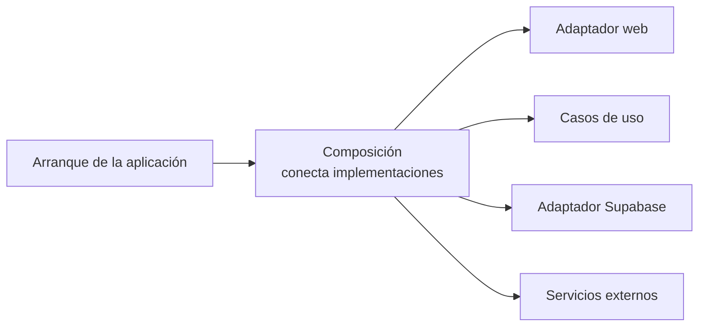
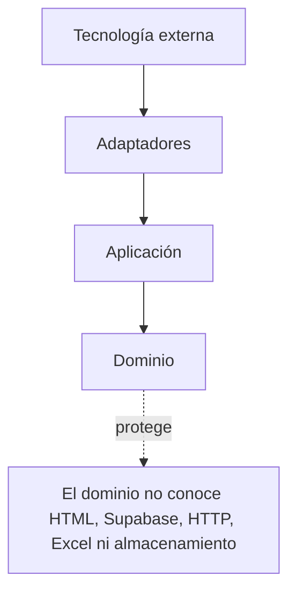
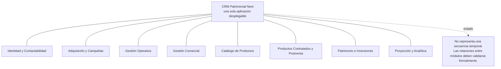
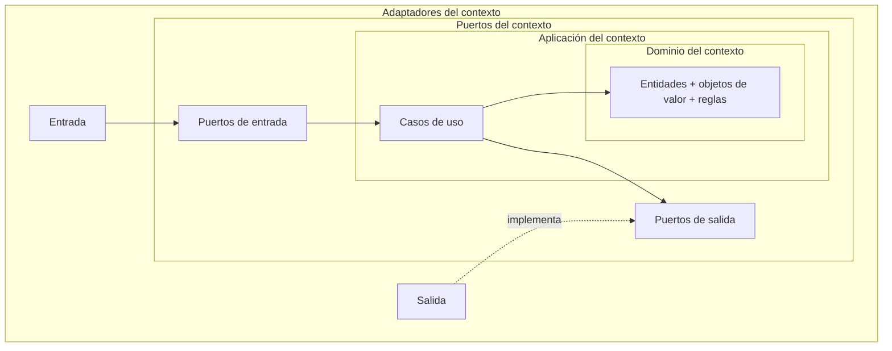
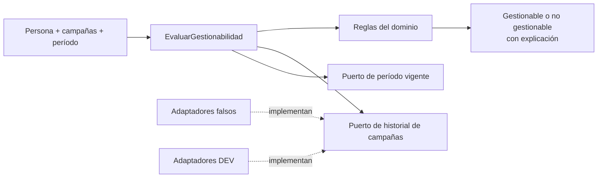

# TO-BE · CRM Patrimonial Next

- Fecha: 2026-07-14
- Estado: Pendiente de revisión
- LCD: LCD-20260714-02
- Issue: #16

## Propósito

Representar la arquitectura base deseada para CRM Patrimonial Next: monolito modular, DDD y arquitectura hexagonal, con dependencias dirigidas hacia el dominio.

Este documento muestra una arquitectura objetivo. No implica que las carpetas, módulos, contextos o casos de uso ya estén implementados o formalmente validados.

## Cómo leer estas vistas

Los diagramas de este documento no representan todos lo mismo:

- una **vista por capas** muestra responsabilidades y dirección de dependencias;
- una **vista de módulos** muestra fronteras internas del producto;
- una **vista de flujo** muestra una secuencia de ejecución concreta;
- una flecha continua indica que un elemento usa o invoca otro;
- una flecha discontinua con la palabra `implementa` indica que una tecnología satisface un contrato definido hacia el interior.

La regla visual principal es:

```text
más cerca del centro
= conocimiento y reglas más estables

más cerca del exterior
= tecnología y mecanismos más reemplazables
```

## Conceptos de la leyenda

| Concepto | Significado en esta arquitectura |
|---|---|
| Dominio | Conocimiento, conceptos, invariantes y comportamiento del negocio. |
| Aplicación | Casos de uso que coordinan acciones utilizando el dominio. |
| Puerto | Contrato definido por el interior para comunicarse con el exterior. |
| Adaptador | Implementación que traduce entre un puerto y una tecnología concreta. |
| Composición | Código de arranque que conecta casos de uso, puertos y adaptadores concretos. |
| Contexto o módulo | Frontera interna que agrupa conocimiento y capacidades relacionadas del negocio. |
| Monolito | Una sola aplicación desplegable, no una colección de microservicios. |
| Modular | La aplicación única conserva fronteras internas explícitas entre responsabilidades. |

## Arquitectura hexagonal · del centro hacia afuera

Esta vista debe leerse desde el centro hacia el exterior. No describe el orden temporal de una operación.



### Qué significa esta estructura

- El **dominio** está al centro porque contiene lo que el negocio significa y lo que debe ser verdad.
- La **aplicación** usa el dominio para ejecutar casos de uso.
- Los **puertos de entrada** expresan acciones que el sistema permite ejecutar.
- Los **puertos de salida** expresan capacidades que el interior necesita, por ejemplo guardar una persona u obtener campañas.
- Los **adaptadores de entrada** convierten clics, archivos o llamadas externas en solicitudes a la aplicación.
- Los **adaptadores de salida** conectan los puertos internos con Supabase, APIs u otras tecnologías.
- Los adaptadores falsos permiten probar la aplicación sin internet ni datos reales.

## Qué es Composición

`Composición` no es una capa del negocio ni el primer paso de todos los procesos.

Es el código técnico que, al arrancar la aplicación, decide qué implementaciones concretas se conectan entre sí.



Ejemplo conceptual:

```text
El caso de uso necesita un Puerto de Personas
            +
la infraestructura ofrece un Adaptador Supabase de Personas
            ↓
Composición conecta ambos al iniciar la aplicación
```

Por eso Composición conoce implementaciones concretas, pero no contiene reglas patrimoniales ni comerciales.

## Dirección de dependencias



Las operaciones pueden salir hacia Supabase durante la ejecución, pero las dependencias del código continúan apuntando hacia el interior mediante puertos.

## Monolito modular por contextos

Un **monolito modular** es una sola aplicación desplegable que contiene módulos internos claramente separados.

Los módulos del diagrama no son pantallas, tablas ni pasos de una cadena. Son fronteras candidatas de conocimiento y responsabilidad del negocio.



### Cómo interpretar cada término

- **Monolito:** se construye y despliega como una sola aplicación.
- **Modular:** internamente no es una masa indiferenciada; cada módulo protege una responsabilidad.
- **Contexto:** frontera donde ciertos términos y reglas tienen un significado coherente.
- **Relación entre contextos:** debe modelarse explícitamente y no deducirse sólo porque dos módulos compartan datos.

Por ejemplo, `Campaña`, `Gestión Operativa` y `Oportunidad` pueden relacionarse, pero eso no significa que cada operación deba recorrer siempre esos módulos en ese orden.

Los contextos de esta vista siguen siendo candidatos pendientes de validación formal.

## Patrón interno de un contexto

Cada contexto validado puede contener su propia arquitectura interior:



Esto significa que la arquitectura hexagonal no existe una sola vez alrededor de todo el producto: puede aplicarse dentro de cada contexto cuando su complejidad y sus reglas lo justifiquen.

## Reglas arquitectónicas

- El dominio representa conocimiento, invariantes y comportamiento del negocio.
- La aplicación coordina casos de uso y transacciones, sin detalles visuales.
- Los puertos expresan capacidades ofrecidas o requeridas por el interior.
- Los adaptadores traducen entre contratos internos y tecnologías externas.
- Composición conecta implementaciones, pero no contiene reglas de dominio.
- Supabase es infraestructura; no gobierna el modelo del dominio.
- Los contextos comparten producto y despliegue, pero conservan fronteras explícitas.
- No se extraen paquetes compartidos antes de demostrar reutilización real.
- DEV usa datos ficticios y nunca apunta a PROD.

## Primera vertical candidata

El siguiente sí es un diagrama de flujo: representa una operación concreta candidata.



Esta vertical es candidata, no una implementación aprobada. Primero deben validarse sus conceptos, reglas y fuentes canónicas.