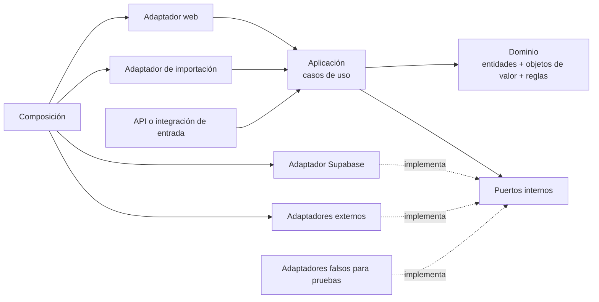
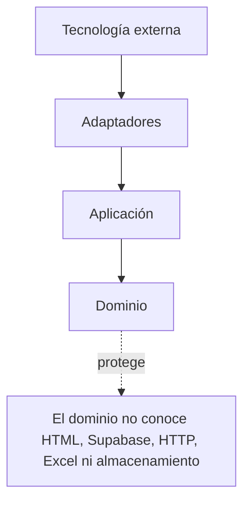
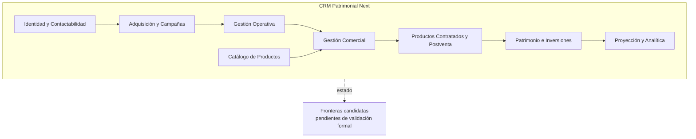
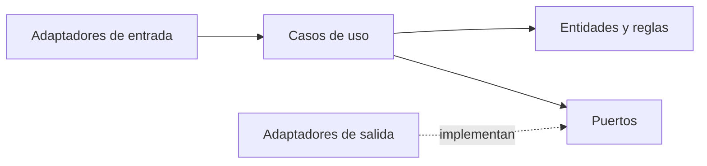
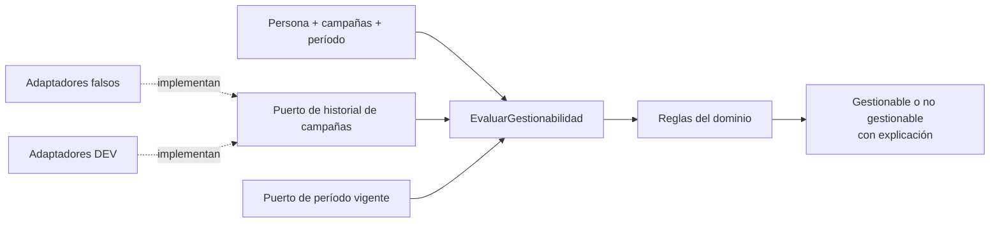

# TO-BE · CRM Patrimonial Next

- Fecha: 2026-07-14
- Estado: Pendiente de revisión
- LCD: LCD-20260714-02
- Issue: #16

## Propósito

Representar la arquitectura base deseada para CRM Patrimonial Next: monolito modular, DDD y arquitectura hexagonal, con dependencias dirigidas hacia el dominio.

## Vista hexagonal simplificada

## Dirección de dependencias

## Monolito modular por contextos

## Patrón interno de un contexto

## Reglas arquitectónicas

- El dominio representa conocimiento, invariantes y comportamiento del negocio.
- La aplicación coordina casos de uso y transacciones, sin detalles visuales.
- Los puertos expresan capacidades requeridas por el interior.
- Los adaptadores traducen entre contratos internos y tecnologías externas.
- Supabase es infraestructura; no gobierna el modelo del dominio.
- Los contextos comparten repositorio y despliegue, pero conservan fronteras explícitas.
- No se extraen paquetes compartidos antes de demostrar reutilización real.
- DEV usa datos ficticios y nunca apunta a PROD.

## Primera vertical candidata

Esta vertical es candidata, no una implementación aprobada. Primero deben validarse sus conceptos, reglas y fuentes canónicas.
