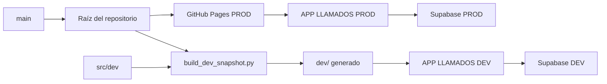
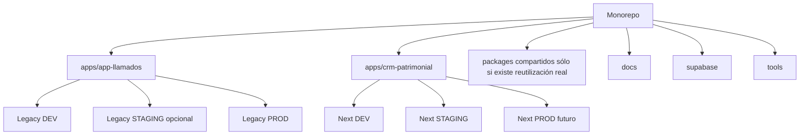

# Matriz Producto × Ambiente × Despliegue

- Fecha: 2026-07-13
- Estado: Pendiente de revisión
- LCD: LCD-20260713-02
- Issue: #10

## Propósito

Evitar confundir producto, ambiente, versión, código fuente y canal de despliegue durante la transición al monorepo.

## Definiciones

- **Producto:** aplicación o generación funcional identificable.
- **Ambiente:** contexto técnico y de datos donde se ejecuta el producto.
- **Versión:** identificación concreta de una entrega.
- **Fuente:** ubicación canónica desde la cual se construye el producto.
- **Artefacto:** resultado construido o publicado.
- **Despliegue:** mecanismo que pone un artefacto a disposición de usuarios.

## Matriz actual

| Producto | Ambiente | Estado | Fuente actual | Artefacto publicado | Backend | Canal de despliegue | Datos | Observaciones |
|---|---|---|---|---|---|---|---|---|
| APP LLAMADOS Legacy | PROD | Operativo | raíz del repositorio, principalmente `index.html` y archivos PWA | `/root` de `main` | Supabase PROD | GitHub Pages desde `main` y `/root` | Reales | Continuidad operativa prioritaria |
| APP LLAMADOS Legacy | DEV | Operativo como laboratorio | `index.html` PROD + `src/dev/` + herramientas Python | `dev/` generado | Supabase DEV | Publicación bajo el repositorio; mecanismo exacto por confirmar | Ficticios | Tiene identidad y configuración propias |
| APP LLAMADOS Legacy | STAGING | No demostrado | — | — | — | — | — | No asumir que existe hasta verificarlo |
| CRM Patrimonial Next | DEV | No creado | futuro `apps/crm-patrimonial/` | futuro | futuro backend DEV | por diseñar | Ficticios | Actualmente en dominio y arquitectura |
| CRM Patrimonial Next | STAGING | Futuro | — | — | — | por diseñar | Sanitizados | Sólo después de validar en DEV |
| CRM Patrimonial Next | PROD | Futuro | — | — | — | por diseñar | Reales | No existe todavía como producto desplegado |

## Topología actual simplificada

## Topología objetivo conceptual

## Reglas de separación

1. Un nombre de carpeta no define por sí solo un ambiente.
2. Una rama Git no es un ambiente.
3. `main` no equivale a PROD, aunque actualmente alimente GitHub Pages.
4. Cada producto debe declarar explícitamente qué backend utiliza.
5. DEV no puede contener endpoints, credenciales o datos de PROD.
6. STAGING sólo se declara existente cuando posee despliegue, configuración y proceso de promoción verificables.
7. CRM Patrimonial Next no debe reutilizar silenciosamente `dev/` como si fuera su aplicación inicial.
8. Las versiones de Legacy y Next evolucionan de forma independiente.

## Nomenclatura propuesta

### Productos

- `app-llamados`
- `crm-patrimonial`

### Ambientes

- `dev`
- `staging`
- `prod`

### Identificadores completos

- `app-llamados-dev`
- `app-llamados-prod`
- `crm-patrimonial-dev`
- `crm-patrimonial-staging`
- `crm-patrimonial-prod`

### Versiones

- APP LLAMADOS Legacy: serie `1.x.y` mientras mantenga compatibilidad.
- CRM Patrimonial Next: serie `0.x.y` durante desarrollo y `1.0.0` al alcanzar producción estable.

## Barreras antes de crear STAGING o PROD para Next

- modelo del dominio aprobado para el alcance;
- primera vertical hexagonal validada;
- pruebas automatizadas mínimas;
- configuración separada;
- datos sanitizados;
- despliegue reproducible;
- rollback documentado;
- smoke test definido.

## Pendientes

- confirmar URL pública exacta de APP LLAMADOS DEV;
- confirmar si existe algún ambiente intermedio informal;
- registrar proyectos Supabase por ambiente sin exponer secretos;
- definir estrategia futura de despliegue para cada aplicación;
- decidir cuándo desacoplar `main` de la publicación automática de PROD.
