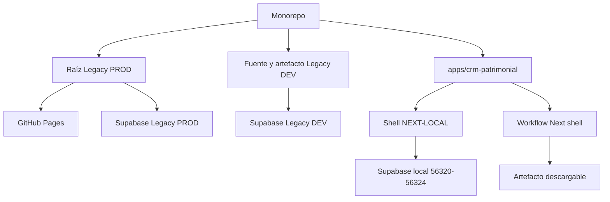
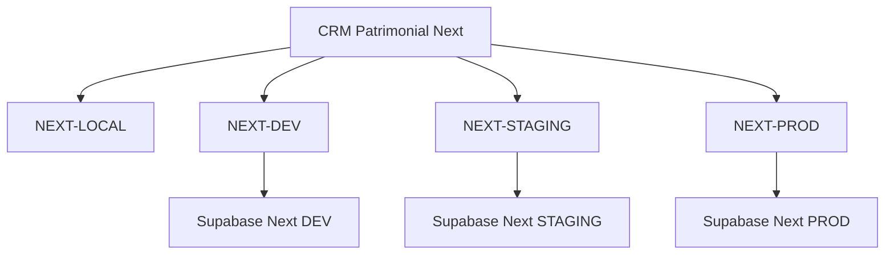

# Matriz Producto × Ambiente × Despliegue

- Estado aprobado de origen: LCD-20260713-04
- Actualización candidata: 2026-08-05 · LCD-20260805-01 · ADR-028
- Issue de actualización: #76

## Propósito

Evitar confundir producto, ambiente, versión, código fuente y canal de despliegue durante la transición al monorepo.

## Definiciones

- **Producto:** aplicación o generación funcional identificable.
- **Ambiente:** contexto técnico y de datos donde se ejecuta el producto.
- **Versión:** identificación concreta de una entrega.
- **Fuente:** ubicación canónica desde la cual se construye el producto.
- **Artefacto:** resultado construido o publicado.
- **Despliegue:** mecanismo que pone un artefacto a disposición de usuarios.

## Matriz actual

| Producto | Ambiente | Estado | Fuente | Artefacto o acceso | Backend | Datos | Observaciones |
|---|---|---|---|---|---|---|---|
| APP LLAMADOS Legacy | PROD | Operativo | raíz del repositorio | GitHub Pages `/root` | `crm-ffvv-v2` | Reales | Única aplicación operativa actual |
| APP LLAMADOS Legacy | DEV | Operativo como laboratorio | `index.html` + `src/dev/` | `dev/` generado y publicado | `crm-ffvv-dev` | Ficticios | Es DEV de Legacy, no plataforma de Next |
| APP LLAMADOS Legacy | STAGING | No demostrado | — | — | — | — | No asumir existencia |
| CRM Patrimonial Next | LOCAL | Shell creada; backend configurado | `apps/crm-patrimonial/` | `http://127.0.0.1:4173` | Supabase local reservado 56320–56324 | Ficticios | Stack completo no iniciado en este entorno |
| CRM Patrimonial Next | DEV | No creado | `apps/crm-patrimonial/` | Workflow y artefacto local | Proyecto remoto previsto | Ficticios | Bloqueado por límite Supabase |
| CRM Patrimonial Next | STAGING | No creado | futuro candidato | — | proyecto remoto propio | Sanitizados | Sólo después de NEXT-DEV |
| CRM Patrimonial Next | PROD | No creado | release aprobada | — | proyecto remoto propio | Reales | Sólo tras corte total autorizado |

## Topología actual

```mermaid
flowchart TB
    REPO[Monorepo]
    REPO --> LROOT[Raíz Legacy PROD]
    REPO --> LDEV[Fuente y artefacto Legacy DEV]
    REPO --> NEXTSRC[apps/crm-patrimonial]

    LROOT --> LPAGES[GitHub Pages]
    LROOT --> LBPROD[Supabase Legacy PROD]
    LDEV --> LBDEV[Supabase Legacy DEV]

    NEXTSRC --> NLOCAL[Shell NEXT-LOCAL]
    NLOCAL --> NCFG[Supabase local 56320-56324]
    NEXTSRC --> NCI[Workflow Next shell]
    NCI --> NART[Artefacto descargable]
```

## Topología objetivo

```mermaid
flowchart TB
    NEXT[CRM Patrimonial Next]
    NEXT --> NLOCAL[NEXT-LOCAL]
    NEXT --> NDEV[NEXT-DEV]
    NEXT --> NSTG[NEXT-STAGING]
    NEXT --> NPROD[NEXT-PROD]

    NDEV --> SBD[Supabase Next DEV]
    NSTG --> SBS[Supabase Next STAGING]
    NPROD --> SBP[Supabase Next PROD]
```

Ninguna flecha de runtime conecta Next con Supabase Legacy.

## Reglas de separación

1. Un nombre de carpeta no define por sí solo un ambiente.
2. Una rama Git no es un ambiente.
3. `main` no equivale conceptualmente a PROD, aunque actualmente publique Legacy.
4. Cada producto declara explícitamente su backend.
5. Un ambiente Next no contiene endpoints, claves ni datos de Legacy.
6. STAGING sólo existe cuando posee despliegue, configuración y promoción verificables.
7. `dev/` pertenece a Legacy y no se reutiliza como aplicación Next.
8. Las versiones, PWA, cachés y service workers evolucionan de forma independiente.
9. El laboratorio local no se confunde con DEV remoto.
10. La operación real no se divide por contactos o campañas entre Legacy y Next.
11. Tras el corte, Next es la única fuente operativa de nuevas gestiones.

## Nombres reservados

- `crm-patrimonial-next-dev`;
- `crm-patrimonial-next-staging`;
- `crm-patrimonial-next-prod`.

Región prevista: `sa-east-1`.

## Estado de capacidad Supabase

El intento de crear NEXT-DEV en la organización actual fue rechazado por el límite de dos proyectos gratuitos activos. No se modificaron los proyectos Legacy.

La creación remota exige ampliar capacidad, usar otra organización autorizada o pausar un proyecto Legacy mediante una decisión explícita y coordinada.

## Barreras antes de NEXT-STAGING o NEXT-PROD

- proyecto NEXT-DEV real y saludable;
- esquema físico aprobado y migraciones reproducibles;
- primera vertical de llamados completa;
- pruebas automatizadas y seguridad Supabase;
- datos sanitizados en STAGING;
- despliegue y rollback documentados;
- ensayo de migración y conciliación;
- smoke test definido;
- autorización explícita para cada ambiente.

## Publicación ejecutable de Etapa A

La shell puede abrirse localmente con `start-next.cmd`. El workflow `Next shell` genera además un artefacto descargable por 14 días. Esto permite evaluación sin alterar GitHub Pages ni el despliegue de Legacy.
