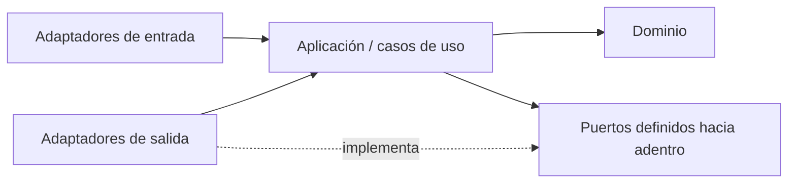

# Estructura objetivo del monorepo

- Fecha: 2026-07-13
- Estado: Pendiente de revisión
- LCD: LCD-20260713-02
- Issue: #10

## Propósito

Definir una estructura destino profesional que permita mantener APP LLAMADOS Legacy y construir CRM Patrimonial Next sin confundir fuentes, artefactos, ambientes ni documentación.

## Principios

1. La estructura debe representar productos y responsabilidades reales.
2. APP LLAMADOS continúa operativa durante la transición.
3. CRM Patrimonial Next nace aislado del legacy, aunque comparta repositorio.
4. No se crea un paquete compartido hasta demostrar reutilización real.
5. Los artefactos generados no se confunden con código fuente.
6. Los despliegues y los datos de cada ambiente permanecen separados.
7. Las dependencias del nuevo producto apuntan hacia el dominio.
8. Toda migración física se realiza por etapas reversibles.

## Estructura destino propuesta

```text
KNwS7F_2a2LZ7MS/
├── AGENTS.md
├── PROJECT_MAP.md
├── README.md
├── CHANGELOG.md
│
├── apps/
│   ├── app-llamados/
│   │   ├── README.md
│   │   ├── src/
│   │   │   ├── legacy/
│   │   │   └── modules/
│   │   ├── public/
│   │   ├── tests/
│   │   │   ├── characterization/
│   │   │   ├── integration/
│   │   │   └── smoke/
│   │   └── scripts/
│   │
│   └── crm-patrimonial/
│       ├── README.md
│       ├── src/
│       │   ├── contexts/
│       │   │   ├── identity/
│       │   │   ├── campaigns/
│       │   │   ├── operations/
│       │   │   ├── commercial/
│       │   │   ├── catalog/
│       │   │   ├── contracts/
│       │   │   ├── investments/
│       │   │   └── analytics/
│       │   ├── adapters/
│       │   │   ├── web/
│       │   │   ├── supabase/
│       │   │   ├── imports/
│       │   │   └── external/
│       │   └── composition/
│       ├── public/
│       └── tests/
│
├── packages/
│   └── README.md
│
├── docs/
│   ├── governance/
│   ├── domain/
│   ├── architecture/
│   ├── adr/
│   ├── operations/
│   ├── references/
│   └── learning/
│
├── supabase/
│   ├── migrations/
│   ├── functions/
│   ├── tests/
│   ├── seeds/
│   └── README.md
│
├── tools/
│   ├── build/
│   ├── validation/
│   ├── imports/
│   ├── diagnostics/
│   ├── backups/
│   └── README.md
│
├── artifacts/
│   ├── dev/
│   ├── staging/
│   └── releases/
│
└── .github/
    ├── workflows/
    ├── ISSUE_TEMPLATE/
    ├── PULL_REQUEST_TEMPLATE.md
    └── CODEOWNERS
```

## Significado de las zonas

### `apps/`

Contiene productos ejecutables.

- `apps/app-llamados/`: código fuente y pruebas de la aplicación legacy.
- `apps/crm-patrimonial/`: nueva generación con DDD y arquitectura hexagonal.

### `packages/`

Espacio reservado para código realmente compartido. Inicialmente sólo debe contener documentación. No se extraen utilidades por anticipación.

### `docs/`

Contiene conocimiento versionable de ingeniería.

- `governance/`: método de trabajo y control de cambios.
- `domain/`: modelos y lenguaje del negocio.
- `architecture/`: organización técnica y diagramas.
- `adr/`: decisiones con contexto y consecuencias.
- `operations/`: despliegue, incidentes, backups y recuperación.
- `references/`: índices hacia fuentes externas de Drive.
- `learning/`: matriz y bitácora de competencias.

### `supabase/`

Contiene infraestructura de base de datos versionada. Debe aclarar qué migraciones aplican a cada ambiente y cómo se prueban.

### `tools/`

Contiene automatización de ingeniería, no lógica de dominio del producto.

### `artifacts/`

Destino conceptual para resultados generados. Debe evaluarse si esos artefactos se versionan, se publican mediante Actions o se conservan sólo como releases.

## Arquitectura interna de CRM Patrimonial Next

Cada contexto puede organizarse de esta forma:

```text
context-name/
├── domain/
│   ├── entities/
│   ├── value-objects/
│   ├── services/
│   ├── events/
│   └── ports/
├── application/
│   ├── commands/
│   ├── queries/
│   └── use-cases/
└── adapters/
    ├── inbound/
    └── outbound/
```

Esta estructura no obliga a crear carpetas vacías ni clases sin necesidad. Se aplica cuando un contexto y sus conceptos han sido validados.

## Dirección de dependencias



Reglas:

- el dominio no importa Supabase, HTML, APIs ni almacenamiento;
- los casos de uso coordinan, pero no contienen detalles visuales;
- los adaptadores traducen entre tecnología y contratos internos;
- la composición conecta implementaciones concretas.

## Compatibilidad transitoria con GitHub Pages

Mientras GitHub Pages publique `main:/root`, la raíz productiva debe conservarse.

Durante la transición se admite una estructura híbrida:

```text
raíz productiva compatible
        ↑ generada o sincronizada desde
apps/app-llamados/
```

La raíz sólo dejará de cumplir esa función cuando otro mecanismo de despliegue haya sido probado y aprobado.

## Convenciones de nombres

- carpetas: `kebab-case`;
- archivos Markdown: `kebab-case.md` salvo archivos estándar como `README.md`;
- ramas: `tipo/descripcion-breve`;
- commits: Conventional Commits;
- contextos: nombres del lenguaje ubicuo en inglés técnico sólo cuando corresponda al código;
- documentación de negocio: español como idioma principal.

## Elementos que no deben crearse todavía

- microservicios;
- paquetes compartidos vacíos;
- una base separada por contexto;
- carpetas de cada entidad antes de validar agregados;
- abstracciones genéricas para todos los productos;
- CRM Patrimonial PROD;
- STAGING nominal sin infraestructura real.

## Criterios para considerar completada la transición física

- APP LLAMADOS puede construirse y desplegarse desde su carpeta propia;
- la raíz deja de ser fuente manual;
- GitHub Pages o el mecanismo sucesor usa un build reproducible;
- DEV, STAGING y PROD están identificados inequívocamente;
- CRM Patrimonial tiene al menos una vertical hexagonal operativa;
- los workflows no escriben inesperadamente en `main`;
- existen pruebas y rollback para cada producto;
- la documentación canónica está enlazada y sin duplicados editables.
