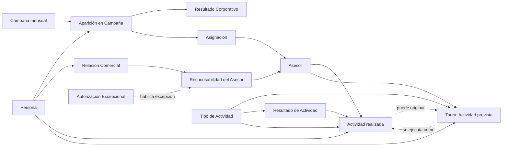

# Modelo Comercial del CRM Patrimonial

- Versión: 0.1
- Estado: Pendiente de revisión
- Fecha: 2026-08-01
- LCD: LCD-20260801-02
- ADR: ADR-024
- Issue: #31

## 1. Propósito

Describir los conceptos y reglas comerciales mínimos necesarios para representar la transición desde una Persona observada en campañas corporativas hasta una relación comercial propia, sin confundir hechos corporativos, gestión interna ni procesos técnicos de importación.

Este documento desarrolla y organiza conceptos ya definidos en el Diccionario del Dominio y en `APP LLAMADOS · Modelo de negocio`. No reemplaza el Modelo Patrimonial, el Modelo de Productos ni los futuros modelos de Casos, Oportunidades y Productos Contratados.

## 2. Alcance de esta versión

Incluye:

- Persona;
- Asesor;
- Campaña;
- Aparición en Campaña;
- Resultado Corporativo;
- Asignación;
- Relación Comercial;
- condición Lead de la Relación Comercial;
- Responsabilidad del Asesor;
- Autorización Excepcional;
- Tipo de Actividad;
- Resultado de Actividad;
- Actividad;
- Tarea.

No incluye todavía el diseño detallado de:

- Caso Comercial;
- Oportunidad;
- Cotización;
- Propuesta;
- Producto Contratado;
- Perfil patrimonial;
- productos, capitales y CNS;
- autenticación, cuentas de usuario y permisos técnicos;
- tablas, columnas, índices o RLS.

## 3. Vista conceptual

El diagrama representa relaciones conceptuales, no tablas ni cardinalidades físicas definitivas. `Lead` y `Cliente del Asesor` son condiciones derivadas de la Relación Comercial, no entidades adicionales del diagrama.

## 4. Conceptos

### 4.1 Persona

Identidad central del CRM. Existe independientemente de campañas, asignaciones, relaciones comerciales, oportunidades o importaciones.

Reglas:

- una Persona no se crea nuevamente porque reaparezca en otra campaña;
- una Persona no se elimina porque deje de aparecer;
- una Persona puede existir por incorporación manual explícita;
- las clasificaciones corporativas Prospecto y Contacto no crean entidades distintas.

### 4.2 Asesor

Actor comercial que puede recibir asignaciones corporativas, realizar actividades y asumir responsabilidad sobre una Relación Comercial.

En esta versión, Asesor representa la identidad comercial necesaria para el dominio. La cuenta de acceso, autenticación y roles técnicos pertenecen a una capa posterior.

### 4.3 Campaña

Selección comercial concreta realizada por la compañía para un período determinado.

Una Campaña debe conservar:

- período;
- nombre corporativo original;
- descripción corporativa original;
- identidad interna estable.

Los textos corporativos se conservan como hechos de origen, pero no se consideran por sí solos identificadores confiables. Los prefijos numéricos tampoco constituyen identidad.

No se incorpora todavía una entidad `Familia de Campaña`. Las agrupaciones históricas se evaluarán sólo cuando exista evidencia suficiente.

### 4.4 Aparición en Campaña

Hecho de que una Persona fue incorporada a una Campaña concreta.

Reglas:

- una Persona puede no aparecer en ninguna Campaña;
- una Persona puede aparecer en varias Campañas del mismo período;
- la misma Aparición no se duplica por cada archivo TOTAL sucesivo;
- la Aparición no crea por sí sola una Relación Comercial;
- una Aparición pertenece a una Persona y a una Campaña específica;
- una Aparición válida normalmente debe tener un único Resultado Corporativo vigente;
- una Aparición sin resultado válido sólo puede conservarse como inconsistencia explícita y conciliable;
- la falta de resultado no constituye un tercer estado y no puede gobernar silenciosamente la gestionabilidad.

### 4.5 Resultado Corporativo

Estado resumido informado por la compañía para una Aparición:

- Gestionado;
- No Gestionado.

Reglas:

- una Aparición válida tiene normalmente exactamente un Resultado Corporativo vigente;
- la ausencia o invalidez del resultado sólo puede existir temporalmente como inconsistencia explícita, con incidencia de conciliación;
- una Aparición sin resultado válido no se considera gestionable hasta corregir o validar el antecedente;
- nunca se inventa un resultado ni se crea un tercer estado como `Desconocido`;
- la ausencia de una Persona en un período no constituye un tercer estado;
- Gestionado no informa el detalle real ni demuestra una relación propia;
- el Resultado Corporativo no se convierte automáticamente en una Actividad interna;
- los cambios de Resultado Corporativo deben conservar trazabilidad.

### 4.6 Asignación

Vínculo temporal entre una Aparición y un Asesor durante la vigencia operativa de la Campaña.

Reglas:

- una Aparición puede no tener Asignación;
- una Aparición tiene normalmente como máximo una Asignación vigente;
- una Asignación no crea una Relación Comercial;
- el orden de Asignación es independiente del orden informado por la carga TOTAL;
- debe conservarse historial cuando cambia o termina;
- una Asignación a otro Asesor puede bloquear la gestión salvo excepción autorizada;
- una Asignación propia permanece visible durante la Campaña activa aunque el Resultado Corporativo sea Gestionado;
- la ausencia en una carga ASIGNADOS posterior del mismo período y alcance comparable no termina automáticamente la Asignación: genera conciliación;
- sólo una resolución confirmada registra el término dentro del mismo período;
- el cambio de período termina la vigencia operativa de las Asignaciones anteriores sin generar incidencias individuales por quienes no reaparecen.

### 4.7 Relación Comercial

Vínculo persistente de continuidad comercial propia entre una Persona y el CRM, bajo la responsabilidad de uno o más Asesores conforme a las reglas de este modelo.

Nace cuando una interacción, incorporación autorizada o antecedente previo establece continuidad comercial propia. Esa continuidad puede quedar demostrada, entre otros hechos, por:

- una reunión agendada;
- un seguimiento acordado para una fecha posterior;
- una solicitud o aceptación de información que requiere continuidad;
- una necesidad concreta identificada para desarrollar;
- una relación previa conocida y registrada;
- una incorporación manual autorizada como referido o contacto propio.

No nace por:

- aparición en campaña;
- asignación;
- intento sin respuesta;
- conversación sin interés ni siguiente paso;
- estado corporativo Gestionado;
- importación de un archivo;
- presentación de una propuesta, porque para entonces la Relación ya debe existir;
- cierre de un negocio, porque el cierre cambia la condición comercial pero no crea la Relación.

Reglas:

- una Persona tiene como máximo una Relación Comercial persistente dentro del CRM;
- la Relación puede existir sin oportunidades abiertas;
- una Oportunidad presupone una Relación Comercial existente;
- no se reemplaza cuando cambia el Asesor responsable;
- no desaparece porque termine una Campaña;
- el cierre y posterior existencia de un Producto Contratado convierten a la Persona en Cliente del Asesor, sin crear otra Relación;
- su futura relación detallada con Casos y Oportunidades se incorporará en versiones posteriores.

#### 4.7.1 Lead y otras condiciones de la Relación

`Lead` no es una Persona distinta ni una entidad paralela. Es una condición o clasificación de una Relación Comercial anterior a la existencia de un Producto Contratado.

Inicialmente deben poder distinguirse, al menos, estas situaciones conceptuales:

- Lead sin Oportunidad: existe continuidad comercial, pero todavía no se identifica un producto concreto;
- Lead con Oportunidad: existe una necesidad o contratación potencial identificable;
- Cliente del Asesor: existe al menos un Producto Contratado vigente asociado al Asesor;
- Relación dormida o inactiva: la Relación persiste, pero no hay Oportunidad ni actividad vigente que requiera atención inmediata.

Estas condiciones pueden derivarse de hechos persistentes y no deben convertirse prematuramente en una secuencia rígida de estados manuales. Una Persona puede avanzar, retroceder o reactivar su gestión sin perder la identidad de la Relación Comercial.

### 4.8 Responsabilidad del Asesor

Hecho temporal que indica qué Asesor es responsable de una Relación Comercial durante un intervalo.

Reglas:

- una Relación Comercial normalmente debe tener un Asesor principal vigente;
- puede quedar temporalmente sin responsable sólo como transición o inconsistencia explícita, nunca como situación silenciosa normal;
- la ausencia temporal de responsable debe generar una alerta o pendiente de asignación y no autoriza a inventar un Asesor;
- el cambio de Asesor termina una responsabilidad e inicia otra, sin crear otra Relación Comercial;
- el historial de responsables debe conservarse;
- una responsabilidad adicional simultánea requiere Autorización Excepcional;
- principal y adicional son roles de responsabilidad, no relaciones comerciales distintas.

### 4.9 Autorización Excepcional

Hecho trazable que permite una excepción a la regla de un único Asesor responsable vigente.

Debe identificar, al menos:

- Relación Comercial afectada;
- Asesor adicional autorizado;
- usuario con rol Administrador que autoriza;
- fecha;
- motivo;
- vigencia o término, cuando corresponda.

`Administrador` no se define aquí como entidad comercial. Es un rol de autorización de un usuario del sistema.

### 4.10 Tipo de Actividad

Vocabulario común que identifica la clase de acción prevista o realizada.

Se utiliza tanto en la Tarea como en la Actividad para evitar una categoría paralela de Tarea que duplique el significado.

Ejemplos iniciales no exhaustivos:

- Llamada;
- Reunión;
- Correo;
- WhatsApp;
- Envío de información;
- Preparación de propuesta;
- Revisión de antecedentes;
- Recepción de documentos.

Reglas:

- el Tipo de Actividad responde qué acción se prevé o se realizó;
- el objetivo de la Tarea responde para qué se realizará;
- el resultado de la Actividad responde qué ocurrió;
- cada Tipo de Actividad define qué Resultados de Actividad estructurados admite;
- una combinación de Tipo y Resultado incompatible debe rechazarse;
- el catálogo exacto y su representación física se definirán durante el diseño lógico;
- el Tipo de Actividad previsto no se sobrescribe con el Tipo realmente realizado.

#### 4.10.1 Resultado de Actividad

Clasificación estructurada de lo que ocurrió durante una Actividad concreta.

Ejemplos iniciales:

- para Llamada: No contestó, Conversación efectiva, Número inválido, Buzón de voz;
- para Reunión: Realizada, Cliente no asistió, Suspendida, Reagendada;
- para Envío de información: Enviada, Entrega fallida;
- para Preparación de propuesta: Preparada, No viable, Pendiente de antecedentes.

Reglas:

- el Resultado pertenece a una Actividad y debe ser compatible con su Tipo;
- describe únicamente lo ocurrido durante esa Actividad;
- puede complementarse con una nota libre, pero no ser reemplazado por ella;
- no incorpora como parte de su significado la creación de una Tarea, Relación Comercial, Oportunidad u otro hecho posterior;
- expresiones como `Agenda reunión`, `Volver a llamar` o `Información enviada` no deben mezclar acción, resultado y próximo paso en una sola etiqueta;
- las consecuencias se registran como hechos independientes y trazables.

### 4.11 Actividad

Hecho de interacción o gestión efectivamente ocurrido, asociado siempre a una Persona y realizado por un Asesor.

Debe poder conservar, al menos:

- Tipo de Actividad realmente realizado;
- fecha y hora efectiva;
- Resultado de Actividad estructurado y compatible con el Tipo;
- nota de ejecución opcional.

Reglas:

- una Persona puede tener cero o muchas Actividades;
- una Actividad puede existir sin Relación Comercial, como un intento sin respuesta o una conversación sin continuidad;
- una Actividad puede originar el nacimiento de una Relación Comercial cuando demuestra continuidad comercial propia;
- una Actividad puede existir sin Tarea previa;
- una Actividad puede originar cero, una o varias Tareas futuras;
- una Actividad puede constituir la ejecución de cero, una o varias Tareas compatibles;
- cuando ejecuta una o varias Tareas, todas deben corresponder a la misma Persona y al Asesor responsable vigente de cada Tarea;
- el Tipo realmente realizado se conserva aunque difiera del Tipo previsto; esa diferencia no modifica retroactivamente la Tarea;
- una Actividad puede existir sin Caso u Oportunidad;
- una Actividad puede vincularse posteriormente a uno o varios Casos u Oportunidades;
- una gestión corporativa externa no se registra automáticamente como Actividad propia;
- un evento técnico de guardado no equivale por sí solo a una Actividad significativa;
- la nota libre complementa, pero no sustituye, el resultado estructurado;
- una consecuencia posterior, como crear una Tarea, una Relación Comercial o una Oportunidad, se registra separadamente y puede conservar referencia a la Actividad que la originó;
- una Actividad registrada no puede eliminarse ni sobrescribirse silenciosamente;
- una corrección o anulación debe conservar el contenido original y su trazabilidad.

#### 4.11.1 Corrección y anulación de Actividad

Una Actividad representa un hecho histórico. Cuando fue registrada con información errónea, debe corregirse o anularse mediante un hecho trazable, sin reemplazar silenciosamente el registro original.

Toda corrección debe conservar, al menos:

- contenido original;
- contenido corregido;
- fecha de corrección;
- responsable de la corrección;
- motivo.

Toda anulación debe conservar, al menos:

- Actividad anulada;
- fecha de anulación;
- responsable de la anulación;
- motivo.

Reglas:

- para la operación y las métricas gobierna la versión corregida vigente;
- una Actividad anulada permanece en la trazabilidad, pero no cuenta para métricas;
- una Actividad anulada no puede justificar el nacimiento de una Relación Comercial ni completar Tareas;
- la corrección o anulación no elimina automáticamente las Tareas, Relaciones Comerciales, Oportunidades u otras consecuencias previamente originadas;
- las consecuencias potencialmente afectadas deben quedar advertidas para revisión, porque pueden haber sido confirmadas posteriormente por otros hechos;
- una anulación no debe convertirse en una eliminación física silenciosa.

### 4.12 Tarea

Previsión de una Actividad futura pendiente de realización, asociada siempre a una Persona y a un Asesor responsable vigente.

Toda Tarea debe conservar, al menos:

- Tipo de Actividad previsto;
- objetivo o descripción de lo que se pretende realizar;
- estado;
- Persona;
- Asesor responsable vigente.

Puede conservar además:

- contexto o instrucciones opcionales;
- fecha y hora prevista de ejecución;
- fecha límite.

No existe una `Nota de programación` separada: el contexto concentra los antecedentes, instrucciones o razones relevantes para ejecutar la Tarea.

Reglas:

- una Tarea puede crearse manualmente sin Actividad previa;
- una Tarea puede originarse en una Actividad;
- cuando posee una Actividad de origen, ambas deben corresponder a la misma Persona y al mismo Asesor;
- una Tarea representa exactamente una Actividad futura prevista;
- la fecha prevista y la fecha límite no son obligatorias, pero la ausencia de programación temporal debe quedar visible e incentivarse su corrección;
- una Tarea pendiente sin programación es `Sin programar` como condición derivada, no como estado almacenado;
- una Tarea pendiente cuya fecha aplicable venció es `Atrasada` como condición derivada, no como estado almacenado;
- los estados mínimos propios de la Tarea son Pendiente, Completada y Cancelada;
- ejecutar una Tarea genera una Actividad vinculada y completa la Tarea, aunque el resultado no alcance el objetivo comercial;
- una Tarea completada por ejecución tiene una única Actividad de ejecución;
- una misma Actividad puede ejecutar y completar varias Tareas compatibles de la misma Persona y Asesor;
- no deben duplicarse Actividades para representar artificialmente una única acción ocurrida;
- si después de ejecutar se requiere otro intento o acción, se crea una nueva Tarea;
- cancelar una Tarea no genera una Actividad, pero debe conservar fecha, responsable y motivo de cancelación;
- reprogramar una Tarea no genera una Actividad y debe conservar trazabilidad del cambio temporal;
- la ejecución no sobrescribe el Tipo previsto, el objetivo ni el contexto originales;
- la Actividad de ejecución debe ser realizada por el Asesor responsable vigente de la Tarea en ese momento;
- una Tarea Pendiente puede modificarse, pero los cambios que alteren el compromiso futuro deben conservar trazabilidad;
- una Tarea Completada o Cancelada no puede reescribirse como si continuara Pendiente; cualquier rectificación posterior debe registrarse explícitamente.

La experiencia normal debe seguir siendo simple: al ejecutar una Tarea, ésta se completa automáticamente. La posibilidad de asociar la misma Actividad a otras Tareas compatibles debe presentarse como ayuda opcional y asistida sólo cuando aporte valor, no como una carga obligatoria en cada registro.

#### 4.12.1 Reasignación de Tarea

Cambio explícito del Asesor responsable de una Tarea pendiente.

Debe conservar, al menos:

- Asesor responsable anterior;
- Asesor responsable nuevo;
- fecha del cambio;
- motivo.

Reglas:

- una Tarea pendiente puede reasignarse antes de su ejecución;
- la reasignación no modifica retroactivamente quién fue responsable antes del cambio;
- la transferencia de la Relación Comercial no reasigna automáticamente las Tareas pendientes;
- las Tareas cuyo responsable ya no coincide con el responsable principal vigente de la Relación deben quedar visibles para resolución;
- cada Tarea pendiente puede reasignarse, cancelarse o permanecer excepcionalmente con el Asesor anterior mediante una decisión explícita;
- una Tarea nunca cambia de responsable silenciosamente.

#### 4.12.2 Modificación y rectificación de Tarea

Una Tarea Pendiente representa un compromiso futuro todavía modificable. Debe conservarse historia cuando cambian elementos que alteran sustancialmente ese compromiso, entre ellos:

- Asesor responsable;
- Tipo de Actividad previsto;
- objetivo;
- fecha y hora prevista;
- fecha límite;
- cancelación.

Los ajustes menores de redacción del contexto pueden tratarse como edición ordinaria cuando no alteran el compromiso. Una Tarea Completada o Cancelada conserva su estado histórico y no se modifica silenciosamente. Toda rectificación posterior debe registrar responsable, fecha, motivo y contenido corregido.

## 5. Cardinalidades conceptuales

| Relación | Cardinalidad conceptual |
|---|---|
| Persona → Aparición | 1 → 0..N |
| Campaña → Aparición | 1 → 0..N |
| Aparición → Resultado Corporativo vigente | 1 → 0..1 |
| Aparición → Asignación histórica | 1 → 0..N |
| Asesor → Asignación | 1 → 0..N |
| Persona → Relación Comercial | 1 → 0..1 |
| Relación Comercial → Responsabilidad histórica | 1 → 0..N |
| Asesor → Responsabilidad | 1 → 0..N |
| Tipo de Actividad → Resultado permitido | 1 → 0..N |
| Tipo de Actividad → Tarea | 1 → 0..N |
| Tipo de Actividad → Actividad | 1 → 0..N |
| Resultado de Actividad → Actividad | 1 → 0..N |
| Persona → Actividad | 1 → 0..N |
| Asesor → Actividad | 1 → 0..N |
| Persona → Tarea | 1 → 0..N |
| Asesor → Tarea | 1 → 0..N |
| Actividad → Tareas originadas | 1 → 0..N |
| Tarea → Actividad de origen | 1 → 0..1 |
| Tarea → Actividad de ejecución | 1 → 0..1 |
| Actividad → Tareas ejecutadas | 1 → 0..N |
| Actividad → correcciones o anulaciones | 1 → 0..N |
| Tarea → Asesores responsables históricos | 1 → 1..N |
| Tarea → cambios significativos históricos | 1 → 0..N |

La cardinalidad `0..1` del Resultado Corporativo permite representar temporalmente una fuente incompleta o inválida. En operación normal, una Aparición válida debe tener exactamente un resultado vigente; la ausencia es una inconsistencia visible y conciliable, no un estado del negocio.

La cardinalidad histórica `0..N` de Asignación permite conservar cambios y términos. En operación normal, una Aparición tiene como máximo una Asignación vigente; la ausencia en una carga comparable no la termina sin conciliación.

La cardinalidad histórica `0..N` de Responsabilidad permite representar una Relación recién reconocida, una transferencia incompleta o una inconsistencia heredada. Operacionalmente, una Relación debe tender a un responsable principal vigente; la ausencia temporal es una excepción visible y controlada.

La Actividad que origina una Tarea y la Actividad que ejecuta una Tarea cumplen funciones diferentes. Una misma Actividad puede originar varias Tareas futuras y también ejecutar varias Tareas compatibles, pero cada Tarea completada por ejecución se vincula a una sola Actividad de ejecución.

El historial de responsables de una Tarea permite preservar los cambios explícitos de Asesor sin alterar retroactivamente los hechos previos. Su representación física se definirá en el diseño lógico.

Las correcciones y anulaciones de Actividad, junto con los cambios significativos de Tarea, representan trazabilidad histórica. Su representación física se decidirá posteriormente sin perder el contenido original ni los motivos del cambio.

Las restricciones temporales y de consistencia se validarán mediante reglas y pruebas; no se deducen sólo de las cardinalidades estáticas.

## 6. Invariantes comerciales

1. No existe más de una Persona para la misma identidad canónica.
2. La Persona sobrevive a Campañas, Apariciones y Asignaciones.
3. La misma Persona puede aparecer en varias Campañas del mismo período.
4. La misma Aparición no se duplica por cargas sucesivas.
5. Una Aparición válida normalmente tiene exactamente un Resultado Corporativo vigente.
6. Una Aparición sin resultado válido es una inconsistencia explícita, conciliable y no gestionable; no constituye un tercer estado.
7. Aparición y Asignación son hechos diferentes.
8. Una Aparición tiene normalmente como máximo una Asignación vigente.
9. Una ausencia aislada en ASIGNADOS comparable no termina automáticamente la Asignación.
10. Resultado Corporativo y gestión propia son conocimientos diferentes.
11. Una Persona tiene como máximo una Relación Comercial.
12. La Relación nace con continuidad comercial propia, no con campaña, asignación, propuesta ni cierre.
13. `Lead` es una condición de la Relación Comercial, no una entidad distinta.
14. El Producto Contratado convierte a la Persona en Cliente del Asesor sin crear otra Relación.
15. Una Relación normalmente tiene un único responsable principal vigente.
16. Una Relación puede quedar temporalmente sin responsable sólo como transición o inconsistencia explícita y alertada.
17. Dos responsables simultáneos requieren autorización trazable.
18. Una autorización no crea una segunda Relación Comercial.
19. Tarea y Actividad pertenecen siempre a una Persona y un Asesor.
20. Tarea y Actividad utilizan el mismo catálogo de Tipos de Actividad.
21. Cada Tipo de Actividad admite sólo Resultados de Actividad compatibles.
22. El Resultado de Actividad describe lo ocurrido y no incorpora consecuencias posteriores.
23. Una Tarea representa exactamente una Actividad futura prevista y debe poseer Tipo y objetivo.
24. El contexto de la Tarea es opcional; no existe una Nota de programación independiente.
25. La programación temporal de una Tarea es opcional, pero su ausencia debe ser visible como condición derivada.
26. Una Tarea ejecutada genera una Actividad y queda Completada aunque no alcance el objetivo comercial.
27. Cada Tarea completada por ejecución tiene una única Actividad de ejecución.
28. Una Actividad puede ejecutar varias Tareas compatibles de la misma Persona y Asesor.
29. No se duplican Actividades para representar una única acción real que resolvió varias Tareas.
30. Una nueva tentativa posterior requiere una nueva Tarea.
31. Una Tarea no puede originarse ni ejecutarse mediante una Actividad de otra Persona o Asesor.
32. El resultado estructurado y la nota libre de una Actividad son conocimientos distintos.
33. Reprogramar o cancelar una Tarea no constituye una Actividad.
34. La creación de Tareas, Relaciones Comerciales u Oportunidades derivadas de una Actividad se registra como hechos independientes.
35. Las métricas de llamada efectiva, agendamiento y seguimiento se derivan de Actividades, Resultados y Tareas, no de etiquetas que mezclen varios conocimientos.
36. La reasignación de una Tarea pendiente es explícita y conserva Asesor anterior, Asesor nuevo, fecha y motivo.
37. Transferir una Relación Comercial no reasigna automáticamente sus Tareas pendientes.
38. La Actividad de ejecución pertenece al Asesor responsable vigente de la Tarea en el momento de ejecutarla.
39. Una Actividad registrada no se elimina ni sobrescribe silenciosamente.
40. Toda corrección o anulación de Actividad conserva original, cambio, responsable, fecha y motivo.
41. Una Actividad anulada no cuenta para métricas, no justifica una Relación Comercial y no completa Tareas.
42. Las consecuencias de una Actividad corregida o anulada se revisan y no se eliminan automáticamente.
43. Los cambios sustantivos de una Tarea Pendiente conservan historia; una Tarea Completada o Cancelada sólo se rectifica explícitamente.

## 7. Vistas y clasificaciones derivadas

No constituyen fuente de verdad:

- cola de trabajo;
- pendientes;
- asignados;
- agenda;
- alertas;
- contactos gestionables;
- clasificación Lead;
- clasificación Cliente del Asesor;
- relación dormida o activa;
- Tarea sin programar;
- Tarea atrasada;
- llamada efectiva;
- agendamiento;
- seguimiento;
- métricas diarias;
- pipeline y proyección futura.

Se calculan desde hechos persistentes y reglas aprobadas.

## 8. Pendientes para versiones futuras

- definir la identidad lógica exacta de Campaña;
- precisar cuándo una Relación Comercial termina o sólo cambia de condición;
- definir las reglas exactas para derivar Lead, Cliente del Asesor y Relación dormida;
- incorporar Casos, Oportunidades, Cotizaciones, Propuestas y Productos Contratados;
- modelar roles, usuarios y autorizaciones técnicas;
- decidir la representación física de la Autorización Excepcional;
- definir el catálogo inicial controlado de Tipos y Resultados de Actividad;
- decidir la regla operativa exacta cuando el Tipo realizado difiere del Tipo previsto;
- definir los criterios exactos de compatibilidad para que una Actividad ejecute varias Tareas;
- diseñar una experiencia asistida y simple para asociar opcionalmente varias Tareas a una Actividad;
- definir la representación física del historial de reprogramaciones;
- definir la representación física del historial de responsables de Tarea;
- definir la representación física de correcciones y anulaciones de Actividad;
- definir la revisión operativa de consecuencias originadas por una Actividad posteriormente corregida o anulada;
- definir la representación física de cambios significativos y rectificaciones de Tarea;
- definir formato y límites de objetivo, contexto y nota de ejecución;
- validar el historial individual de teléfonos y correos;
- diseñar `next_v03` y probar estas invariantes con datos ficticios.
