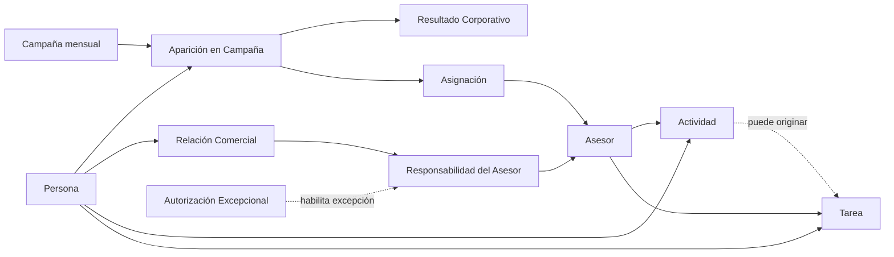

# Modelo Comercial del CRM Patrimonial

- Versión: 0.1
- Estado: Pendiente de revisión
- Fecha: 2026-08-01
- LCD: LCD-20260801-02
- ADR: ADR-024
- Issue: #31

## 1. Propósito

Describir los conceptos y reglas comerciales mínimos necesarios para representar la transición desde una Persona observada en campañas corporativas hasta una relación comercial propia, sin confundir hechos corporativos, gestión interna ni procesos técnicos de importación.

Este documento desarrolla y organiza conceptos ya definidos en el Diccionario del Dominio y en `APP LLAMADOS · Modelo de negocio`. No reemplaza el Modelo Patrimonial, el Modelo de Productos ni los futuros modelos de Casos, Oportunidades y Productos Contratados.

## 2. Alcance de esta versión

Incluye:

- Persona;
- Asesor;
- Campaña;
- Aparición en Campaña;
- Resultado Corporativo;
- Asignación;
- Relación Comercial;
- Responsabilidad del Asesor;
- Autorización Excepcional;
- Actividad;
- Tarea.

No incluye todavía el diseño detallado de:

- Caso Comercial;
- Oportunidad;
- Cotización;
- Propuesta;
- Producto Contratado;
- Perfil patrimonial;
- productos, capitales y CNS;
- autenticación, cuentas de usuario y permisos técnicos;
- tablas, columnas, índices o RLS.

## 3. Vista conceptual

El diagrama representa relaciones conceptuales, no tablas ni cardinalidades físicas definitivas.

## 4. Conceptos

### 4.1 Persona

Identidad central del CRM. Existe independientemente de campañas, asignaciones, relaciones comerciales, oportunidades o importaciones.

Reglas:

- una Persona no se crea nuevamente porque reaparezca en otra campaña;
- una Persona no se elimina porque deje de aparecer;
- una Persona puede existir por incorporación manual explícita;
- las clasificaciones corporativas Prospecto y Contacto no crean entidades distintas.

### 4.2 Asesor

Actor comercial que puede recibir asignaciones corporativas, realizar actividades y asumir responsabilidad sobre una Relación Comercial.

En esta versión, Asesor representa la identidad comercial necesaria para el dominio. La cuenta de acceso, autenticación y roles técnicos pertenecen a una capa posterior.

### 4.3 Campaña

Selección comercial concreta realizada por la compañía para un período determinado.

Una Campaña debe conservar:

- período;
- nombre corporativo original;
- descripción corporativa original;
- identidad interna estable.

Los textos corporativos se conservan como hechos de origen, pero no se consideran por sí solos identificadores confiables. Los prefijos numéricos tampoco constituyen identidad.

No se incorpora todavía una entidad `Familia de Campaña`. Las agrupaciones históricas se evaluarán sólo cuando exista evidencia suficiente.

### 4.4 Aparición en Campaña

Hecho de que una Persona fue incorporada a una Campaña concreta.

Reglas:

- una Persona puede no aparecer en ninguna Campaña;
- una Persona puede aparecer en varias Campañas del mismo período;
- la misma Aparición no se duplica por cada archivo TOTAL sucesivo;
- la Aparición no crea por sí sola una Relación Comercial;
- una Aparición pertenece a una Persona y a una Campaña específica.

### 4.5 Resultado Corporativo

Estado resumido informado por la compañía para una Aparición:

- Gestionado;
- No Gestionado.

Reglas:

- cada Aparición posee como máximo un Resultado Corporativo vigente;
- la ausencia de una Persona en un período no constituye un tercer estado;
- Gestionado no informa el detalle real ni demuestra una relación propia;
- el Resultado Corporativo no se convierte automáticamente en una Actividad interna;
- los cambios de Resultado Corporativo deben conservar trazabilidad.

### 4.6 Asignación

Vínculo temporal entre una Aparición y un Asesor durante la vigencia operativa de la Campaña.

Reglas:

- una Aparición puede no tener Asignación;
- una Asignación no crea una Relación Comercial;
- el orden de Asignación es independiente del orden informado por la carga TOTAL;
- debe conservarse historial cuando cambia o termina;
- una Asignación a otro Asesor puede bloquear la gestión salvo excepción autorizada;
- una Asignación propia permanece visible durante la Campaña activa aunque el Resultado Corporativo sea Gestionado.

### 4.7 Relación Comercial

Vínculo persistente entre una Persona y el CRM comercial propio.

Puede nacer por:

- contacto efectivo que deja continuidad comercial;
- incorporación manual autorizada;
- relación previa conocida y registrada.

No nace por:

- aparición en campaña;
- asignación;
- intento sin respuesta;
- estado corporativo Gestionado;
- importación de un archivo.

Reglas:

- una Persona tiene como máximo una Relación Comercial persistente dentro del CRM;
- la Relación puede existir sin oportunidades abiertas;
- no se reemplaza cuando cambia el Asesor responsable;
- no desaparece porque termine una Campaña;
- su futura relación con Casos y Oportunidades se incorporará en versiones posteriores.

### 4.8 Responsabilidad del Asesor

Hecho temporal que indica qué Asesor es responsable de una Relación Comercial durante un intervalo.

Reglas:

- una Relación Comercial normalmente debe tener un Asesor principal vigente;
- puede quedar temporalmente sin responsable sólo como transición o inconsistencia explícita, nunca como situación silenciosa normal;
- la ausencia temporal de responsable debe generar una alerta o pendiente de asignación y no autoriza a inventar un Asesor;
- el cambio de Asesor termina una responsabilidad e inicia otra, sin crear otra Relación Comercial;
- el historial de responsables debe conservarse;
- una responsabilidad adicional simultánea requiere Autorización Excepcional;
- principal y adicional son roles de responsabilidad, no relaciones comerciales distintas.

### 4.9 Autorización Excepcional

Hecho trazable que permite una excepción a la regla de un único Asesor responsable vigente.

Debe identificar, al menos:

- Relación Comercial afectada;
- Asesor adicional autorizado;
- usuario con rol Administrador que autoriza;
- fecha;
- motivo;
- vigencia o término, cuando corresponda.

`Administrador` no se define aquí como entidad comercial. Es un rol de autorización de un usuario del sistema.

### 4.10 Actividad

Hecho de interacción o gestión asociado siempre a una Persona y realizado por un Asesor.

Reglas:

- una Persona puede tener cero o muchas Actividades;
- una Actividad puede existir sin Caso u Oportunidad;
- una Actividad puede vincularse posteriormente a uno o varios Casos u Oportunidades;
- una gestión corporativa externa no se registra automáticamente como Actividad propia;
- un evento técnico de guardado no equivale por sí solo a una Actividad significativa.

### 4.11 Tarea

Acción futura asociada a una Persona y a un Asesor, con fecha y estado.

Reglas:

- puede crearse manualmente sin Actividad previa;
- puede originarse en una Actividad;
- cuando referencia una Actividad, ambas deben corresponder a la misma Persona y al mismo Asesor;
- puede reprogramarse conservando trazabilidad;
- su vencimiento puede alimentar vistas de agenda, alertas y cola, pero esas vistas son derivadas.

## 5. Cardinalidades conceptuales

| Relación | Cardinalidad conceptual |
|---|---|
| Persona → Aparición | 1 → 0..N |
| Campaña → Aparición | 1 → 0..N |
| Aparición → Resultado Corporativo vigente | 1 → 0..1 |
| Aparición → Asignación histórica | 1 → 0..N |
| Asesor → Asignación | 1 → 0..N |
| Persona → Relación Comercial | 1 → 0..1 |
| Relación Comercial → Responsabilidad histórica | 1 → 0..N |
| Asesor → Responsabilidad | 1 → 0..N |
| Persona → Actividad | 1 → 0..N |
| Asesor → Actividad | 1 → 0..N |
| Persona → Tarea | 1 → 0..N |
| Asesor → Tarea | 1 → 0..N |
| Actividad → Tarea originada | 1 → 0..N |

La cardinalidad histórica `0..N` permite representar una Relación recién reconocida, una transferencia incompleta o una inconsistencia heredada. Operacionalmente, una Relación debe tender a un responsable principal vigente; la ausencia temporal es una excepción visible y controlada.

Las restricciones temporales, especialmente la unicidad del responsable principal vigente y las responsabilidades adicionales autorizadas, se validarán mediante reglas y pruebas; no se deducen sólo de las cardinalidades estáticas.

## 6. Invariantes comerciales

1. No existe más de una Persona para la misma identidad canónica.
2. La Persona sobrevive a Campañas, Apariciones y Asignaciones.
3. La misma Persona puede aparecer en varias Campañas del mismo período.
4. La misma Aparición no se duplica por cargas sucesivas.
5. Aparición y Asignación son hechos diferentes.
6. Resultado Corporativo y gestión propia son conocimientos diferentes.
7. Una Persona tiene como máximo una Relación Comercial.
8. Una Relación normalmente tiene un único responsable principal vigente.
9. Una Relación puede quedar temporalmente sin responsable sólo como transición o inconsistencia explícita y alertada.
10. Dos responsables simultáneos requieren autorización trazable.
11. Una autorización no crea una segunda Relación Comercial.
12. Actividad y Tarea pertenecen siempre a una Persona y un Asesor.
13. Una Tarea no puede originarse en una Actividad de otra Persona o Asesor.

## 7. Vistas derivadas

No constituyen fuente de verdad:

- cola de trabajo;
- pendientes;
- asignados;
- agenda;
- alertas;
- contactos gestionables;
- métricas diarias;
- pipeline y proyección futura.

Se calculan desde hechos persistentes y reglas aprobadas.

## 8. Pendientes para versiones futuras

- definir la identidad lógica exacta de Campaña;
- precisar cuándo una Relación Comercial termina o sólo cambia de estado;
- incorporar Casos, Oportunidades, Cotizaciones, Propuestas y Productos Contratados;
- modelar roles, usuarios y autorizaciones técnicas;
- decidir la representación física de la Autorización Excepcional;
- validar el historial individual de teléfonos y correos;
- diseñar `next_v03` y probar estas invariantes con datos ficticios.
