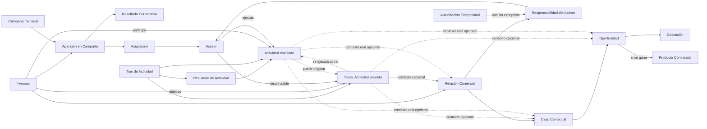

# Modelo Comercial del CRM Patrimonial

- Versión: 0.3 candidata
- Estado: Aprobado hasta LCD-20260802-01 · <span style="color:red">extensión LCD-20260804-01 pendiente de revisión</span>
- Fecha: 2026-08-04
- LCD aprobado de origen: LCD-20260801-02
- LCD aprobado de extensión: LCD-20260802-01
- ADR: ADR-024, ADR-025 y <span style="color:red">ADR-027 pendiente de revisión</span>
- Issues: #31, #34 y #52
- Motivo del cambio: incorporar el modelo mínimo aprobado de Caso Comercial, Oportunidad, Cotización, Propuesta, Pipeline, CNS y Producto Contratado, y separar la equivalencia motivacional por Agendamiento de los hechos comerciales.

## 1. Propósito

Describir los conceptos y reglas comerciales mínimos necesarios para representar la transición desde una Persona observada en campañas corporativas hasta una relación comercial propia, su desarrollo mediante Casos y Oportunidades y la eventual existencia de Productos Contratados, sin confundir hechos corporativos, gestión interna ni procesos técnicos de importación.

Este documento desarrolla y organiza los conceptos del Diccionario del Dominio y absorbió el conocimiento vigente del antecedente histórico `APP LLAMADOS · Modelo de negocio`. No reemplaza el Modelo Patrimonial ni el Modelo de Productos. ADR-025 amplía el alcance aprobado mediante ADR-024 y sustituye expresamente las hipótesis intermedias incompatibles surgidas durante su descubrimiento.

## 2. Alcance de esta versión

Incluye:

- Persona;
- Asesor;
- Campaña;
- Aparición en Campaña;
- Resultado Corporativo;
- Asignación;
- Relación Comercial;
- condición Lead de la Relación Comercial;
- Responsabilidad del Asesor;
- Autorización Excepcional;
- Tipo de Actividad;
- Resultado de Actividad;
- Actividad;
- Tarea;
- Caso Comercial;
- Oportunidad;
- Cotización;
- Propuesta como conocimiento descriptivo;
- Pipeline y etapas del Caso;
- CNS proyectados, sometidos y emitidos;
- historial descriptivo del Caso como vista derivada;
- Producto Contratado y su origen comercial.

No incluye todavía el diseño detallado de:

- Perfil patrimonial;
- catálogo y reglas particulares de productos;
- modificaciones, vigencia, término y postventa de Productos Contratados;
- autenticación, cuentas de usuario y permisos técnicos;
- tablas, columnas, índices o RLS;
- UX detallada, colores, dashboards o automatizaciones.

## 3. Vista conceptual



El diagrama representa relaciones conceptuales, no tablas ni cardinalidades físicas definitivas. `Lead` y `Cliente del Asesor` son condiciones derivadas de la Relación Comercial. La Propuesta y el historial del Caso son conocimiento descriptivo y vistas derivadas, no entidades adicionales del diagrama.

## 4. Conceptos

### 4.1 Persona

Identidad central del CRM. Existe independientemente de campañas, asignaciones, relaciones comerciales, oportunidades o importaciones.

Reglas:

- una Persona no se crea nuevamente porque reaparezca en otra campaña;
- una Persona no se elimina porque deje de aparecer;
- una Persona puede existir por incorporación manual explícita;
- las clasificaciones corporativas Prospecto y Contacto no crean entidades distintas.

### 4.2 Asesor

Actor comercial que puede recibir asignaciones corporativas, realizar actividades y asumir responsabilidad sobre una Relación Comercial o propiedad operativa sobre un Caso.

En esta versión, Asesor representa la identidad comercial necesaria para el dominio. La cuenta de acceso, autenticación y roles técnicos pertenecen a una capa posterior.

### 4.3 Campaña

Selección comercial concreta realizada por la compañía para un período determinado.

Una Campaña debe conservar:

- período;
- nombre corporativo original;
- descripción corporativa original;
- identidad interna estable.

Los textos corporativos se conservan como hechos de origen, pero no se consideran por sí solos identificadores confiables. Los prefijos numéricos tampoco constituyen identidad.

No se incorpora todavía una entidad `Familia de Campaña`. Las agrupaciones históricas se evaluarán sólo cuando exista evidencia suficiente.

### 4.4 Aparición en Campaña

Hecho de que una Persona fue incorporada a una Campaña concreta.

Reglas:

- una Persona puede no aparecer en ninguna Campaña;
- una Persona puede aparecer en varias Campañas del mismo período;
- la misma Aparición no se duplica por cada archivo TOTAL sucesivo;
- la Aparición no crea por sí sola una Relación Comercial;
- una Aparición pertenece a una Persona y a una Campaña específica;
- una Aparición válida normalmente debe tener un único Resultado Corporativo vigente;
- una Aparición sin resultado válido sólo puede conservarse como inconsistencia explícita y conciliable;
- la falta de resultado no constituye un tercer estado y no puede gobernar silenciosamente la gestionabilidad;
- un retiro corporativo confirmado durante una Campaña activa no elimina ni termina la Aparición histórica: registra que la compañía dejó de incluir a la Persona, conservando el último Resultado Corporativo conocido.

### 4.5 Resultado Corporativo

Estado resumido informado por la compañía para una Aparición:

- Gestionado;
- No Gestionado.

Reglas:

- una Aparición válida tiene normalmente exactamente un Resultado Corporativo vigente;
- la ausencia o invalidez del resultado sólo puede existir temporalmente como inconsistencia explícita, con incidencia de conciliación;
- una Aparición sin resultado válido no se considera gestionable hasta corregir o validar el antecedente;
- nunca se inventa un resultado ni se crea un tercer estado como `Desconocido`;
- la ausencia de una Persona en un período no constituye un tercer estado;
- Gestionado no informa el detalle real ni demuestra una relación propia;
- el Resultado Corporativo no se convierte automáticamente en una Actividad interna;
- los cambios de Resultado Corporativo deben conservar trazabilidad.

### 4.6 Asignación

Vínculo temporal entre una Aparición y un Asesor durante la vigencia operativa de la Campaña.

Reglas:

- una Aparición puede no tener Asignación;
- una Aparición tiene normalmente como máximo una Asignación vigente;
- una Asignación no crea una Relación Comercial;
- una carga ASIGNADOS puede observar Persona, Campaña, Aparición, Resultado Corporativo y datos de contacto, además de confirmar la Asignación, sin depender de una carga TOTAL previa;
- la Asignación puede conservar una posición propia dentro de la lista reducida del Asesor;
- la posición de ASIGNADOS es independiente de cualquier posición de la Aparición en TOTAL y ninguna debe sobrescribir a la otra;
- debe conservarse historial cuando cambia o termina;
- una Asignación a otro Asesor puede bloquear la gestión salvo excepción autorizada;
- una Asignación propia permanece visible durante la Campaña activa aunque el Resultado Corporativo sea Gestionado;
- la ausencia en una carga ASIGNADOS posterior del mismo período, Campaña activa y alcance comparable no termina automáticamente la Asignación: deja su vigencia pendiente de conciliación;
- mientras la vigencia está pendiente de conciliación, la Aparición permanece visible, pero no integra la cola normal de gestionables hasta confirmar que continúa asignada al Asesor;
- sólo un retiro de Asignación confirmado registra el término dentro del mismo período y conserva íntegramente el historial;
- si la ausencia afecta muchas filas o una sección completa, debe tratarse primero como posible problema de alcance del archivo y no como múltiples retiros individuales;
- el cambio de período termina la vigencia operativa de las Asignaciones anteriores sin generar incidencias individuales por quienes no reaparecen.

### 4.7 Relación Comercial

Vínculo persistente de continuidad comercial propia entre una Persona y el CRM, bajo la responsabilidad de uno o más Asesores conforme a las reglas de este modelo.

Nace cuando una interacción, incorporación autorizada o antecedente previo establece continuidad comercial propia. Esa continuidad puede quedar demostrada, entre otros hechos, por:

- una reunión agendada;
- un seguimiento acordado para una fecha posterior;
- una solicitud o aceptación de información que requiere continuidad;
- una necesidad concreta identificada para desarrollar;
- una relación previa conocida y registrada;
- una incorporación manual autorizada como referido o contacto propio.

No nace por:

- aparición en campaña;
- asignación;
- intento sin respuesta;
- conversación sin interés ni siguiente paso;
- estado corporativo Gestionado;
- importación de un archivo;
- presentación de una propuesta, porque para entonces la Relación ya debe existir;
- cierre de un negocio, porque el cierre cambia la condición comercial pero no crea la Relación.

Reglas:

- una Persona tiene como máximo una Relación Comercial persistente dentro del CRM;
- la Relación puede existir sin Casos ni Oportunidades abiertas;
- un Caso y una Oportunidad presuponen una Relación Comercial existente;
- no se reemplaza cuando cambia el Asesor responsable;
- no desaparece porque termine una Campaña;
- el cierre y posterior existencia de un Producto Contratado convierten a la Persona en Cliente del Asesor, sin crear otra Relación.

#### 4.7.1 Lead y otras condiciones de la Relación

`Lead` no es una Persona distinta ni una entidad paralela. Es una condición o clasificación de una Relación Comercial anterior a la existencia de un Producto Contratado.

Inicialmente deben poder distinguirse, al menos, estas situaciones conceptuales:

- Lead sin Oportunidad: existe continuidad comercial, pero todavía no se identifica un producto concreto;
- Lead con Oportunidad: existe una necesidad o contratación potencial identificable;
- Cliente del Asesor: existe al menos un Producto Contratado vigente asociado al Asesor;
- Relación dormida o inactiva: la Relación persiste, pero no hay Caso, Oportunidad ni actividad vigente que requiera atención inmediata.

Estas condiciones pueden derivarse de hechos persistentes y no deben convertirse prematuramente en una secuencia rígida de estados manuales. Una Persona puede avanzar, retroceder o reactivar su gestión sin perder la identidad de la Relación Comercial.

### 4.8 Responsabilidad del Asesor

Hecho temporal que indica qué Asesor es responsable de una Relación Comercial durante un intervalo.

Reglas:

- una Relación Comercial normalmente debe tener un Asesor principal vigente;
- puede quedar temporalmente sin responsable sólo como transición o inconsistencia explícita, nunca como situación silenciosa normal;
- la ausencia temporal de responsable debe generar una alerta o pendiente de asignación y no autoriza a inventar un Asesor;
- el cambio de Asesor termina una responsabilidad e inicia otra, sin crear otra Relación Comercial;
- el historial de responsables debe conservarse;
- una responsabilidad adicional simultánea requiere Autorización Excepcional;
- principal y adicional son roles de responsabilidad, no relaciones comerciales distintas.

### 4.9 Autorización Excepcional

Hecho trazable que permite una excepción a la regla de un único Asesor responsable vigente.

Debe identificar, al menos:

- Relación Comercial afectada;
- Asesor adicional autorizado;
- usuario con rol Administrador que autoriza;
- fecha;
- motivo;
- vigencia o término, cuando corresponda.

`Administrador` no se define aquí como entidad comercial. Es un rol de autorización de un usuario del sistema.

### 4.10 Tipo de Actividad

Vocabulario común que identifica la clase de acción prevista o realizada.

Se utiliza tanto en la Tarea como en la Actividad para evitar una categoría paralela de Tarea que duplique el significado.

Ejemplos iniciales no exhaustivos:

- Llamada;
- Reunión;
- Correo;
- WhatsApp;
- Envío de información;
- Preparación de propuesta;
- Revisión de antecedentes;
- Recepción de documentos.

Reglas:

- el Tipo de Actividad responde qué acción se prevé o se realizó;
- el objetivo de la Tarea responde para qué se realizará;
- el resultado de la Actividad responde qué ocurrió;
- cada Tipo de Actividad define qué Resultados de Actividad estructurados admite;
- una combinación de Tipo y Resultado incompatible debe rechazarse;
- el catálogo exacto y su representación física se definirán durante el diseño lógico;
- el Tipo de Actividad previsto no se sobrescribe con el Tipo realmente realizado.

#### 4.10.1 Resultado de Actividad

Clasificación estructurada de lo que ocurrió durante una Actividad concreta.

Ejemplos iniciales:

- para Llamada: No contestó, Conversación efectiva, Número inválido, Buzón de voz;
- para Reunión: Realizada, Cliente no asistió, Suspendida, Reagendada;
- para Envío de información: Enviada, Entrega fallida;
- para Preparación de propuesta: Preparada, No viable, Pendiente de antecedentes.

Reglas:

- el Resultado pertenece a una Actividad y debe ser compatible con su Tipo;
- describe únicamente lo ocurrido durante esa Actividad;
- puede complementarse con una nota libre, pero no ser reemplazado por ella;
- no incorpora como parte de su significado la creación de una Tarea, Relación Comercial, Caso, Oportunidad u otro hecho posterior;
- expresiones como `Agenda reunión`, `Volver a llamar` o `Información enviada` no deben mezclar acción, resultado y próximo paso en una sola etiqueta;
- las consecuencias se registran como hechos independientes y trazables.

### 4.11 Actividad

Hecho de interacción o gestión efectivamente ocurrido, asociado siempre a una o varias Personas participantes y ejecutado por un único Asesor.

Debe poder conservar, al menos:

- una o varias Personas participantes;
- Asesor ejecutor;
- Tipo de Actividad realmente realizado;
- fecha y hora efectiva;
- Resultado de Actividad estructurado y compatible con el Tipo;
- nota de ejecución opcional.

Reglas:

- una Persona puede participar en cero o muchas Actividades;
- toda Actividad debe tener al menos una Persona participante;
- una Actividad puede incluir una o varias Personas sin duplicarse por cada participante;
- una única llamada, reunión u otra acción real se registra como una sola Actividad, aunque involucre a varias Personas;
- la participación de una Persona no crea por sí sola una Relación Comercial;
- una Actividad puede existir sin Relación Comercial para una o varias de sus Personas participantes;
- una Actividad puede originar el nacimiento de una Relación Comercial sólo para las Personas cuya participación demuestra continuidad comercial propia;
- las consecuencias comerciales se evalúan individualmente para cada Persona participante;
- una Actividad puede existir sin Tarea previa;
- una Actividad puede originar cero, una o varias Tareas futuras;
- las Personas objetivo de una Tarea originada pueden coincidir total o parcialmente con las participantes de la Actividad de origen, o ser distintas cuando el origen explica una derivación, referido u otro próximo paso legítimo;
- la referencia de origen no convierte a una Persona objetivo en participante de la Actividad anterior ni crea una Relación Comercial para ella;
- una Actividad puede constituir la ejecución de cero, una o varias Tareas compatibles;
- cuando ejecuta una o varias Tareas, todas sus Personas objetivo deben estar comprendidas entre las Personas participantes de la Actividad y el Asesor ejecutor debe ser el responsable vigente de cada Tarea;
- el Tipo realmente realizado se conserva aunque difiera del Tipo previsto; esa diferencia no modifica retroactivamente la Tarea;
- una Actividad puede existir sin Relación Comercial, Caso u Oportunidad;
- puede vincularse opcionalmente a una Relación Comercial y a uno o varios Casos u Oportunidades cuando ese contexto represente lo que realmente ocurrió;
- una gestión corporativa externa no se registra automáticamente como Actividad propia;
- un evento técnico de guardado no equivale por sí solo a una Actividad significativa;
- la nota libre complementa, pero no sustituye, el resultado estructurado;
- una consecuencia posterior, como crear una Tarea, una Relación Comercial, un Caso o una Oportunidad, se registra separadamente y puede conservar referencia a la Actividad que la originó;
- una Actividad registrada no puede eliminarse ni sobrescribirse silenciosamente;
- una corrección o anulación debe conservar el contenido original y su trazabilidad.

#### 4.11.1 Corrección y anulación de Actividad

Una Actividad representa un hecho histórico. Cuando fue registrada con información errónea, debe corregirse o anularse mediante un hecho trazable, sin reemplazar silenciosamente el registro original.

Toda corrección debe conservar, al menos:

- contenido original;
- contenido corregido;
- fecha de corrección;
- actor o usuario que corrige;
- motivo.

Toda anulación debe conservar, al menos:

- Actividad anulada;
- fecha de anulación;
- actor o usuario que anula;
- motivo.

Reglas:

- para la operación y las métricas gobierna la versión corregida vigente;
- una Actividad anulada permanece en la trazabilidad, pero no cuenta para métricas;
- una Actividad anulada no puede justificar el nacimiento de una Relación Comercial ni completar Tareas;
- la corrección o anulación no elimina automáticamente las Tareas, Relaciones Comerciales, Casos, Oportunidades u otras consecuencias previamente originadas;
- las consecuencias potencialmente afectadas deben quedar advertidas para revisión, porque pueden haber sido confirmadas posteriormente por otros hechos;
- en una Actividad con varias Personas, la revisión de consecuencias se realiza individualmente para cada Persona afectada;
- una anulación no debe convertirse en una eliminación física silenciosa.

### 4.12 Tarea

Previsión de una Actividad futura pendiente de realización, asociada siempre a una o varias Personas objetivo y a un único Asesor responsable vigente.

Toda Tarea debe conservar, al menos:

- una o varias Personas objetivo;
- Tipo de Actividad previsto;
- objetivo o descripción de lo que se pretende realizar;
- estado;
- Asesor responsable vigente.

Puede conservar además:

- contexto o instrucciones opcionales;
- fecha y hora prevista de ejecución;
- fecha límite;
- vínculos contextuales opcionales con Relación Comercial, Casos u Oportunidades.

No existe una `Nota de programación` separada: el contexto concentra los antecedentes, instrucciones o razones relevantes para ejecutar la Tarea.

Reglas:

- toda Tarea debe incluir al menos una Persona objetivo;
- una Tarea puede prever una acción individual o grupal;
- una única acción futura grupal se representa mediante una sola Tarea y no mediante copias por cada Persona;
- una Tarea puede incluir Personas que todavía no poseen Relación Comercial;
- crear una Tarea no crea por sí solo una Relación Comercial para ninguna de sus Personas;
- una Tarea puede crearse manualmente sin Actividad previa;
- una Tarea puede originarse en una Actividad;
- cuando posee una Actividad de origen, ésta explica por qué se creó la Tarea, pero sus Personas objetivo no necesitan haber participado en la Actividad anterior;
- una Persona objetivo que no participó en la Actividad de origen no se incorpora retroactivamente como participante ni adquiere por ello una Relación Comercial;
- una Tarea representa exactamente una Actividad futura prevista;
- la fecha prevista y la fecha límite no son obligatorias, pero la ausencia de programación temporal debe quedar visible e incentivarse su corrección;
- una Tarea pendiente sin programación es `Sin programar` como condición derivada, no como estado almacenado;
- una Tarea pendiente cuya fecha aplicable venció es `Atrasada` como condición derivada, no como estado almacenado;
- los estados mínimos propios de la Tarea son Pendiente, Completada y Cancelada;
- ejecutar una Tarea genera una Actividad vinculada y completa la Tarea, aunque el resultado no alcance el objetivo comercial;
- la Actividad de ejecución debe incluir a todas las Personas objetivo de la Tarea, aunque puede incluir además a otras Personas participantes;
- una Tarea completada por ejecución tiene una única Actividad de ejecución;
- una misma Actividad puede ejecutar y completar varias Tareas compatibles cuando las Personas objetivo de cada Tarea están comprendidas entre sus participantes y el Asesor ejecutor coincide con el responsable vigente de cada Tarea;
- no deben duplicarse Actividades para representar artificialmente una única acción ocurrida;
- si después de ejecutar se requiere otro intento o acción, se crea una nueva Tarea;
- cancelar una Tarea no genera una Actividad, pero debe conservar fecha, actor o usuario y motivo de cancelación;
- reprogramar una Tarea no genera una Actividad y debe conservar trazabilidad del cambio temporal;
- la ejecución no sobrescribe el Tipo previsto, el objetivo, el contexto ni los vínculos comerciales previstos;
- la Actividad de ejecución debe ser realizada por el Asesor responsable vigente de la Tarea en ese momento;
- las consecuencias comerciales de ejecutar una Tarea grupal se determinan individualmente para cada Persona;
- una Tarea Pendiente puede modificarse, pero los cambios que alteren el compromiso futuro deben conservar trazabilidad;
- una Tarea Completada o Cancelada no puede reescribirse como si continuara Pendiente; cualquier rectificación posterior debe registrarse explícitamente.

La experiencia normal debe seguir siendo simple: al ejecutar una Tarea, ésta se completa automáticamente. La posibilidad de asociar la misma Actividad a otras Tareas compatibles, incorporar varias Personas o vincular varios Casos u Oportunidades debe presentarse sólo mediante divulgación progresiva y cuando el usuario lo necesite.

#### 4.12.1 Reasignación de Tarea

Cambio explícito del Asesor responsable de una Tarea pendiente.

Debe conservar, al menos:

- Asesor responsable anterior;
- Asesor responsable nuevo;
- fecha del cambio;
- motivo.

Reglas:

- una Tarea pendiente puede reasignarse antes de su ejecución;
- la reasignación no modifica retroactivamente quién fue responsable antes del cambio;
- la transferencia de la Relación Comercial no reasigna automáticamente las Tareas pendientes;
- las Tareas cuyo responsable ya no coincide con el responsable principal vigente de una o varias Relaciones involucradas deben quedar visibles para resolución;
- cada Tarea pendiente puede reasignarse, cancelarse o permanecer excepcionalmente con el Asesor anterior mediante una decisión explícita;
- una Tarea nunca cambia de responsable silenciosamente.

#### 4.12.2 Modificación y rectificación de Tarea

Una Tarea Pendiente representa un compromiso futuro todavía modificable. Debe conservarse historia cuando cambian elementos que alteran sustancialmente ese compromiso, entre ellos:

- Personas objetivo;
- Asesor responsable;
- Tipo de Actividad previsto;
- objetivo;
- fecha y hora prevista;
- fecha límite;
- cancelación;
- contexto comercial previsto cuando su cambio altera sustancialmente el compromiso.

Los ajustes menores de redacción del contexto pueden tratarse como edición ordinaria cuando no alteran el compromiso. Una Tarea Completada o Cancelada conserva su estado histórico y no se modifica silenciosamente. Toda rectificación posterior debe registrar actor o usuario, fecha, motivo y contenido corregido.

#### 4.12.3 Vinculación contextual de Tareas y Actividades

Las Personas y el Asesor son vínculos esenciales de toda Tarea y Actividad. La Relación Comercial, los Casos y las Oportunidades son contexto opcional.

Reglas:

- una Tarea o Actividad puede existir sin Caso ni Oportunidad;
- vincular contexto comercial no crea automáticamente Relaciones, Casos ni Oportunidades;
- una Oportunidad vinculada debe pertenecer a uno de los Casos vinculados o permitir derivar inequívocamente su Caso actual;
- la Relación Comercial no se duplica como fuente de verdad cuando puede derivarse inequívocamente;
- la Tarea conserva el contexto previsto;
- la Actividad conserva el contexto real de lo ocurrido;
- al ejecutar una Tarea, la Actividad puede heredar sus vínculos como propuesta inicial, pero debe corregirlos cuando la acción real trató otro contexto;
- una diferencia entre planificación y ejecución no sobrescribe silenciosamente la Tarea;
- una acción puede tratar excepcionalmente varios Casos u Oportunidades, manteniendo simple el flujo habitual.

### 4.13 Caso Comercial

Negocio concreto dentro de una Relación Comercial: un proceso de decisión que el Asesor administra y espera resolver como una unidad indivisible.

Reglas:

- una Relación Comercial puede existir sin Casos y contener varios Casos simultáneos o sucesivos;
- un Caso puede nacer en `Nuevo` antes de identificar una Oportunidad concreta;
- para nacer, debe estar vinculado a una Persona, a su Relación Comercial y poseer un Asesor propietario;
- puede contener cero, una o varias Oportunidades;
- varias Oportunidades pueden permanecer en un mismo Caso cuando son alternativas o componentes cuya decisión y avance se administran conjuntamente;
- dos desarrollos que necesiten etapas, tiempos, sometimientos, emisiones o resultados independientes constituyen Casos distintos;
- la coincidencia de Persona, objetivo, fecha o producto no basta por sí sola para unir Casos;
- posee una única etapa actual, una sola tarjeta operativa y un resultado final de `Ganado` o `Perdido`;
- organiza el desarrollo comercial propio y no reemplaza oportunidades formales exigidas por sistemas corporativos.

### 4.14 Oportunidad

Contratación potencial individualizable de un producto concreto evaluado dentro de un Caso.

Reglas:

- una necesidad general o conversación exploratoria sin producto potencial concreto no crea una Oportunidad;
- nace cuando existe un producto potencial concreto y una posibilidad comercial que justifica evaluarlo;
- presupone una Relación Comercial y un Caso existentes;
- pertenece exactamente a un Caso actual y no existe suelta;
- conserva la identidad de la contratación potencial, mientras el Caso conserva la identidad del negocio;
- mientras el Caso permanece activo, las Oportunidades son alternativas o componentes candidatos y no unidades independientes del Pipeline;
- al ganarse el Caso, las contratadas quedan identificadas como ganadas y las restantes descartadas históricamente;
- al perderse el Caso, ninguna Oportunidad resulta ganada;
- todo traslado entre Casos conserva origen, destino, fecha, actor e historia.

### 4.15 Cotización

Configuración específica de una Oportunidad.

Reglas:

- una Oportunidad puede existir antes de su primera Cotización y luego tener una o varias;
- varias Cotizaciones pertenecen a la misma Oportunidad cuando son configuraciones mutuamente excluyentes de una única contratación potencial;
- diferencias de capital, prima, cobertura, régimen, aporte, costo, plazo u otra configuración no crean por sí solas una Oportunidad distinta;
- existen Oportunidades distintas cuando representan contratos individualizables que podrían celebrarse y persistir simultáneamente;
- pueden existir varias Oportunidades del mismo producto;
- una diferencia impuesta por un CRM corporativo no redefine automáticamente el dominio propio;
- cada Cotización pertenece exactamente a una Oportunidad;
- una Cotización no sustituye al Producto Contratado ni demuestra que la contratación ocurrió;
- cuando una Oportunidad se gana, se identifica una única Cotización seleccionada y las restantes quedan como antecedentes históricos.

Una Cotización puede conservar capitales, costos y CNS descriptivos de su configuración, pero esos valores no gobiernan la proyección vigente del Caso ni se suman automáticamente. Una taxonomía todavía incompleta no debe convertirse prematuramente en una restricción física irreversible. Las combinaciones aparentemente incoherentes se tratan como advertencias confirmables mientras no contradigan una invariante aprobada.

### 4.16 Propuesta

Conocimiento descriptivo de lo que el Asesor decide presentar al cliente dentro de un Caso.

Reglas:

- vive como descripción comprensible dentro del Caso;
- puede apoyarse en Oportunidades, Cotizaciones, Tareas, Actividades, notas y documentos;
- no constituye una entidad estructurada independiente;
- no se crean entidades `Propuesta`, `Alternativa de Propuesta`, `Versión de Propuesta`, `Composición de Propuesta` ni `Historial de Propuesta`;
- preparar, enviar o presentar información puede registrarse mediante Tareas y Actividades vinculadas al Caso;
- un documento, correo, simulación o PDF puede conservarse como evidencia, pero no convierte automáticamente la Propuesta en entidad;
- la etapa `Propuesta` expresa el grado de elaboración del negocio y no altera esta decisión;
- si la operación futura exige identidad, versionado, aceptación, vigencia, reutilización o trazabilidad regulatoria propia, su promoción a entidad requiere otro LCD.

### 4.17 Pipeline, etapa y resultado del Caso

El Caso es la unidad canónica del Pipeline, la navegación operativa y la medición de CNS por etapa.

Etapas mínimas:

```text
Nuevo
→ Pendiente
→ Propuesta
→ En Firma
→ Sometido
→ Emitido
```

Reglas generales:

- cada Caso activo posee exactamente una etapa actual;
- el Kanban muestra una sola tarjeta por Caso;
- mover la tarjeta cambia la etapa del Caso completo;
- las Oportunidades no poseen etapas independientes;
- un Caso no aparece simultáneamente en dos columnas;
- la tarjeta y los totales son vistas derivadas;
- todo cambio conserva etapa anterior, etapa nueva, fecha y actor.

Requisitos por etapa:

- `Nuevo`: Persona, Relación Comercial y Asesor propietario; no exige Oportunidades, Cotizaciones, CNS ni fechas;
- `Pendiente`: los mismos requisitos estructurales; se recomienda descripción suficiente, sin bloqueo adicional;
- `Propuesta`: proyección vigente de CNS, fecha estimada de sometimiento y fecha estimada de emisión; la ausencia de Cotizaciones genera advertencia confirmable, no bloqueo;
- `En Firma`: una o más Oportunidades aceptadas por el cliente y una Cotización vigente seleccionada para cada una, además de proyección y fechas;
- `Sometido`: una o más Oportunidades con documentación contractual firmada, CNS sometidos y fecha efectiva; registrar el hecho y cambiar de etapa es una única operación;
- `Emitido`: una o más Oportunidades aceptadas por la compañía, Cotización seleccionada y Producto Contratado para cada Oportunidad ganada, CNS emitidos y fecha efectiva; registrar la emisión y cambiar de etapa es una única operación que determina `Ganado`.

Resultado:

- `Ganado`: el Caso alcanzó `Emitido` y obtuvo al menos una contratación;
- `Perdido`: cierre antes de `Emitido` sin ninguna contratación; no es una etapa y conserva la última etapa alcanzada, fecha y motivo;
- no existe `parcialmente ganado`;
- un Caso Ganado identifica Oportunidades ganadas y descarta históricamente las restantes;
- un Caso Perdido no posee Oportunidades ganadas;
- una Oportunidad que conserve posibilidad independiente después del cierre debe separarse antes en otro Caso.

Movimientos:

- los Casos pueden avanzar o retroceder normalmente entre `Nuevo`, `Pendiente`, `Propuesta` y `En Firma`, cumpliendo requisitos de destino y conservando historial;
- los saltos de etapas anteriores son advertencias confirmables cuando se cumplen los requisitos de destino;
- ingresar a `Sometido` o `Emitido` exige registrar el hecho real en la misma operación;
- abandonar `Sometido` es una corrección excepcional y motivada;
- un Caso `Emitido` sólo cambia mediante rectificación o anulación explícita de la emisión;
- un Caso `Perdido` puede reabrirse recuperando su última etapa sin borrar el cierre anterior.

### 4.18 CNS del Caso

CNS es una magnitud comercial y no una entidad autónoma.

El Caso conserva tres clases de conocimiento:

1. **Proyección vigente:** monto manual de CNS proyectados, fecha estimada de sometimiento y fecha estimada de emisión. La revisión más reciente gobierna la operación y las anteriores permanecen trazables con fecha y actor.
2. **Sometimiento real:** monto efectivamente sometido y fecha efectiva. Fundamenta `Sometido` y no reescribe la proyección.
3. **Emisión real:** monto efectivamente emitido y fecha efectiva. Fundamenta `Emitido`, determina `Ganado` y no reescribe el sometimiento.

Reglas:

- la proyección pertenece al Caso completo y no se distribuye entre Oportunidades;
- proyección, sometimiento y emisión no se sobrescriben;
- una revisión modifica la expectativa actual, no hechos reales ya ocurridos;
- sometimiento y emisión sólo se corrigen o anulan mediante operaciones explícitas y trazables;
- para el stock operativo, el Caso aporta CNS únicamente a su etapa actual;
- los valores previos permanecen como historia, pero no se suman nuevamente;
- las diferencias expresan la evolución real del mismo negocio y no crean saldos parciales;
- los reportes de flujo pueden mostrar hechos ocurridos en un período, pero no sumarlos como producción independiente;
- una misma magnitud no puede computarse simultáneamente en varias etapas.

Los CNS reconocidos con posterioridad y el capital asociado a la contratación son hechos distintos de los CNS emitidos. Este modelo mínimo no los implementa todavía, pero tampoco los equipara ni los elimina.

### 4.18.1 Equivalencia motivacional desde Agendamientos

<span style="color:red">APP LLAMADOS puede mostrar una expectativa motivacional derivada de los Agendamientos. Esta proyección parte de dos parámetros configurables para el mes: CNS esperados por Agendamiento y pesos esperados por CNS.</span>

<span style="color:red">Para el mes vigente al abrir este lote, la Meta Mensual configurada por el Asesor es de **189 Agendamientos**, la equivalencia es de **2,5 CNS esperados por Agendamiento** y el valor de referencia es de **$10.000 CLP por CNS**. Por tanto, la meta equivale a **472,5 CNS esperados** y **$4.725.000 CLP esperados**.</span>

<span style="color:red">Reglas:</span>

- <span style="color:red">la Meta Mensual se lee del valor que el Asesor guarda en Ajustes; ningún valor local obsoleto ni una meta histórica del contrato Legacy puede reemplazarla;</span>
- <span style="color:red">un Agendamiento real continúa siendo el Resultado Diario final `Agenda` de una Persona y fecha local;</span>
- <span style="color:red">los CNS y pesos mostrados por el cockpit se calculan al leer los Agendamientos de la ventana seleccionada;</span>
- <span style="color:red">la equivalencia esperada es un supuesto de planificación y motivación, no una Cotización, una proyección de Caso, CNS sometidos, CNS emitidos, CNS reconocidos, remuneración ni ingreso devengado;</span>
- <span style="color:red">las ventanas deben declarar su alcance exacto: últimos 60 minutos, hoy, semana calendario y mes calendario;</span>
- <span style="color:red">el pulso se actualiza al registrar un nuevo Resultado Diario; no se prorratea una ganancia ficticia por minuto;</span>
- <span style="color:red">la próxima Agenda puede expresarse como `+2,5 CNS / +$25.000 esperados` para mantener visible el incentivo inmediato;</span>
- <span style="color:red">la futura proyección comercial de CRM Patrimonial Next continuará derivándose de Casos, Oportunidades, Cotizaciones y hechos de producción, sin reutilizar esta equivalencia como fuente de verdad.</span>

### 4.19 Historial descriptivo del Caso

No se crea una entidad independiente llamada `Historial`.

El Caso conserva:

- una descripción o resumen vigente, editable por el Asesor;
- notas descriptivas fechadas cuando sea necesario conservar contexto;
- Tareas y Actividades vinculadas;
- cambios de etapa y resultado;
- revisiones de proyección;
- hechos de sometimiento y emisión;
- referencias documentales cuando correspondan.

La vista histórica se deriva cronológicamente de esos antecedentes.

Reglas:

- editar la descripción vigente no altera los hechos históricos;
- una nota complementa el contexto, pero no sustituye una Actividad, un cambio de etapa ni otro hecho estructurado;
- las notas no poseen estados, aprobaciones ni ciclo de vida propio;
- la Propuesta continúa siendo conocimiento descriptivo y no una entidad;
- documentos o correos pueden conservarse como evidencia sin transformarse en la fuente de verdad del Caso.

### 4.20 Separación de una Oportunidad en un nuevo Caso

Operación excepcional y explícita.

Reglas:

- la Oportunidad se traslada y no se copia;
- conserva identidad y Cotizaciones;
- el nuevo Caso pertenece a la misma Persona y Relación Comercial;
- conserva por defecto el mismo Asesor propietario;
- comienza por defecto en la etapa del Caso original al momento de la separación;
- debe cumplir los requisitos de esa etapa;
- las proyecciones del Caso original y del nuevo Caso se revisan expresamente para impedir duplicación de CNS;
- los hechos anteriores permanecen en el contexto donde ocurrieron y no se reescriben retroactivamente;
- ambos Casos conservan referencia de separación, fecha, actor, origen y destino;
- después de la separación, cada Caso avanza, se gana o se pierde independientemente;
- la capacidad se expone mediante divulgación progresiva y no complica el flujo habitual.

### 4.21 Producto Contratado

Contrato efectivamente vigente originado por una Oportunidad ganada.

Cadena de origen:

```text
Caso Emitido y Ganado
└── Oportunidad ganada
    └── Cotización seleccionada
        └── Producto Contratado
```

Reglas:

- un Caso `Emitido` posee al menos una Oportunidad ganada;
- cada Oportunidad ganada representa una contratación obtenida;
- cada Oportunidad ganada identifica exactamente una Cotización seleccionada;
- las demás Cotizaciones quedan descartadas históricamente;
- cada Oportunidad ganada origina exactamente un Producto Contratado;
- varias Oportunidades ganadas originan varios Productos Contratados;
- nace cuando la compañía acepta plenamente el contrato y éste entra en vigencia;
- conserva referencia al Caso, la Oportunidad y la Cotización de origen;
- la Cotización permanece como antecedente de lo ofrecido y no se transforma en Producto Contratado;
- puede evolucionar posteriormente de manera independiente;
- modificaciones, vigencia o término posteriores no reescriben la Cotización ni cambian retroactivamente el resultado Ganado del Caso.

## 5. Cardinalidades conceptuales

| Relación | Cardinalidad conceptual |
|---|---|
| Persona → Aparición | 1 → 0..N |
| Campaña → Aparición | 1 → 0..N |
| Aparición → Resultado Corporativo vigente | 1 → 0..1 |
| Aparición → Asignación histórica | 1 → 0..N |
| Asesor → Asignación | 1 → 0..N |
| Persona → Relación Comercial | 1 → 0..1 |
| Relación Comercial → Responsabilidad histórica | 1 → 0..N |
| Asesor → Responsabilidad | 1 → 0..N |
| Relación Comercial → Caso Comercial | 1 → 0..N |
| Caso Comercial → Oportunidad | 1 → 0..N |
| Oportunidad → Caso Comercial actual | 1 → 1 |
| Oportunidad → Cotización | 1 → 0..N |
| Cotización → Oportunidad | 1 → 1 |
| Oportunidad ganada → Cotización seleccionada | 1 → 1 |
| Oportunidad ganada → Producto Contratado | 1 → 1 |
| Producto Contratado → Oportunidad de origen | 1 → 1 |
| Tipo de Actividad → Resultado permitido | 1 → 0..N |
| Tipo de Actividad → Tarea | 1 → 0..N |
| Tipo de Actividad → Actividad | 1 → 0..N |
| Resultado de Actividad → Actividad | 1 → 0..N |
| Persona → Actividad | 1 → 0..N |
| Actividad → Personas participantes | 1 → 1..N |
| Asesor → Actividad | 1 → 0..N |
| Persona → Tarea | 1 → 0..N |
| Tarea → Personas objetivo | 1 → 1..N |
| Asesor → Tarea | 1 → 0..N |
| Tarea o Actividad → Relación Comercial contextual | 1 → 0..1 |
| Tarea o Actividad → Casos contextuales | 1 → 0..N |
| Tarea o Actividad → Oportunidades contextuales | 1 → 0..N |
| Actividad → Tareas originadas | 1 → 0..N |
| Tarea → Actividad de origen | 1 → 0..1 |
| Tarea → Actividad de ejecución | 1 → 0..1 |
| Actividad → Tareas ejecutadas | 1 → 0..N |
| Actividad → correcciones o anulaciones | 1 → 0..N |
| Tarea → Asesores responsables históricos | 1 → 1..N |
| Tarea → cambios significativos históricos | 1 → 0..N |

La cardinalidad `0..1` del Resultado Corporativo permite representar temporalmente una fuente incompleta o inválida. En operación normal, una Aparición válida debe tener exactamente un resultado vigente; la ausencia es una inconsistencia visible y conciliable, no un estado del negocio.

La cardinalidad histórica `0..N` de Asignación permite conservar cambios y términos. En operación normal, una Aparición tiene como máximo una Asignación vigente. La ausencia dentro de la misma Campaña activa y en una carga ASIGNADOS comparable no termina la Asignación por sí sola: deja su vigencia pendiente de conciliación y requiere una resolución trazable.

La cardinalidad histórica `0..N` de Responsabilidad permite representar una Relación recién reconocida, una transferencia incompleta o una inconsistencia heredada. Operacionalmente, una Relación debe tender a un responsable principal vigente; la ausencia temporal es una excepción visible y controlada.

Una Relación puede existir sin Casos. Un Caso puede existir inicialmente sin Oportunidades, pero toda Oportunidad pertenece exactamente a un Caso actual. Una Oportunidad puede tener varias Cotizaciones, mientras una Cotización pertenece exactamente a una Oportunidad.

Actividad–Persona y Tarea–Persona son relaciones de muchos a muchos. Cada Actividad y cada Tarea deben incluir al menos una Persona, mientras una Persona puede participar en muchas de ellas. La representación física de esta participación se definirá durante el diseño lógico.

Los vínculos de Tareas y Actividades con Relación Comercial, Casos y Oportunidades son contextuales y opcionales. No sustituyen los vínculos esenciales con Personas y Asesor ni crean automáticamente entidades comerciales.

La Actividad que origina una Tarea y la Actividad que ejecuta una Tarea cumplen funciones diferentes. La Actividad de origen explica el nacimiento del compromiso y puede involucrar a Personas distintas; la Actividad de ejecución debe incluir a todas las Personas objetivo de la Tarea. Una misma Actividad puede originar varias Tareas futuras y también ejecutar varias Tareas compatibles, pero cada Tarea completada por ejecución se vincula a una sola Actividad de ejecución.

El historial de responsables de una Tarea permite preservar los cambios explícitos de Asesor sin alterar retroactivamente los hechos previos. Su representación física se definirá en el diseño lógico.

Las correcciones y anulaciones de Actividad, junto con los cambios significativos de Tarea, representan trazabilidad histórica. Su representación física se decidirá posteriormente sin perder el contenido original ni los motivos del cambio.

Las restricciones temporales y de consistencia se validarán mediante reglas y pruebas; no se deducen sólo de las cardinalidades estáticas.

## 6. Invariantes comerciales

1. No existe más de una Persona para la misma identidad canónica.
2. La Persona sobrevive a Campañas, Apariciones y Asignaciones.
3. La misma Persona puede aparecer en varias Campañas del mismo período.
4. La misma Aparición no se duplica por cargas sucesivas.
5. Una Aparición válida normalmente tiene exactamente un Resultado Corporativo vigente.
6. Una Aparición sin resultado válido es una inconsistencia explícita, conciliable y no gestionable; no constituye un tercer estado.
7. Aparición y Asignación son hechos diferentes.
8. Una Aparición tiene normalmente como máximo una Asignación vigente.
9. Una ausencia aislada en ASIGNADOS comparable no termina automáticamente la Asignación.
10. Resultado Corporativo y gestión propia son conocimientos diferentes.
11. Una Persona tiene como máximo una Relación Comercial.
12. La Relación nace con continuidad comercial propia, no con campaña, asignación, propuesta ni cierre.
13. `Lead` es una condición de la Relación Comercial, no una entidad distinta.
14. El Producto Contratado convierte a la Persona en Cliente del Asesor sin crear otra Relación.
15. Una Relación normalmente tiene un único responsable principal vigente.
16. Una Relación puede quedar temporalmente sin responsable sólo como transición o inconsistencia explícita y alertada.
17. Dos responsables simultáneos requieren autorización trazable.
18. Una autorización no crea una segunda Relación Comercial.
19. Toda Tarea pertenece a una o varias Personas y a un único Asesor responsable; toda Actividad pertenece a una o varias Personas y a un único Asesor ejecutor.
20. Tarea y Actividad utilizan el mismo catálogo de Tipos de Actividad.
21. Cada Tipo de Actividad admite sólo Resultados de Actividad compatibles.
22. El Resultado de Actividad describe lo ocurrido y no incorpora consecuencias posteriores.
23. Una Tarea representa exactamente una Actividad futura prevista y debe poseer Tipo y objetivo.
24. El contexto de la Tarea es opcional; no existe una Nota de programación independiente.
25. La programación temporal de una Tarea es opcional, pero su ausencia debe ser visible como condición derivada.
26. Una Tarea ejecutada genera una Actividad y queda Completada aunque no alcance el objetivo comercial.
27. Cada Tarea completada por ejecución tiene una única Actividad de ejecución.
28. Una Actividad puede ejecutar varias Tareas compatibles cuyas Personas objetivo están comprendidas entre sus participantes y cuyo Asesor ejecutor coincide con el responsable vigente de cada Tarea.
29. No se duplican Actividades para representar una única acción real que resolvió varias Tareas o involucró a varias Personas.
30. Una nueva tentativa posterior requiere una nueva Tarea.
31. La Actividad de ejecución de una Tarea debe incluir a todas sus Personas objetivo y ser ejecutada por el mismo Asesor responsable.
32. Las Personas objetivo de una Tarea originada pueden ser distintas de las participantes de la Actividad de origen.
33. Una referencia de origen no convierte retroactivamente a una Persona en participante ni crea para ella una Relación Comercial.
34. El resultado estructurado y la nota libre de una Actividad son conocimientos distintos.
35. Reprogramar o cancelar una Tarea no constituye una Actividad.
36. La creación de Tareas, Relaciones Comerciales, Casos u Oportunidades derivadas de una Actividad se registra como hechos independientes.
37. Las métricas de llamada efectiva, agendamiento y seguimiento se derivan de Actividades, Resultados y Tareas, no de etiquetas que mezclen varios conocimientos.
38. La reasignación de una Tarea pendiente es explícita y conserva Asesor anterior, Asesor nuevo, fecha y motivo.
39. Transferir una Relación Comercial no reasigna automáticamente sus Tareas pendientes.
40. La Actividad de ejecución es realizada por el Asesor responsable vigente de la Tarea en el momento de ejecutarla.
41. Una Actividad registrada no se elimina ni sobrescribe silenciosamente.
42. Toda corrección o anulación de Actividad conserva original, cambio, actor o usuario, fecha y motivo.
43. Una Actividad anulada no cuenta para métricas, no justifica una Relación Comercial y no completa Tareas.
44. Las consecuencias de una Actividad corregida o anulada se revisan y no se eliminan automáticamente.
45. Los cambios sustantivos de una Tarea Pendiente conservan historia; una Tarea Completada o Cancelada sólo se rectifica explícitamente.
46. Toda Actividad y toda Tarea tiene al menos una Persona participante u objetivo.
47. Una interacción grupal real se registra como una única Actividad y una acción grupal futura como una única Tarea.
48. La participación en una Actividad o Tarea no crea automáticamente una Relación Comercial.
49. Las consecuencias comerciales de una Actividad o Tarea grupal se determinan individualmente para cada Persona.
50. Una Tarea grupal puede incluir Personas sin Relación Comercial previa.
51. TOTAL y ASIGNADOS pueden observar los mismos hechos de Persona, Campaña, Aparición, Resultado Corporativo y datos de contacto.
52. ASIGNADOS agrega la pertenencia temporal al Asesor y puede procesarse antes o después de TOTAL sin duplicar hechos.
53. La posición de ASIGNADOS pertenece a la lista del Asesor y es independiente de cualquier posición de TOTAL.
54. Una ausencia en ASIGNADOS comparable dentro de una Campaña activa deja la vigencia pendiente de conciliación; no termina la Asignación automáticamente ni mantiene a la Aparición en la cola normal de gestionables.
55. Un retiro corporativo confirmado en TOTAL conserva la Aparición histórica y el último Resultado Corporativo conocido.
56. Un retiro de Asignación confirmado en ASIGNADOS termina la Asignación vigente y conserva su historial.
57. Un Caso siempre pertenece a una Persona, su Relación Comercial y un Asesor propietario.
58. Una Relación puede existir sin Casos y un Caso puede existir inicialmente sin Oportunidades.
59. Toda Oportunidad pertenece exactamente a un Caso actual.
60. Toda Cotización pertenece exactamente a una Oportunidad.
61. El Caso es la unidad indivisible del Pipeline y posee exactamente una etapa actual cuando está activo.
62. Las Oportunidades no poseen etapas independientes ni generan tarjetas propias del Pipeline.
63. `Perdido` es un resultado de cierre y no una etapa.
64. `Emitido` determina `Ganado`; un Caso Perdido no posee Oportunidades ganadas.
65. Ingresar a `Propuesta`, `En Firma`, `Sometido` o `Emitido` exige los antecedentes definidos para la etapa de destino.
66. Sometimiento y emisión se registran atómicamente con sus cambios de etapa.
67. Los hechos de etapa, resultado, sometimiento y emisión no se sobrescriben silenciosamente.
68. CNS proyectados, sometidos y emitidos son conocimientos distintos y no se sustituyen entre sí.
69. La proyección pertenece al Caso completo y no se distribuye entre Oportunidades.
70. Una misma magnitud de CNS no se computa simultáneamente en varias etapas.
71. La Propuesta y el Historial del Caso no constituyen entidades estructuradas independientes.
72. Personas y Asesor son vínculos esenciales de Tareas y Actividades; Relación, Casos y Oportunidades son contexto opcional.
73. La Tarea conserva el contexto previsto y la Actividad el contexto real sin sobrescribir la planificación.
74. Separar una Oportunidad la traslada sin copiarla y conserva trazabilidad de origen y destino.
75. La separación no duplica Oportunidades, Cotizaciones, CNS ni hechos históricos.
76. Cada Oportunidad ganada identifica exactamente una Cotización seleccionada.
77. Cada Oportunidad ganada origina exactamente un Producto Contratado.
78. Un Caso Emitido posee al menos una Oportunidad ganada y un Producto Contratado por cada una.
79. La Cotización permanece como antecedente y no se transforma en Producto Contratado.
80. La evolución posterior del Producto Contratado no reescribe su Cotización ni cambia retroactivamente el resultado del Caso.

## 7. Advertencias confirmables y recomendaciones

### Advertencias confirmables

El sistema advierte, pero permite continuar con confirmación, ante:

- mover un Caso a `Propuesta` sin ninguna Cotización;
- combinación aparentemente incoherente de productos o configuraciones dentro de una Oportunidad;
- salto de etapas anteriores cuando se cumplen los requisitos de destino;
- modificación importante de proyección o fechas;
- Tarea o Actividad cuyo contexto real difiere del previsto;
- separación que podría duplicar inicialmente la proyección entre dos Casos.

### Recomendaciones operativas

No bloquean ni exigen confirmación:

- dejar una descripción suficiente al pasar a `Pendiente`;
- registrar proyección y fechas desde `Nuevo` o `Pendiente`;
- vincular Tareas y Actividades al Caso u Oportunidad cuando aporte contexto;
- separar una Oportunidad sólo cuando necesite tiempos independientes;
- dejar una nota breve que explique decisiones comerciales relevantes.

Los invariantes gobiernan la validez del dominio. Las advertencias detectan situaciones dudosas que pueden confirmarse. Las recomendaciones orientan una operación de calidad sin transformarse en restricciones rígidas.

## 8. Principio de simplicidad operativa y UX

El Modelo del Dominio debe representar correctamente hechos excepcionales que afecten identidad, cardinalidad, trazabilidad o fuentes de verdad. Sin embargo, los casos de baja recurrencia no deben dominar el flujo habitual ni convertirse en formularios obligatorios.

Reglas de diseño:

- el flujo principal debe optimizar el caso más frecuente: una Persona, una Tarea, una Actividad y un Caso;
- las capacidades grupales, de ejecución múltiple, de origen hacia otra Persona o de separación de Oportunidades deben aparecer sólo mediante divulgación progresiva;
- la aplicación debe proponer valores por defecto coherentes y resolver automáticamente los casos inequívocos;
- las excepciones deben poder registrarse sin exigir al usuario comprender la estructura interna del modelo;
- no se incorporarán nuevos casos hipotéticos al dominio salvo que cambien una cardinalidad, una invariante, una fuente de verdad o una necesidad de trazabilidad relevante;
- los casos raros que no alteren la estructura se postergarán al diseño de UX, al backlog o a validación empírica.

## 9. Vistas y clasificaciones derivadas

No constituyen fuente de verdad:

- cola de trabajo;
- pendientes;
- asignados;
- agenda;
- alertas;
- contactos gestionables;
- clasificación Lead;
- clasificación Cliente del Asesor;
- relación dormida o activa;
- Tarea sin programar;
- Tarea atrasada;
- llamada efectiva;
- agendamiento;
- seguimiento;
- métricas diarias;
- Kanban del Pipeline;
- tarjeta del Caso;
- historial cronológico presentado al usuario;
- totales de CNS por etapa o período;
- proyecciones agregadas y estadísticas.

Se calculan desde hechos persistentes y reglas aprobadas. La etapa actual del Caso, su proyección vigente, el sometimiento real y la emisión real sí son conocimiento canónico; sus representaciones agregadas no lo son.

## 10. Decisiones expresamente sustituidas

Quedan descartadas las hipótesis que proponían:

- exigir al menos una Oportunidad para crear un Caso;
- mantener etapas individuales por Oportunidad;
- mostrar varias tarjetas del mismo Caso en distintas columnas;
- dividir o reunir tarjetas según etapas de Oportunidades;
- distribuir la proyección entre tarjetas u Oportunidades;
- mantener saldos parciales de CNS entre etapas;
- derivar el cierre desde una mezcla de resultados independientes de Oportunidades;
- considerar `Perdido` como etapa;
- crear entidades estructuradas para Propuesta o Historial;
- duplicar una Oportunidad al separarla en otro Caso.

Estas hipótesis no deben trasladarse a la Matriz de Validación ni al diseño físico.

## 11. Pendientes para versiones futuras

- definir la identidad lógica exacta de Campaña;
- precisar cuándo una Relación Comercial termina o sólo cambia de condición;
- definir las reglas exactas para derivar Lead, Cliente del Asesor y Relación dormida;
- modelar roles, usuarios y autorizaciones técnicas;
- decidir la representación física de la Autorización Excepcional;
- definir el catálogo inicial controlado de Tipos y Resultados de Actividad;
- decidir la regla operativa exacta cuando el Tipo realizado difiere del Tipo previsto;
- definir los criterios exactos de compatibilidad para que una Actividad ejecute varias Tareas;
- diseñar una experiencia asistida y simple para asociar opcionalmente varias Tareas, Personas, Casos u Oportunidades a una Actividad;
- definir la representación física de las relaciones muchos-a-muchos involucradas;
- decidir si una participación necesita atributos propios, como rol o condición de participante principal;
- definir cómo se derivan las métricas por acción y por Persona en Actividades grupales;
- definir la representación física del historial de reprogramaciones y responsables de Tarea;
- definir la representación física de correcciones y anulaciones de Actividad;
- definir la revisión operativa de consecuencias originadas por una Actividad posteriormente corregida o anulada;
- definir la representación física de cambios significativos y rectificaciones de Tarea;
- definir la UX y la representación física de Asignaciones pendientes de conciliación;
- definir formato y límites de objetivo, contexto, descripción, notas y evidencia documental;
- validar el historial individual de teléfonos y correos;
- definir nombres físicos, restricciones y transacciones para Caso, Oportunidad, Cotización, etapas, CNS y Producto Contratado;
- definir el mecanismo técnico de advertencias confirmables y operaciones de corrección;
- modelar el ciclo posterior de Productos Contratados y sus reglas particulares por producto;
- diseñar `next_v03` en un LCD propio y probar estas invariantes con datos ficticios antes de cualquier cambio de esquema o runtime.
