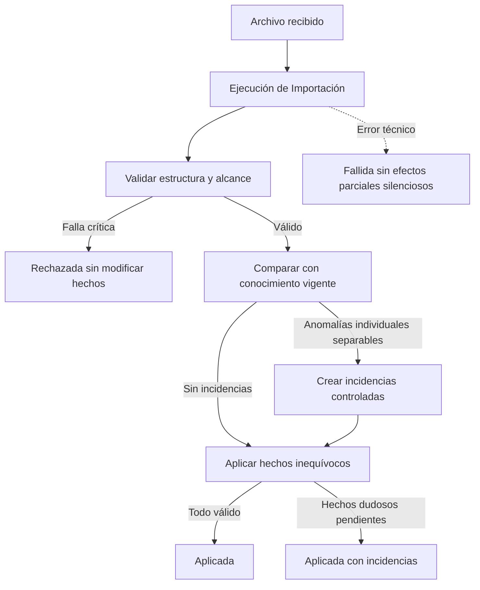

# Modelo Operacional del CRM Patrimonial

- Versión: 0.1
- Estado: Aprobado
- Fecha: 2026-08-01
- LCD: LCD-20260801-02
- ADR: ADR-024
- Issue: #31

## 1. Propósito

Describir los procesos operativos mínimos que incorporan, validan, comparan y concilian información corporativa externa sin redefinir los hechos del Modelo Comercial.

El Modelo Operacional explica cómo una carga observa o modifica conocimiento existente. No convierte archivos, filas, staging ni telemetría en conceptos comerciales.

## 2. Alcance de esta versión

Incluye:

- ejecuciones de importación;
- archivos TOTAL y ASIGNADOS;
- validación de estructura y alcance;
- idempotencia;
- procesamiento incremental;
- linaje mínimo;
- comparación entre cargas sucesivas del mismo período;
- cambios de Resultado Corporativo;
- Incidencias de Conciliación individuales y de alcance;
- estados y aplicación controlada de Ejecuciones de Importación;
- activación de una campaña posterior;
- rechazo o bloqueo de archivos aparentemente incompletos.

No incluye todavía:

- implementación SQL;
- staging físico definitivo;
- umbrales exactos de rechazo;
- interfaz de revisión de incidencias;
- sincronización con Salesforce mediante API;
- recuperación automática ante fallos de infraestructura;
- migración de datos Legacy → Next.

## 3. Fuentes corporativas iniciales

TOTAL y ASIGNADOS poseen la misma estructura comercial básica y pueden observar los mismos hechos:

- Persona;
- datos de contacto;
- Campaña corporativa;
- Resultado Corporativo;
- Aparición en Campaña.

La diferencia operacional es que ASIGNADOS representa el subconjunto de Apariciones perteneciente temporalmente al Asesor y agrega ese vínculo de Asignación.

Cada fuente puede conservar una posición propia dentro de la lista que representa. La posición de ASIGNADOS está acotada al Asesor y es independiente de cualquier posición informada por TOTAL.

### 3.1 Carga TOTAL

Archivo que observa el universo general informado para un período y alcance determinados.

Durante un mismo mes pueden existir varias cargas TOTAL sucesivas. Suelen incorporar nuevas Personas y cambios de Resultado Corporativo o datos de contacto.

La posición informada por TOTAL, cuando existe, pertenece únicamente a esa lista general.

### 3.2 Carga ASIGNADOS

Archivo que observa el subconjunto de Apariciones asignadas al Asesor dentro de Campañas activas.

Además de los hechos comunes, cada fila confirma:

- que la Aparición pertenece temporalmente al Asesor;
- su posición propia dentro de la lista reducida del Asesor, cuando el archivo la representa.

ASIGNADOS no depende de una carga TOTAL previa. Puede procesarse antes o después de TOTAL mediante la misma lógica base de Persona, Campaña, Aparición, Resultado Corporativo y datos de contacto, agregando además la Asignación.

La carga ASIGNADOS no debe crear una segunda Persona ni duplicar una Aparición ya identificada. Su posición no se hereda de TOTAL ni sobrescribe la posición propia de esa fuente.

## 4. Archivo de origen, Tipo de carga y Ejecución de Importación

Deben distinguirse tres conceptos operacionales:

- **Archivo de origen:** evidencia externa recibida desde la compañía;
- **Tipo de carga:** interpretación operacional del archivo, inicialmente TOTAL o ASIGNADOS;
- **Ejecución de Importación:** intento identificable de validar y procesar un archivo bajo un Tipo de carga y alcance determinados.

Cada archivo procesado genera una Ejecución de Importación identificable.

Debe conservar, al menos:

- Tipo de carga;
- período informado;
- referencia al Archivo de origen en Google Drive;
- nombre del archivo;
- hash;
- fecha y hora de recepción;
- fecha y hora de procesamiento;
- estado de la ejecución;
- cantidad de filas recibidas;
- cantidad de filas válidas;
- cantidad de filas rechazadas;
- resumen de incidencias.

El Archivo de origen con datos personales o sensibles conserva su única ubicación editable canónica en Google Drive. El CRM almacena su referencia, hash y metadatos de procesamiento; no mantiene una copia paralela presentada como fuente vigente.

## 5. Estados de una Ejecución de Importación

Una Ejecución de Importación puede encontrarse en alguno de estos estados conceptuales:

- Recibida;
- En validación;
- Rechazada;
- Aplicada;
- Aplicada con incidencias;
- Fallida.

`Recibida` y `En validación` son estados transitorios. Los demás expresan el resultado final conocido de la ejecución.

### 5.1 Recibida

El archivo fue incorporado al proceso, pero todavía no se ha validado ni aplicado.

No modifica hechos canónicos.

### 5.2 En validación

El sistema está evaluando estructura, contenido, alcance, comparabilidad e idempotencia.

No modifica hechos canónicos de forma definitiva.

### 5.3 Aplicada

La carga superó las validaciones críticas y todos sus efectos válidos fueron incorporados o confirmados sin dejar incidencias abiertas.

Una fila que reitera un hecho ya conocido puede no producir un cambio, pero igualmente constituye una observación válida dentro de una ejecución Aplicada.

### 5.4 Aplicada con incidencias

La carga es confiable en su estructura y alcance general, pero contiene anomalías individuales aisladas, identificables y separables.

En este estado:

- se aplican los hechos inequívocos;
- los hechos dudosos no se inventan ni se aplican;
- las anomalías quedan registradas mediante Incidencias de Conciliación;
- cada efecto queda explícitamente aplicado o pendiente, nunca ambiguamente aplicado a medias.

Este estado representa una aplicación parcial controlada. No puede utilizarse cuando la anomalía pone en duda la integridad del resto de la carga.

### 5.5 Rechazada

La carga no supera una validación crítica de estructura, contenido o alcance y, por ello, no puede considerarse confiable antes de aplicarla.

Ejemplos:

- faltan columnas esenciales;
- el período o el Tipo de carga no puede determinarse;
- el archivo parece truncado;
- falta una Campaña o sección completa;
- existe una reducción masiva sospechosa;
- hay contradicciones que comprometen el alcance general.

Una Ejecución Rechazada no modifica hechos canónicos. Conserva el archivo, el motivo y la evidencia del rechazo.

### 5.6 Fallida

La carga era potencialmente procesable, pero un error técnico inesperado impidió completar la ejecución.

Ejemplos:

- interrupción de conexión;
- error interno;
- caída de infraestructura;
- interrupción del proceso.

Una Ejecución Fallida no debe dejar efectos canónicos parciales silenciosos. La aplicación final debe ser atómica o quedar sometida a una recuperación explícita antes de poder considerarse Aplicada o Aplicada con incidencias.

### 5.7 Regla de decisión

| Situación | Estado final esperado | Efectos canónicos |
|---|---|---|
| Carga válida sin incidencias abiertas | Aplicada | Se incorporan o confirman todos los efectos válidos |
| Anomalías individuales aisladas y separables | Aplicada con incidencias | Se aplican sólo los efectos inequívocos; lo dudoso queda pendiente |
| Falla crítica de estructura, contenido o alcance | Rechazada | No se aplica ningún efecto |
| Error técnico durante el procesamiento | Fallida | No quedan efectos parciales silenciosos |

Una Incidencia de Conciliación de alcance abierta bloquea normalmente la aplicación de la carga. Las incidencias individuales aisladas pueden permitir una aplicación parcial controlada cuando no ponen en duda el resto del archivo.

## 6. Validación previa

Antes de aplicar una carga deben comprobarse, al menos:

1. formato esperado;
2. columnas requeridas;
3. período interpretable;
4. RUT normalizable;
5. Resultado Corporativo válido cuando corresponda;
6. ausencia de duplicados ambiguos;
7. alcance de campañas o segmentos incluidos;
8. comparabilidad con la carga anterior cuando se busque detectar ausencias;
9. coherencia del Tipo de carga;
10. hash e idempotencia.

Un archivo que no supera validaciones críticas no modifica hechos canónicos.

## 7. Idempotencia

Procesar dos veces el mismo archivo no debe duplicar Personas, Apariciones, Asignaciones, cambios ni incidencias.

El hash y los identificadores internos de la ejecución deben permitir distinguir:

- reintento del mismo archivo;
- nueva versión con igual nombre;
- archivo diferente del mismo período;
- corrección posterior.

La idempotencia no significa ignorar una nueva versión válida del archivo: significa aplicar una vez cada efecto real.

## 8. Procesamiento de cargas TOTAL sucesivas

Las cargas TOTAL de un mismo período se interpretan como observaciones sucesivas e incrementales del universo mensual.

Para cada fila válida:

1. localizar o crear la Persona;
2. localizar la Campaña concreta;
3. localizar o crear la Aparición;
4. comparar el Resultado Corporativo observado con el vigente;
5. actualizar datos de contacto visibles cuando la nueva observación sea la más reciente;
6. conservar linaje de creación, observación y cambio;
7. no duplicar hechos cuando la fila no cambia.

### 8.1 Persona nueva

Se crea la Persona y su Aparición si no existían.

### 8.2 Aparición repetida sin cambios

No se crea otra Aparición ni otro evento de cambio. Se actualiza la última observación.

### 8.3 Cambio de Resultado Corporativo

Se actualiza el resultado vigente y se conserva un evento de cambio con:

- resultado anterior;
- resultado nuevo;
- fecha observada;
- ejecución que produjo el cambio.

### 8.4 Cambio de datos de contacto

La observación válida más reciente, provenga de TOTAL o ASIGNADOS, informa los datos visibles vigentes. La política física de historial individual de teléfonos y correos queda pendiente.

## 9. Linaje mínimo

Apariciones y Asignaciones deben poder responder:

- qué ejecución creó el hecho;
- cuál fue la última ejecución que volvió a observarlo;
- qué ejecución produjo su último cambio relevante.

Representación conceptual mínima:

- creada por;
- observada por última vez en;
- modificada por última vez en.

No se conserva por defecto una copia permanente de cada fila idéntica ni una observación negativa por cada Persona ausente.

## 10. Comparabilidad de cargas

La detección de ausencias sólo se realiza entre cargas comparables.

Para ser comparables deben corresponder, al menos, a:

- mismo período;
- misma Campaña concreta o mismo alcance explícitamente equivalente;
- mismo Tipo de carga;
- archivo validado como suficientemente completo.

No basta comparar por RUT y mes.

## 11. Incidencia de Conciliación

Una Incidencia de Conciliación representa una discrepancia detectada durante la validación o comparación de una carga con el conocimiento anterior.

Es un único concepto con dos alcances posibles:

- individual;
- de alcance o conjunto.

Toda incidencia debe conservar, al menos:

- tipo de discrepancia;
- evidencia que la originó;
- una o más Ejecuciones de Importación relacionadas;
- estado;
- resolución, cuando exista;
- fecha y actor o usuario de la resolución;
- trazabilidad de sus cambios.

### 11.1 Incidencia individual

Se utiliza cuando la discrepancia afecta una fila, Persona, Aparición o Asignación concreta.

Puede identificar, según corresponda:

- fila o referencia de origen;
- Persona;
- Campaña;
- Aparición;
- Asignación;
- ejecución anterior;
- ejecución posterior.

No todos esos vínculos son obligatorios simultáneamente. Una fila cuyo RUT no puede normalizarse, por ejemplo, todavía no puede vincularse a una Persona canónica.

Cuando una Persona estaba presente en una carga TOTAL anterior y no aparece en una carga posterior comparable del mismo período y Campaña activa:

- no se elimina automáticamente la Persona;
- no se elimina automáticamente la Aparición;
- no se inventa un nuevo Resultado Corporativo;
- se genera una Incidencia de Conciliación individual, salvo que la discrepancia forme parte de una anomalía de alcance mayor.

La ausencia es sospechosa porque puede representar un retiro corporativo real, un archivo incompleto o un error durante la carga. No constituye por sí sola una instrucción inequívoca de eliminación.

### 11.2 Incidencia de alcance

Se utiliza cuando la discrepancia parece pertenecer al archivo completo, a una Campaña, a un segmento o a un conjunto estructurado de filas.

Debe identificar, según corresponda:

- Ejecución de Importación afectada;
- ejecución o conocimiento utilizado para comparar;
- alcance afectado: archivo completo, Campaña, segmento u otro conjunto reconocible;
- cantidad o proporción afectada;
- descripción de la anomalía.

No necesita vincular individualmente a todas las Personas potencialmente afectadas.

### 11.3 Regla de agrupación

Cuando varias ausencias o anomalías pueden explicarse por una misma falla de alcance, se crea primero una única Incidencia de Conciliación de alcance.

Mientras esa incidencia permanezca abierta:

- no se generan incidencias individuales masivas por la misma causa;
- la ejecución puede quedar bloqueada o pendiente de decisión;
- las discrepancias individuales quedan subordinadas a la resolución del problema de conjunto.

Si posteriormente se confirma que el archivo era correcto y sólo algunas filas requieren revisión particular, se crean únicamente las incidencias individuales que realmente correspondan.

## 12. Resolución y cierre de incidencias

Una resolución humana debe expresar qué se determinó sobre la discrepancia. Una causa automática de cierre sólo informa que un hecho posterior eliminó la incertidumbre. No son equivalentes.

### 12.1 Resoluciones humanas

| Resolución | Consecuencia |
|---|---|
| Omisión de la fuente | Se conserva el hecho anterior y se cierra la incidencia con la evidencia disponible |
| Retiro corporativo confirmado en TOTAL | Se conserva la Persona, la Aparición histórica y el último Resultado Corporativo conocido; se registra que la compañía dejó de incluirla en esa Campaña activa |
| Retiro de Asignación confirmado en ASIGNADOS | Termina la Asignación vigente al Asesor, conservando íntegramente su historial |
| Traslado confirmado | Se conserva el antecedente anterior y se registra el nuevo hecho correspondiente, cuando la fuente lo permita |
| Archivo incompleto detectado antes de aplicar | La ejecución se bloquea o rechaza sin modificar hechos canónicos |
| Archivo incompleto detectado después de aplicar | Se corrige o compensa mediante una nueva acción trazable; no se borra ni reescribe silenciosamente la aplicación anterior |

`Sin explicación disponible` no constituye una resolución. La incidencia permanece abierta y conserva el último conocimiento válido sin inventar una conclusión.

### 12.2 Cierre automático por reaparición

La reaparición posterior en una carga comparable puede cerrar automáticamente una incidencia de ausencia:

- confirma nuevamente el hecho observado;
- no duplica Persona, Aparición ni Asignación;
- conserva la incidencia y su cierre en la trazabilidad.

La reaparición es una causa de cierre, no una resolución humana retroactiva sobre el motivo de la ausencia.

No se permite eliminar silenciosamente una Aparición o una Asignación ni cerrar una incidencia mediante texto libre sin categoría y evidencia.

## 13. Falta de una Campaña o segmento completo

Si una carga posterior omite una Campaña, un segmento completo o una cantidad anómala y estructurada de filas presentes en la anterior, el sistema no debe generar miles de incidencias individuales.

Debe generar primero una Incidencia de Conciliación de alcance y evaluar el bloqueo de la ejecución.

Ejemplo:

```text
TOTAL_01 agosto:
- Propensión Integral
- Profesionales
- Segmento Joven

TOTAL_02 agosto:
- Propensión Integral
- Profesionales
```

La ausencia completa de Segmento Joven debe tratarse primero como posible incompletitud del archivo.

El umbral cuantitativo y las reglas automáticas de bloqueo son decisiones técnicas configurables, no conceptos permanentes del dominio.

## 14. Cambio de período

Cuando se activa una Campaña del período siguiente:

- se crea su propio conjunto de Apariciones;
- es normal que miles de Personas del período anterior no reaparezcan;
- no se generan incidencias por esas ausencias;
- las Personas y sus Apariciones anteriores conservan historia;
- la ausencia en el nuevo período significa falta de observación, no Gestionado, No Gestionado, retiro ni eliminación;
- las Asignaciones del período anterior dejan de estar operativamente vigentes sin generar incidencias individuales por quienes no reaparecen;
- el término de una Asignación no termina una Relación Comercial ni una Responsabilidad del Asesor existente.

La Campaña del período siguiente se activa mediante una operación explícita, después de validar y conciliar el conjunto que la sustenta. La primera fila o carga parcial válida no desactiva por sí sola la Campaña anterior. La activación conserva fecha, actor y Ejecuciones de Importación asociadas.

## 15. Procesamiento de ASIGNADOS

Para cada fila válida:

1. localizar o crear la Persona por identidad canónica;
2. localizar o crear la Campaña concreta informada;
3. localizar o crear la Aparición correspondiente;
4. comparar y aplicar el Resultado Corporativo observado;
5. actualizar los datos de contacto visibles cuando la observación sea la más reciente;
6. crear o actualizar la Asignación al Asesor;
7. conservar la posición propia de ASIGNADOS cuando el archivo la represente;
8. registrar linaje de creación, observación y cambio.

### 15.1 ASIGNADOS antes o después de TOTAL

Una fila ASIGNADOS válida constituye evidencia suficiente para crear o actualizar Persona, Campaña, Aparición, Resultado Corporativo, datos de contacto y Asignación.

No genera una Aparición incompleta ni una incidencia por el solo hecho de que TOTAL todavía no haya sido cargado. Cuando TOTAL llega posteriormente, vuelve a observar los mismos hechos sin duplicarlos y agrega las demás Apariciones del universo general.

### 15.2 Coincidencia ambigua

Si la identidad de la Campaña no puede determinarse de manera única a partir de la fila, la carga no debe adivinar. Se registra una incidencia y la Asignación queda pendiente de aplicación.

### 15.3 Ausencia en una carga ASIGNADOS posterior comparable

Cuando una Aparición estaba asignada al Asesor en una carga ASIGNADOS anterior y no aparece en una carga posterior del mismo período, Campaña activa y alcance comparable:

- no se elimina la Asignación histórica;
- no se registra automáticamente su término;
- la vigencia actual queda pendiente de conciliación;
- se genera una Incidencia de Conciliación individual, salvo que la ausencia forme parte de una anomalía de alcance mayor;
- la Aparición permanece visible, pero queda fuera de la cola normal de gestionables mientras no se confirme que continúa asignada al Asesor;
- si se confirma el retiro, termina la Asignación vigente y se conserva su historial;
- si la carga perdió muchas filas o una sección completa, se trata primero como posible incompletitud de alcance;
- si la Persona reaparece en una carga posterior comparable, se cierra la incidencia sin crear una Asignación duplicada.

La ausencia aislada es una discrepancia infrecuente que requiere resolución. Puede representar un retiro corporativo real o un error del archivo o de la carga; no demuestra por sí sola ninguno de ellos.

### 15.4 Unicidad vigente

Una Aparición tiene normalmente como máximo una Asignación vigente. Si una carga informa simultáneamente dos Asesores para la misma Aparición, el proceso no debe aceptar ambas silenciosamente: debe bloquear o conciliar la inconsistencia antes de modificar el hecho vigente.

## 16. Datos de contacto

La observación válida más reciente, provenga de TOTAL o ASIGNADOS, informa los datos visibles vigentes.

Reglas iniciales:

- una carga posterior puede actualizar teléfono o correo;
- un dato anterior no debe seguir mostrándose como vigente si la fuente más reciente lo retiró;
- el antecedente puede conservarse históricamente cuando exista necesidad de auditoría;
- la representación física se mantendrá simple mientras no sea necesario modelar múltiples valores, validaciones o historial individual completo.

## 17. Conciliación y conocimiento propio

Una discrepancia corporativa nunca debe:

- inventar una Actividad interna;
- crear o terminar por sí sola una Relación Comercial;
- borrar una Oportunidad propia;
- cambiar por sí sola la condición Lead o Cliente del Asesor;
- atribuir al Asesor una gestión realizada fuera del CRM;
- alterar estadísticas operativas como si hubiera existido trabajo interno.

Las incidencias informan una diferencia que requiere resolución; no sustituyen los hechos originales.

## 18. Flujo operativo general



## 19. Invariantes operacionales

1. Un archivo rechazado no modifica hechos canónicos.
2. Una ejecución fallida no deja efectos canónicos parciales silenciosos.
3. El mismo archivo no aplica dos veces el mismo efecto.
4. Una carga TOTAL sucesiva no duplica Apariciones existentes.
5. Sólo los cambios efectivos generan historial de cambio.
6. Las ausencias sólo se concilian dentro del mismo período, Campaña activa y alcance comparable.
7. El cambio de período no genera incidencias masivas.
8. La falta de una Campaña completa o una ausencia masiva estructurada se trata antes como problema de alcance.
9. Existe un único concepto Incidencia de Conciliación con alcance individual o de conjunto.
10. Una incidencia de alcance evita generar incidencias individuales masivas por la misma causa mientras permanezca abierta.
11. Toda incidencia conserva tipo, evidencia, estado, resolución y trazabilidad hacia las Ejecuciones de Importación relacionadas.
12. Una ejecución Aplicada no conserva incidencias abiertas.
13. Una ejecución Aplicada con incidencias aplica sólo hechos inequívocos y mantiene separados los hechos dudosos.
14. Aplicada con incidencias sólo procede ante anomalías individuales aisladas y separables que no comprometen el alcance general.
15. Una Incidencia de Conciliación de alcance abierta bloquea normalmente la aplicación de la carga.
16. Cada efecto de una ejecución queda aplicado o pendiente; nunca ambiguamente aplicado a medias.
17. TOTAL y ASIGNADOS pueden observar los mismos hechos de Persona, Campaña, Aparición, Resultado Corporativo y datos de contacto.
18. ASIGNADOS agrega la pertenencia temporal al Asesor y no depende de una carga TOTAL previa.
19. Las posiciones de TOTAL y ASIGNADOS pertenecen a listas distintas y no se sobrescriben entre sí.
20. Una carga ASIGNADOS no duplica Personas ni Apariciones.
21. Una coincidencia ambigua nunca se resuelve por suposición.
22. Una Aparición tiene normalmente como máximo una Asignación vigente.
23. La ausencia en ASIGNADOS comparable no termina automáticamente la Asignación: deja su vigencia pendiente de conciliación.
24. Una Asignación pendiente de conciliación permanece visible, pero no integra la cola normal de gestionables hasta confirmar su continuidad.
25. Un retiro confirmado en TOTAL no elimina ni termina la Aparición histórica ni reemplaza su último Resultado Corporativo conocido.
26. Un retiro confirmado en ASIGNADOS termina la Asignación vigente y conserva su historial.
27. `Sin explicación disponible` mantiene la incidencia abierta y no constituye una resolución.
28. Una reaparición posterior puede cerrar automáticamente una incidencia sin duplicar hechos.
29. Un problema descubierto después de aplicar se corrige o compensa con trazabilidad; no se borra silenciosamente la aplicación previa.
30. El cambio de período termina la vigencia operativa de Asignaciones anteriores sin terminar Relaciones Comerciales ni Responsabilidades.
31. La información corporativa no crea automáticamente gestión interna, Relación Comercial ni condición Lead o Cliente.

## 20. Pendientes para `next_v03`

- clave lógica exacta de Campaña;
- representación física de Ejecución de Importación y sus estados;
- mecanismo transaccional y de recuperación que garantice ausencia de efectos parciales silenciosos;
- modelo mínimo de eventos de cambio;
- representación física de Incidencia de Conciliación y sus alcances;
- regla SQL de idempotencia;
- historial de datos de contacto;
- umbrales técnicos de bloqueo;
- UX de revisión de Asignaciones pendientes de conciliación;
- pruebas con snapshots ficticios y archivos históricos sanitizados.
