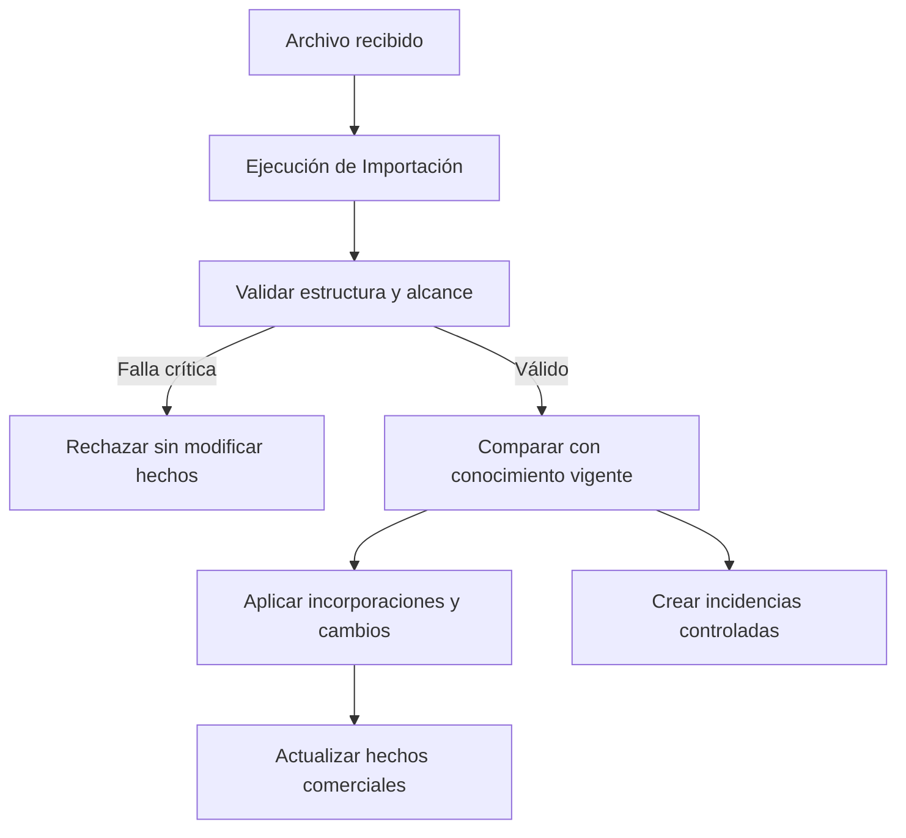

# Modelo Operacional del CRM Patrimonial

- Versión: 0.1
- Estado: Pendiente de revisión
- Fecha: 2026-08-01
- LCD: LCD-20260801-02
- ADR: ADR-024
- Issue: #31

## 1. Propósito

Describir los procesos operativos mínimos que incorporan, validan, comparan y concilian información corporativa externa sin redefinir los hechos del Modelo Comercial.

El Modelo Operacional explica cómo una carga observa o modifica conocimiento existente. No convierte archivos, filas, staging ni telemetría en conceptos comerciales.

## 2. Alcance de esta versión

Incluye:

- ejecuciones de importación;
- archivos TOTAL y ASIGNADOS;
- validación de estructura y alcance;
- idempotencia;
- procesamiento incremental;
- linaje mínimo;
- comparación entre cargas sucesivas del mismo período;
- cambios de Resultado Corporativo;
- conciliación de ausencias excepcionales;
- activación de una campaña posterior;
- rechazo o bloqueo de archivos aparentemente incompletos.

No incluye todavía:

- implementación SQL;
- staging físico definitivo;
- umbrales exactos de rechazo;
- interfaz de revisión de incidencias;
- sincronización con Salesforce mediante API;
- recuperación automática ante fallos de infraestructura;
- migración de datos Legacy → Next.

## 3. Fuentes corporativas iniciales

### 3.1 Carga TOTAL

Archivo que informa, para un período y alcance determinados:

- Persona observada;
- Campaña corporativa;
- Resultado Corporativo;
- orden de origen;
- datos de contacto informados por la fuente.

Durante un mismo mes pueden existir varias cargas TOTAL sucesivas. Suelen incorporar nuevas Personas y cambios de Resultado Corporativo o datos de contacto.

### 3.2 Carga ASIGNADOS

Archivo que informa qué Apariciones fueron asignadas a un Asesor y en qué orden operativo.

Durante un mismo período pueden existir cargas ASIGNADOS sucesivas y comparables. Una carga posterior puede incorporar asignaciones nuevas, reiterar las vigentes o informar cambios que requieren conciliación.

La carga ASIGNADOS no debe crear una segunda Persona ni duplicar una Aparición ya identificada. Su orden es independiente del orden TOTAL.

Cuando no existe una coincidencia única con una Aparición, el proceso no debe adivinar: debe generar una incidencia de conciliación.

## 4. Ejecución de Importación

Cada archivo procesado genera una Ejecución de Importación identificable.

Debe conservar, al menos:

- tipo de carga;
- período informado;
- archivo original o referencia a su ubicación en Drive;
- nombre del archivo;
- hash;
- fecha y hora de recepción;
- fecha y hora de procesamiento;
- estado de la ejecución;
- cantidad de filas recibidas;
- cantidad de filas válidas;
- cantidad de filas rechazadas;
- resumen de incidencias.

El archivo original permanece como fuente o evidencia en Google Drive cuando contiene datos personales o material no apto para GitHub.

## 5. Estados mínimos de una ejecución

Una Ejecución de Importación puede encontrarse en alguno de estos estados conceptuales:

- Recibida;
- En validación;
- Rechazada;
- Aplicada;
- Aplicada con incidencias;
- Fallida.

Los nombres físicos definitivos podrán variar, pero la diferencia entre rechazo previo, aplicación parcial controlada y fallo técnico debe preservarse.

## 6. Validación previa

Antes de aplicar una carga deben comprobarse, al menos:

1. formato esperado;
2. columnas requeridas;
3. período interpretable;
4. RUT normalizable;
5. Resultado Corporativo válido cuando corresponda;
6. ausencia de duplicados ambiguos;
7. alcance de campañas o segmentos incluidos;
8. comparabilidad con la carga anterior cuando se busque detectar ausencias;
9. coherencia del tipo de archivo;
10. hash e idempotencia.

Un archivo que no supera validaciones críticas no modifica hechos canónicos.

## 7. Idempotencia

Procesar dos veces el mismo archivo no debe duplicar Personas, Apariciones, Asignaciones, cambios ni incidencias.

El hash y los identificadores internos de la ejecución deben permitir distinguir:

- reintento del mismo archivo;
- nueva versión con igual nombre;
- archivo diferente del mismo período;
- corrección posterior.

La idempotencia no significa ignorar una nueva versión válida del archivo: significa aplicar una vez cada efecto real.

## 8. Procesamiento de cargas TOTAL sucesivas

Las cargas TOTAL de un mismo período se interpretan como observaciones sucesivas e incrementales del universo mensual.

Para cada fila válida:

1. localizar o crear la Persona;
2. localizar la Campaña concreta;
3. localizar o crear la Aparición;
4. comparar el Resultado Corporativo observado con el vigente;
5. actualizar datos de contacto visibles cuando la nueva observación sea la más reciente;
6. conservar linaje de creación, observación y cambio;
7. no duplicar hechos cuando la fila no cambia.

### 8.1 Persona nueva

Se crea la Persona y su Aparición si no existían.

### 8.2 Aparición repetida sin cambios

No se crea otra Aparición ni otro evento de cambio. Se actualiza la última observación.

### 8.3 Cambio de Resultado Corporativo

Se actualiza el resultado vigente y se conserva un evento de cambio con:

- resultado anterior;
- resultado nuevo;
- fecha observada;
- ejecución que produjo el cambio.

### 8.4 Cambio de datos de contacto

La observación más reciente informa los datos visibles vigentes. La política física de historial individual de teléfonos y correos queda pendiente.

## 9. Linaje mínimo

Apariciones y Asignaciones deben poder responder:

- qué ejecución creó el hecho;
- cuál fue la última ejecución que volvió a observarlo;
- qué ejecución produjo su último cambio relevante.

Representación conceptual mínima:

- creada por;
- observada por última vez en;
- modificada por última vez en.

No se conserva por defecto una copia permanente de cada fila idéntica ni una observación negativa por cada Persona ausente.

## 10. Comparabilidad de cargas

La detección de ausencias sólo se realiza entre cargas comparables.

Para ser comparables deben corresponder, al menos, a:

- mismo período;
- misma Campaña concreta o mismo alcance explícitamente equivalente;
- mismo tipo de carga;
- archivo validado como suficientemente completo.

No basta comparar por RUT y mes.

## 11. Ausencia excepcional dentro del mismo período

Cuando una Persona estaba presente en una carga TOTAL anterior y no aparece en una carga posterior comparable del mismo período y Campaña:

- no se elimina automáticamente la Persona;
- no se elimina automáticamente la Aparición;
- no se inventa un nuevo Resultado Corporativo;
- se genera una Incidencia de Conciliación.

La incidencia debe conservar:

- Persona;
- Campaña;
- ejecución anterior;
- ejecución posterior;
- tipo de discrepancia;
- estado;
- resolución;
- fecha y responsable de la resolución.

## 12. Resoluciones permitidas

Las resoluciones iniciales son:

| Resolución | Consecuencia |
|---|---|
| Omisión de la fuente | Se conserva el hecho anterior |
| Retiro confirmado | Se registra el término o retiro conservando historia |
| Traslado confirmado | Se conserva el antecedente anterior y se registra el nuevo correspondiente |
| Archivo incompleto | Se rechaza o revierte la aplicación del archivo |
| Sin explicación disponible | Se conserva el hecho y la incidencia permanece abierta |
| Reaparición posterior | Se cierra automáticamente la incidencia conservando la trazabilidad |

No se permite eliminar silenciosamente la Aparición o la Asignación ni resolver mediante texto libre sin una categoría registrada.

## 13. Falta de una Campaña o segmento completo

Si una carga posterior omite una Campaña o un segmento completo presente en la anterior, el sistema no debe generar miles de incidencias individuales.

Debe generar una incidencia de alcance del archivo y evaluar el bloqueo de la ejecución.

Ejemplo:

```text
TOTAL_01 agosto:
- Propensión Integral
- Profesionales
- Segmento Joven

TOTAL_02 agosto:
- Propensión Integral
- Profesionales
```

La ausencia completa de Segmento Joven debe tratarse primero como posible incompletitud del archivo.

El umbral cuantitativo y las reglas automáticas de bloqueo son decisiones técnicas configurables, no conceptos permanentes del dominio.

## 14. Cambio de período

Cuando se activa una Campaña del período siguiente:

- se crea su propio conjunto de Apariciones;
- es normal que miles de Personas del período anterior no reaparezcan;
- no se generan incidencias por esas ausencias;
- las Personas y sus Apariciones anteriores conservan historia;
- la ausencia en el nuevo período significa falta de observación, no Gestionado, No Gestionado, retiro ni eliminación;
- las Asignaciones del período anterior dejan de estar operativamente vigentes sin generar incidencias individuales por quienes no reaparecen;
- el término de una Asignación no termina una Relación Comercial ni una Responsabilidad del Asesor existente.

La Campaña anterior permanece activa hasta que se cargan los primeros contactos válidos del período siguiente, conforme al modelo de negocio vigente.

## 15. Procesamiento de ASIGNADOS

Para cada fila válida:

1. localizar la Persona por identidad canónica;
2. localizar la Campaña del período y alcance informado;
3. localizar una única Aparición compatible;
4. crear o actualizar la Asignación;
5. conservar el orden propio de ASIGNADOS;
6. registrar linaje de creación, observación y cambio.

### 15.1 Coincidencia única

Se vincula la Asignación con la Aparición existente.

### 15.2 Asignado no presente en TOTAL

La fila de ASIGNADOS puede constituir evidencia corporativa suficiente para mantener visible la asignación, pero debe generar una incidencia de conciliación sobre la Aparición o el alcance faltante. No se descarta silenciosamente.

### 15.3 Coincidencia ambigua

Si la Persona aparece en más de una Campaña compatible y la fila no permite decidir cuál corresponde, la carga no debe adivinar. Se registra una incidencia y la Asignación queda pendiente de aplicación.

### 15.4 Ausencia en una carga ASIGNADOS posterior comparable

Cuando una Persona estaba presente en una carga ASIGNADOS anterior y no aparece en una carga posterior del mismo período, Campaña y alcance comparable:

- no se elimina la Asignación histórica;
- no se registra automáticamente su término;
- se genera una Incidencia de Conciliación;
- si se confirma el retiro, se registra la fecha de término conservando historia;
- si la carga perdió muchas filas o una sección completa, se trata primero como posible incompletitud de alcance;
- si la Persona reaparece en una carga posterior, se cierra la incidencia sin crear una Asignación duplicada.

La ausencia aislada es una observación operacional que requiere resolución; no demuestra por sí sola que la compañía haya terminado la Asignación.

### 15.5 Unicidad vigente

Una Aparición tiene normalmente como máximo una Asignación vigente. Si una carga informa simultáneamente dos Asesores para la misma Aparición, el proceso no debe aceptar ambas silenciosamente: debe bloquear o conciliar la inconsistencia antes de modificar el hecho vigente.

## 16. Datos de contacto

La última observación válida informa los datos visibles vigentes.

Reglas iniciales:

- una carga posterior puede actualizar teléfono o correo;
- un dato anterior no debe seguir mostrándose como vigente si la fuente más reciente lo retiró;
- el antecedente puede conservarse históricamente cuando exista necesidad de auditoría;
- la representación física se mantendrá simple mientras no sea necesario modelar múltiples valores, validaciones o historial individual completo.

## 17. Conciliación y conocimiento propio

Una discrepancia corporativa nunca debe:

- inventar una Actividad interna;
- crear o terminar por sí sola una Relación Comercial;
- borrar una Oportunidad propia;
- cambiar por sí sola la condición Lead o Cliente del Asesor;
- atribuir al Asesor una gestión realizada fuera del CRM;
- alterar estadísticas operativas como si hubiera existido trabajo interno.

Las incidencias informan una diferencia que requiere resolución; no sustituyen los hechos originales.

## 18. Flujo operativo general



## 19. Invariantes operacionales

1. Un archivo rechazado no modifica hechos canónicos.
2. El mismo archivo no aplica dos veces el mismo efecto.
3. Una carga TOTAL sucesiva no duplica Apariciones existentes.
4. Sólo los cambios efectivos generan historial de cambio.
5. Las ausencias sólo se concilian dentro del mismo período y alcance comparable.
6. El cambio de período no genera incidencias masivas.
7. La falta de una Campaña completa se trata antes como problema de alcance.
8. Una carga ASIGNADOS no duplica Personas ni Apariciones.
9. Una coincidencia ambigua nunca se resuelve por suposición.
10. Una Aparición tiene normalmente como máximo una Asignación vigente.
11. La ausencia en ASIGNADOS comparable no termina automáticamente la Asignación.
12. El cambio de período termina la vigencia operativa de Asignaciones anteriores sin terminar Relaciones Comerciales ni Responsabilidades.
13. La información corporativa no crea automáticamente gestión interna, Relación Comercial ni condición Lead o Cliente.

## 20. Pendientes para `next_v03`

- clave lógica exacta de Campaña;
- representación física de Ejecución de Importación;
- modelo mínimo de eventos de cambio;
- estructura de Incidencia de Conciliación;
- regla SQL de idempotencia;
- validación de coherencia entre Tarea y Actividad;
- historial de datos de contacto;
- umbrales técnicos de bloqueo;
- pruebas con snapshots ficticios y archivos históricos sanitizados.
