# APP LLAMADOS · Arquitectura de base de datos y guía de aprendizaje

<span style="color:#b91c1c"><strong>LCD-20260716-01 · Estado: Pendiente de revisión</strong></span>

> <span style="color:#b91c1c"><strong>Todo el contenido de este documento pertenece al LCD-20260716-01 y está pendiente de revisión.</strong></span>

- **Fecha de levantamiento:** 2026-07-16
- **Producto observado:** APP LLAMADOS Legacy
- **Producto evolutivo:** CRM Patrimonial Next
- **Ambiente inspeccionado:** PROD, exclusivamente mediante consultas de lectura y catálogo
- **Repositorio:** `guilledpn/KNwS7F_2a2LZ7MS`
- **Ruta del documento:** `docs/learning/database-architecture-and-learning-guide.md`
- **Naturaleza:** material educativo y diagnóstico; **no es fuente canónica de arquitectura ni del dominio**
- **Documento canónico futuro:** `docs/architecture/database-architecture.md`

---

## Resumen ejecutivo

APP LLAMADOS posee una base relacional funcional que ya separa correctamente varios hechos esenciales: una Persona vive una sola vez en `contacts`; sus apariciones históricas en campañas viven en `contact_month_state`; las campañas poseen identidad en `campaigns`; y los cambios de gestión dejan huella en `crm_log` y `crm_events`.

El problema estructural principal no es que falten datos, sino que **una proyección operativa llamada `work_queue` concentra responsabilidades incompatibles**:

1. decide qué Personas se muestran como gestionables;
2. conserva el identificador que exige la interfaz para guardar;
3. almacena el estado interno actual de gestión;
4. almacena comentarios e ingreso estimado;
5. almacena recordatorios;
6. sirve como base de lectura de la aplicación;
7. es reconstruida por importaciones y hotfixes.

Esto convierte una conclusión derivada y temporal —la cola del período— en un punto de dependencia para hechos persistentes. Por eso corregir gestionabilidad implica intervenir repetidamente `work_queue`, aun cuando la gestionabilidad debería poder calcularse desde Persona, Aparición, Resultado Corporativo y Asignación.

El segundo hallazgo crítico es la **divergencia entre caminos de ejecución**. En el levantamiento:

- `get_contacts_v2` lee sólo `work_queue`, ignora el parámetro de situación y marca toda fila visible como gestionable;
- `get_contacts_filtered_v3` falla al ejecutarse porque consulta columnas inexistentes en `contact_month_state`;
- la reconstrucción completa de `work_queue` usa la política canónica;
- una sincronización por lote observada no usa necesariamente la misma política;
- las funciones de compatibilidad llamadas `contact_operational_state` no corresponden a una tabla persistente: son stubs protegidos que no crean caché.

La dirección recomendada para Next es:

- conservar Persona, Campaña y Aparición como hechos;
- representar Asignación y Resultado Corporativo sin mezclarlos con gestión interna;
- separar Gestión Interna y Recordatorio de cualquier cola;
- calcular Gestionabilidad mediante una política única;
- exponer una proyección regenerable para lectura;
- mantener `work_queue` sólo como adaptador de compatibilidad durante la transición;
- retirar su rol como fuente de verdad antes de retirarla físicamente.

Nada de lo anterior autoriza un cambio de esquema. Las decisiones objetivo se presentan como propuestas pendientes de validación y gobierno.

---

## Tabla de contenidos

1. [Cómo leer este documento](#1-cómo-leer-este-documento)
2. [Modelo mental del dominio](#2-modelo-mental-del-dominio)
3. [Qué es una base de datos relacional](#3-qué-es-una-base-de-datos-relacional)
4. [PostgreSQL y Supabase](#4-postgresql-y-supabase)
5. [Contexto y contenedores](#5-contexto-y-contenedores)
6. [Modelo conceptual, lógico y físico](#6-modelo-conceptual-lógico-y-físico)
7. [Catálogo real de PROD](#7-catálogo-real-de-prod)
8. [Análisis tabla por tabla](#8-análisis-tabla-por-tabla)
9. [Flujos de lectura y escritura](#9-flujos-de-lectura-y-escritura)
10. [Importaciones TOTAL, ASIGNADO y FIX](#10-importaciones-total-asignado-y-fix)
11. [Normalización y diseño relacional](#11-normalización-y-diseño-relacional)
12. [Transacciones, idempotencia y concurrencia](#12-transacciones-idempotencia-y-concurrencia)
13. [MVCC, VACUUM y bloat](#13-mvcc-vacuum-y-bloat)
14. [Índices y almacenamiento](#14-índices-y-almacenamiento)
15. [Funciones, triggers, vistas y RLS](#15-funciones-triggers-vistas-y-rls)
16. [Recuperación, migraciones y ambientes](#16-recuperación-migraciones-y-ambientes)
17. [Arquitectura objetivo propuesta para Next](#17-arquitectura-objetivo-propuesta-para-next)
18. [Transición Legacy a Next](#18-transición-legacy-a-next)
19. [Matriz AS-IS y TO-BE](#19-matriz-as-is-y-to-be)
20. [Riesgos, decisiones y backlog](#20-riesgos-decisiones-y-backlog)
21. [Propuesta para el documento canónico futuro](#21-propuesta-para-el-documento-canónico-futuro)
22. [Glosario](#22-glosario)
23. [Apéndice de consultas seguras](#23-apéndice-de-consultas-seguras)
24. [Fuentes, cobertura y límites](#24-fuentes-cobertura-y-límites)
25. [Validación de Mermaid](#25-validación-de-mermaid)

---

# 1. Cómo leer este documento

## 1.1 Niveles de certeza

Cada afirmación diagnóstica utiliza una de estas marcas:

| Marca | Significado |
|---|---|
| **Verificado** | Observado directamente en el catálogo de PostgreSQL, definiciones de funciones, repositorio o documentos vigentes. |
| **Inferido** | Conclusión razonable apoyada por evidencia, pero no comprobada en todos los caminos de ejecución. |
| **Pendiente de validar** | Falta evidencia o decisión explícita. |
| **Propuesta para Next** | Diseño candidato. No constituye aprobación ni migración autorizada. |

## 1.2 Qué es ley y qué no lo es

| Tipo | Ejemplo |
|---|---|
| **Ley técnica** | Una clave foránea impide referencias a filas inexistentes mientras la restricción esté activa. |
| **Convención** | Usar `snake_case` para nombres SQL. PostgreSQL no lo exige. |
| **Heurística** | Colocar primero la columna más útil de un índice compuesto. Requiere validar consultas reales. |
| **Preferencia del proyecto** | Los hechos se almacenan y las proyecciones se calculan. Deriva de la Arquitectura y el dominio del proyecto. |

## 1.3 Alcance y no alcance

Este documento:

- explica el sistema real;
- registra deuda, riesgos e hipótesis;
- enseña fundamentos de bases de datos;
- propone un destino coherente con el dominio.

Este documento no:

- modifica PROD;
- crea migraciones;
- autoriza eliminar tablas o índices;
- reemplaza la Constitución, Arquitectura o Modelo del Dominio;
- convierte propuestas en decisiones aprobadas.

## 1.4 Mapa de los 50 contenidos mínimos

| Contenido | Sección principal |
|---|---|
| Base relacional, PostgreSQL, Supabase | 3 y 4 |
| Tablas, filas, columnas y tipos | 3 |
| Claves primarias, naturales, sustitutas y foráneas | 3 y 11 |
| Restricciones y consistencia | 3 y 7 |
| Normalización, 1FN, 2FN, 3FN y desnormalización | 11 |
| Entidades, hechos y proyecciones | 2 y 11 |
| Transacciones y ACID | 12 |
| Idempotencia y upsert | 10 y 12 |
| Concurrencia, bloqueos y MVCC | 12 y 13 |
| Versiones muertas, VACUUM, autovacuum y bloat | 13 |
| B-tree, GIN, trigramas, parciales y compuestos | 14 |
| Selectividad, orden, duplicación y costo de escritura | 14 |
| EXPLAIN y EXPLAIN ANALYZE | 14 |
| Triggers, SQL, PL/pgSQL y SECURITY DEFINER | 15 |
| RLS, vistas y vistas materializadas | 15 |
| Staging, lotes, checkpoints y timeout | 10, 12 y 16 |
| Auditoría, retención, backups y restauración | 16 |
| Migraciones, ambientes, evolución y compatibilidad | 16 y 18 |
| Observabilidad y almacenamiento | 7, 13 y 16 |
| Diseño orientado al dominio | 2 y 17 |

---

# 2. Modelo mental del dominio

## 2.1 Persona

**Concepto general:** una entidad representa algo con identidad estable a través del tiempo.

**Explicación sencilla:** Guillermo puede aparecer en muchas listas mensuales, pero sigue siendo la misma persona. No debería crearse un “Guillermo de marzo” y otro “Guillermo de abril”.

**Explicación técnica:** `contacts.contact_id` es una clave sustituta estable y `rut_norm` funciona como clave natural única. Las apariciones históricas se relacionan mediante `contact_id`.

**APP LLAMADOS · Verificado:** `contacts` contiene una fila por `rut_norm`; `contact_month_state` puede contener muchas filas relacionadas con la misma Persona.

**Qué está bien:** evita duplicar nombre, teléfonos y correo por cada mes.

**Qué puede mejorar:** `contacts` mezcla identidad, datos corporativos actuales y preferencias internas como `telefono_activo_idx`. Next deberá distinguir qué atributo es corporativo, cuál es propio y cuál requiere historial.

**Ejercicio:** ¿cambiar un teléfono crea una Persona nueva? Respuesta esperada: no; modifica información asociada a la misma identidad y, si importa conservar la evolución, crea historial del dato.

## 2.2 Aparición en Campaña

Es el hecho de que una Persona fue incluida en una Campaña para un período. En Legacy se aproxima con `contact_month_state`.

Una aparición no es la Persona. Tampoco es una gestión. Es un hecho corporativo con contexto: campaña, período, orden de importación, posible asignación y resultado corporativo.

## 2.3 Campaña

Es la selección corporativa que agrupa apariciones. `campaigns` evita repetir nombre y descripción en cientos de miles de filas. La combinación `(period, campaign_key)` es única en PROD.

## 2.4 Resultado Corporativo

`Gestionado` y `No Gestionado` resumen el resultado corporativo de una aparición. No describen el detalle de lo ocurrido dentro del CRM personal.

En PROD vive en `contact_month_state.estado_origen`. La base no restringe todavía sus valores mediante `CHECK`; la política canónica normaliza texto y aplica fail-closed ante nulos o valores desconocidos.

## 2.5 Asignación

Es el vínculo temporal que habilita al asesor para gestionar una aparición. En Legacy se representa como `contact_month_state.is_assigned`, junto con prioridad de fuente.

**Pendiente de validar para Next:** si una aparición puede tener varias asignaciones sucesivas, la asignación merece identidad e historial propios; un booleano sólo conserva el estado final observado.

## 2.6 Gestionabilidad

La Gestionabilidad es una **conclusión** calculada desde hechos. No es una entidad independiente ni debería depender de que una fila de cola haya sido reconstruida.

La política canónica vigente considera, en orden general:

1. asignación propia vigente;
2. exclusión de aparición activa no asignada;
3. último Resultado Corporativo válido para históricos;
4. contacto manual sin aparición corporativa;
5. fail-closed cuando existen apariciones pero ningún resultado válido.

## 2.7 Gestión interna

Es conocimiento creado por el asesor: estado de trabajo, comentarios, ingreso estimado y actividades. Debe persistir aunque una Persona salga de la cola del mes.

**Verificado:** Legacy guarda el estado actual, comentarios e ingreso en `work_queue`; además agrega hechos en `crm_log` y `crm_events`.

## 2.8 Cola de trabajo

Es una bandeja temporal de Personas accionables. Es una proyección, no el origen de los hechos que justifican la presencia en ella.

**Verificado:** `work_queue` mezcla la proyección con datos persistentes. Éste es el acoplamiento central del AS-IS.

## 2.9 Fuente de verdad frente a derivado

| Pregunta | Fuente de verdad recomendada | Derivado |
|---|---|---|
| ¿Quién es la Persona? | Persona y sus identificadores | Ficha renderizada |
| ¿Apareció en una campaña? | Aparición en Campaña | Meses mostrados en filtros |
| ¿Estuvo asignada? | Asignación | Badge Asignado |
| ¿Cuál fue su resultado corporativo? | Resultado Corporativo | Último resultado válido |
| ¿Qué gestionó el asesor? | Actividades y estado interno | Estado actual y estadísticas |
| ¿Es gestionable hoy? | No se almacena como hecho | Evaluación de política |
| ¿Debe aparecer en la bandeja? | No se almacena como hecho | Proyección de cola |

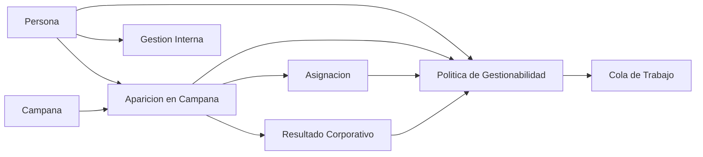

**Diagrama 1 de 22 · Dependencia entre hechos y derivados.**

---

# 3. Qué es una base de datos relacional

## 3.1 Tablas, filas y columnas

Una tabla representa un conjunto de cosas del mismo tipo. Cada fila es una ocurrencia y cada columna describe un atributo.

```sql
-- Ejemplo ficticio y seguro
select contact_id, rut_norm, nombre
from public.contacts
where rut_norm = '11111111K';
```

- `contacts` es la tabla.
- cada Persona es una fila;
- `nombre` es una columna;
- `contact_id` identifica la fila.

## 3.2 Tipos de datos

Los tipos limitan qué clase de valor cabe en una columna:

- `uuid`: identificador global;
- `text`: texto variable;
- `integer` y `bigint`: enteros;
- `numeric`: número decimal exacto;
- `boolean`: verdadero o falso;
- `date`: fecha sin hora;
- `timestamptz`: instante con zona horaria;
- `jsonb`: documento JSON indexable.

Elegir el tipo correcto es parte del modelo. Un período `2026-07` está almacenado como texto con `CHECK`; una alternativa futura podría ser una fecha normalizada al primer día del mes, pero eso sería una decisión de esquema, no una obligación universal.

## 3.3 Claves primarias

Una clave primaria identifica inequívocamente una fila y no acepta nulos. Ejemplos verificados:

- `contacts.contact_id`;
- `campaigns.campaign_id`;
- `contact_month_state.cms_id`;
- `work_queue.work_item_id`.

## 3.4 Clave natural y clave sustituta

- **Natural:** nace del negocio, como un RUT normalizado.
- **Sustituta:** identificador técnico sin significado comercial, como UUID.

Legacy usa ambas en Persona: UUID como PK y `rut_norm` como `UNIQUE`. Esto es razonable porque las relaciones internas no dependen del formato del RUT, mientras la base impide duplicar la identidad natural.

## 3.5 Claves foráneas

Una clave foránea conecta tablas e impide referencias huérfanas.

```sql
-- Relación conceptual, no instrucción de cambio
contact_month_state.contact_id -> contacts.contact_id
```

**Verificado:** `contact_month_state` referencia Persona y Campaña. `work_queue` referencia Persona, Aparición y Campaña. `crm_log.contact_id` referencia Persona, pero `crm_log.work_item_id` no posee FK.

## 3.6 Restricciones y consistencia

Las restricciones actuales incluyen:

- PK;
- `UNIQUE` sobre RUT y combinaciones de negocio;
- FK;
- `CHECK` para el formato `AAAA-MM`;
- `CHECK` para `telefono_activo_idx` entre 0 y 2.

**Mejora candidata:** normalizar y restringir estados corporativos y tipos de carga mediante catálogos o checks versionados, sin bloquear la recepción controlada de fuentes inesperadas.

## 3.7 Preguntas de comprobación

1. ¿Por qué `rut_norm` no necesita ser la PK?  
2. ¿Qué evita `UNIQUE contact_id, campaign_id, period`?  
3. ¿Qué diferencia existe entre no permitir nulos y validar semánticamente un valor?

---

# 4. PostgreSQL y Supabase

PostgreSQL es el motor relacional. Supabase agrega servicios alrededor de él:

- autenticación;
- API REST automática;
- llamadas RPC a funciones;
- Row Level Security;
- panel, backups y observabilidad según plan;
- librerías cliente.

**Verificado en PROD:** PostgreSQL 17.6; Supabase Auth, RLS y RPC forman parte del sistema. Las extensiones incluyen `pg_trgm`, `pg_stat_statements`, `pgcrypto`, `uuid-ossp`, `http` y componentes de Supabase.

Supabase no reemplaza el diseño de base. Una política RLS permisiva sigue siendo permisiva; una función `SECURITY DEFINER` insegura sigue siendo insegura; un índice redundante sigue costando espacio y escritura.

---

# 5. Contexto y contenedores

## 5.1 Diagrama de contexto del sistema

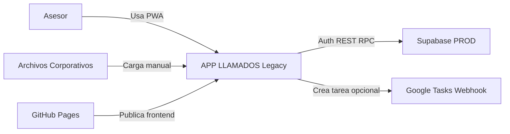

**Diagrama 2 de 22 · Contexto.**

## 5.2 Diagrama de contenedores

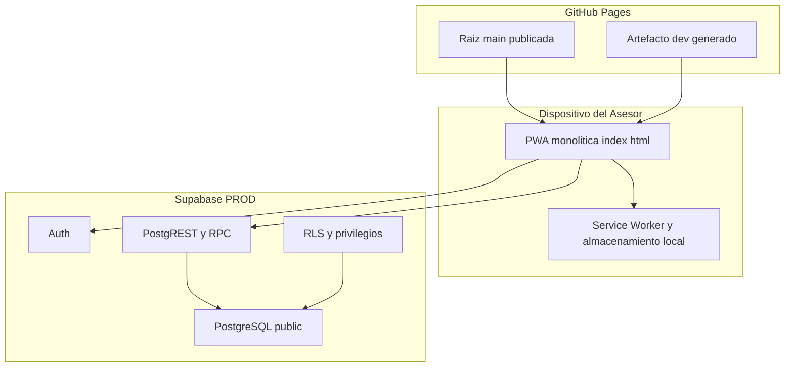

**Diagrama 3 de 22 · Contenedores.**

## 5.3 AS-IS simplificado

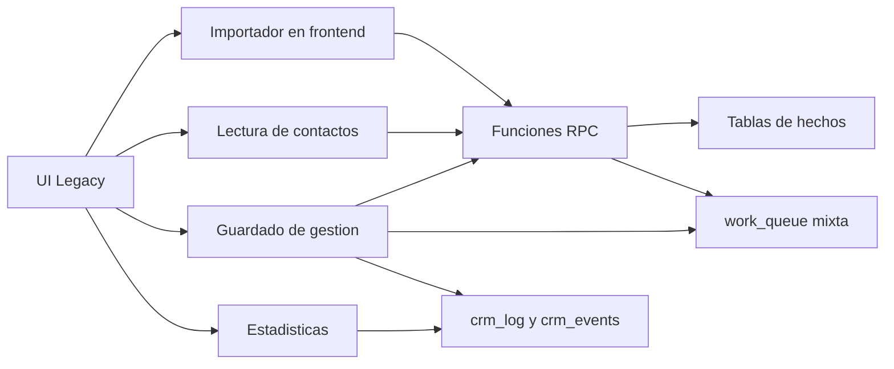

**Diagrama 4 de 22 · AS-IS.**

**Verificado:** la raíz de `main` es simultáneamente fuente y artefacto productivo; `index.html` concentra UI y lógica; DEV se genera desde PROD más módulos auxiliares; Next todavía no es una aplicación independiente completa.

---

# 6. Modelo conceptual, lógico y físico

## 6.1 Entidad-relación conceptual

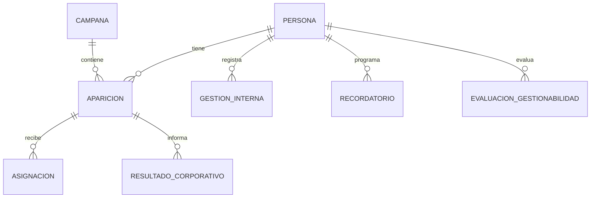

**Diagrama 5 de 22 · ER conceptual.**

## 6.2 Entidad-relación lógico AS-IS

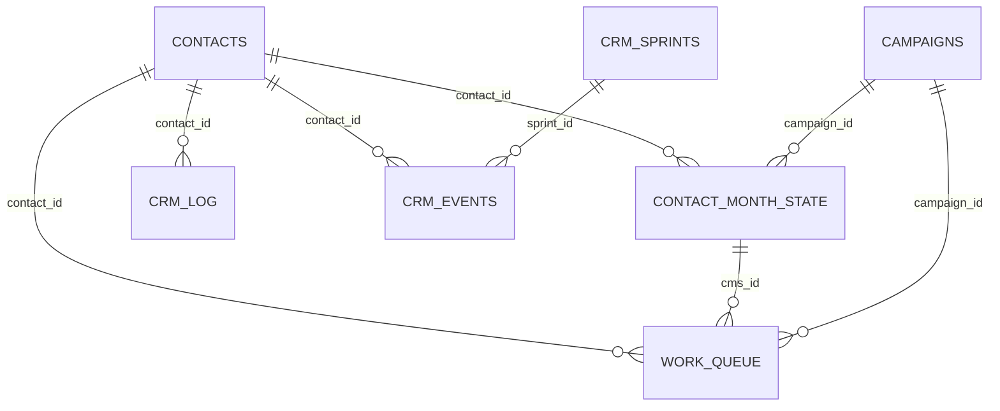

**Diagrama 6 de 22 · ER lógico AS-IS.**

## 6.3 Modelo físico simplificado

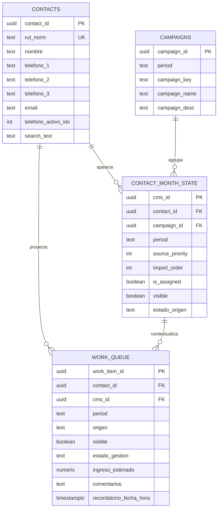

**Diagrama 7 de 22 · Físico simplificado.**

## 6.4 Por qué Persona no se duplica

Duplicar Persona por aparición produciría:

- teléfonos contradictorios en distintas filas;
- comentarios repartidos;
- búsquedas duplicadas;
- dificultad para conocer la historia completa;
- imposibilidad de contar Personas sin deduplicar;
- actualizaciones masivas innecesarias.

Separar `contacts` de `contact_month_state` aplica una idea central de normalización: almacenar una vez el hecho estable y relacionarlo con eventos históricos.

---

# 7. Catálogo real de PROD

## 7.1 Fotografía de almacenamiento

**Verificado mediante catálogo, 2026-07-16:**

| Métrica | Valor aproximado |
|---|---:|
| Tamaño total de la base | 468.8 MiB |
| Heap público de tablas | 178.8 MiB |
| Índices públicos | 277.3 MiB |
| Índices sobre heap más índices | 60.8 % |
| Índices respecto del heap | 155.1 % |

No existe un porcentaje universal “correcto”. Un índice puede ser mayor que la tabla porque guarda sus propias páginas, claves repetidas, estructura de árbol o posting lists, y puede conservar espacio tras borrados. La pregunta correcta es si cada índice protege una restricción o acelera una carga real con un costo aceptable.

## 7.2 Relaciones principales

| Relación | Filas exactas | Total aprox. | Clasificación |
|---|---:|---:|---|
| `contacts` | 275.614 | 146.1 MiB | Dominio y datos maestros |
| `campaigns` | 18 | 64 KiB | Dominio e integración |
| `contact_month_state` | 536.328 | 224.1 MiB | Historial de hechos corporativos |
| `work_queue` | 155.424 | 58.9 MiB | Proyección, operación y legado |
| `staging_contacts` | 0 | 21.1 MiB | Integración temporal |
| `crm_log` | 127 | 64 KiB | Auditoría de gestión |
| `crm_events` | 127 | 184 KiB | Auditoría y analítica desnormalizada |
| `crm_import_runs` | 13 | 48 KiB | Auditoría de importación |
| `crm_import_progress` | 13 | 32 KiB | Checkpoint operativo |
| `crm_guardrail_events` | 5.825 | 1.8 MiB | Observabilidad |
| `crm_eligibility_hotfix_snapshot` | 19.000 | 3.8 MiB | Recuperación temporal |
| `legacy_eligibility_recovery_snapshot` | 0 | 16 KiB | Legado y recuperación |
| `crm_hotfix_payload_20260714` | 1 | 112 KiB | Hotfix temporal |
| `crm_contact_day_outcomes_v1` | Vista | 0 físico | Proyección analítica |

## 7.3 Apariciones por período

| Período | Apariciones | Asignadas | Gestionado | No Gestionado | Nulo o inválido |
|---|---:|---:|---:|---:|---:|
| 2026-02 | 89.067 | 0 | 40.710 | 48.357 | 0 |
| 2026-03 | 87.396 | 0 | 45.876 | 41.520 | 0 |
| 2026-04 | 82.711 | 0 | 42.314 | 40.397 | 0 |
| 2026-05 | 95.608 | 0 | 50.290 | 45.318 | 0 |
| 2026-06 | 119.979 | 252 | 64.543 | 55.401 | 35 |
| 2026-07 | 61.567 | 150 | 6.102 | 55.465 | 0 |

## 7.4 Cola por período

| Período | Filas físicas | Visibles | Con estado interno | Comentarios | Recordatorios |
|---|---:|---:|---:|---:|---:|
| 2026-06 | 31.508 | 31.508 | 0 | 0 | 0 |
| 2026-07 | 123.916 | 62.499 | 211 | 4 | 19 |

**Conclusión verificada:** `work_queue` conserva filas invisibles y datos internos; no es sólo el conjunto visible actual.

## 7.5 Diagrama de flujo de datos

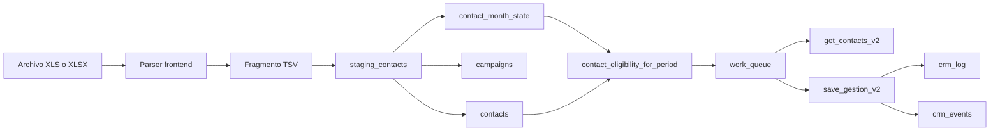

**Diagrama 8 de 22 · Flujo de datos AS-IS.**

---

# 8. Análisis tabla por tabla

## 8.1 `contacts`

| Dimensión | Diagnóstico |
|---|---|
| Propósito | Ficha única de Persona y datos de contacto vigentes. |
| Dominio | Persona, más atributos corporativos e internos mezclados. |
| Fuente o derivado | Fuente de verdad actual para identidad y ficha vigente. |
| PK | `contact_id uuid`. |
| Clave natural | `rut_norm UNIQUE`. |
| Restricciones | índice único de RUT y check de teléfono activo. |
| Índices | PK, RUT y GIN trigram sobre `search_text`. |
| Triggers | reconstrucción de búsqueda y `updated_at`. |
| RLS | `ALL` para cualquier usuario autenticado. |
| Escrituras | importaciones, selección de teléfono, edición directa de correo. |
| Lecturas | RPC de contactos, búsquedas y joins. |
| Volumen | 275.614 filas; 146.1 MiB total. |
| Problema | mezcla dato corporativo, edición propia y preferencia de teléfono; `search_text` duplica datos para búsqueda. |
| Riesgo | una carga puede reemplazar contacto vigente; búsquedas GIN encarecen cada cambio. |
| Recomendación | definir autoridad por atributo y conservar historial cuando sea necesario. |

**Verificado:** la función actual de upsert de contactos usa `IS DISTINCT FROM`, por lo que evita actualizar filas cuyo conjunto relevante no cambió. La afirmación histórica “actualiza siempre” ya no describe esta función actual, aunque las estadísticas acumuladas muestran 563.800 actualizaciones y 192.600 Personas con `updated_at` posterior a creación.

## 8.2 `campaigns`

| Dimensión | Diagnóstico |
|---|---|
| Propósito | Catálogo de campañas por período. |
| Fuente | Hecho corporativo normalizado. |
| Unicidad | `(period, campaign_key)`. |
| Bien | elimina repetición de textos en apariciones. |
| Mejora | distinguir identidad estable de una campaña y edición o revisión mensual si el negocio lo requiere. |

## 8.3 `contact_month_state`

| Dimensión | Diagnóstico |
|---|---|
| Propósito | Registrar apariciones corporativas históricas. |
| Fuente | Hecho histórico principal. |
| PK | `cms_id`. |
| FK | Persona y Campaña con borrado en cascada. |
| Unicidad | `(contact_id, campaign_id, period)`. |
| Datos | período, prioridad, orden, asignación, visibilidad, resultado corporativo. |
| Volumen | 536.328 filas; 224.1 MiB. |
| Problema | nombre “state” favorece pensar en estado mutable; mezcla aparición, asignación y resultado. |
| Riesgo | cascadas podrían eliminar historia si se borra Persona o Campaña; `visible` puede ocultar hechos. |
| Recomendación | tratarla como aparición histórica; evaluar separar Asignación y Resultado si requieren historial propio. |

**Verificado:** existen aproximadamente 92.710 tuplas muertas estimadas y más de 1,1 millones de actualizaciones acumuladas. Autovacuum está activo.

## 8.4 `work_queue`

| Dimensión | Diagnóstico |
|---|---|
| Propósito declarado | Cola operativa por período. |
| Rol real | Cola, caché, contexto de campaña, estado interno, ingreso, comentarios y recordatorios. |
| Fuente o derivado | Debiera ser derivado, pero contiene fuentes operativas actuales. |
| PK | `work_item_id`. |
| Unicidad | `(contact_id, period)`. |
| Volumen | 155.424 filas; 58.9 MiB. |
| Escrituras | imports, rebuild, sync, gestión, recordatorios. |
| Lecturas | lista principal y varias métricas auxiliares. |
| Riesgo | corregir cola puede afectar gestión; una Persona no proyectada no puede guardarse. |
| Recomendación | extraer primero hechos persistentes; después convertirla en compatibilidad regenerable. |

### Por qué esta tabla produce parches recurrentes

La política responde “¿es gestionable?”. `work_queue` responde además “¿cuál es su estado interno y recordatorio?”. Cuando una misma fila responde ambas cosas, cambiar la primera amenaza la segunda.

```text
Hechos corporativos ──► política ──► fila visible de work_queue
                                      │
                                      ├── estado interno
                                      ├── comentarios
                                      ├── ingreso
                                      └── recordatorio
```

La dirección sana invierte esa dependencia:

```text
Hechos corporativos ──► política ──► proyección de cola
Persona ──► gestión interna persistente ──► estado actual derivado
Persona ──► recordatorios persistentes
```

## 8.5 `staging_contacts`

| Dimensión | Diagnóstico |
|---|---|
| Propósito | Recibir fragmentos de archivo antes de aplicar. |
| Fuente | Temporal; nunca canónica. |
| Sesión | `import_session_id`. |
| Volumen actual | 0 filas; 21.1 MiB físicos, casi todo índices. |
| Control | trigger limita sesión, total y cantidad de sesiones; limpia filas antiguas. |
| Problema | cinco índices permanecen grandes después de más de un millón de inserciones y borrados. |
| Riesgo | espacio y costo de escritura; recuperación puede confundir sesiones si el checkpoint no está ligado a la sesión. |
| Recomendación | medir bloat y rediseñar índices; finalizar importación con limpieza explícita; considerar staging particionado o `UNLOGGED` sólo tras evaluar recuperación. |

Los índices no son copias exactas, pero hay prefijos solapados:

- `(period, import_order)`;
- `(import_session_id, import_order)`;
- `(import_session_id, period, import_order)`;
- `(import_session_id, rut_norm)`;
- PK.

No debe eliminarse ninguno sin planes reales y pruebas de importación.

## 8.6 `crm_log`

| Dimensión | Diagnóstico |
|---|---|
| Propósito | Historial de guardados de gestión. |
| Fuente | Hecho de auditoría. |
| Bien | conserva anterior, nuevo, ingreso y comentario. |
| Problema | `work_item_id` no tiene FK; `fecha` usa `CURRENT_DATE` del servidor mientras otras métricas usan Santiago. |
| Riesgo | identidad de Persona puede caer a `work_item_id` o log si falta contacto. |
| Recomendación | hacer de Persona la referencia obligatoria cuando el dominio lo permita; uniformar tiempo y semántica de evento. |

## 8.7 `crm_events`

Tabla de eventos analíticos desnormalizada. Repite período, origen, RUT, rango de RUT, flags de estado y otros atributos para acelerar estadísticas.

**Cuándo desnormalizar:** cuando el costo de joins o cálculo está medido y se acepta la duplicación. Debe existir una fuente clara y una regla de regeneración o auditoría.

**Riesgo verificado:** la RPC de guardado inserta simultáneamente en `work_queue`, `crm_log` y `crm_events`. Si la transacción falla, PostgreSQL revierte todo; si surgen otros caminos de escritura directa, las fuentes pueden divergir.

## 8.8 `crm_import_runs`

- PK numérica;
- `UNIQUE file_name, load_type, period`;
- estado, conteos y JSON de resultado;
- no posee hash de contenido ni identificador de sesión.

**Problema:** renombrar el mismo archivo evita la deduplicación; una revisión corregida con el mismo nombre colisiona; el nombre no prueba identidad del contenido.

## 8.9 `crm_import_progress`

Checkpoint por `(file_name, load_type, period)`. Utiliza `greatest` para no retroceder el avance.

**Riesgo:** un reintento distinto con la misma clave puede heredar avance de una ejecución anterior. Sin hash y `run_id`, “continuar” puede ser una falsa recuperación.

## 8.10 `contact_operational_state`

**Verificado:** no existe una tabla o vista pública persistente con ese nombre en PROD.

Existen funciones `prepare_contact_operational_state_v2*` y `refresh_contact_operational_state_v2*`, pero devuelven respuestas `guarded_no_cache` y no materializan datos. Deben tratarse como superficie de compatibilidad, no como componente activo.

## 8.11 Snapshots, hotfix y recuperación

| Relación | Estado | Evidencia faltante antes de eliminar |
|---|---|---|
| `crm_eligibility_hotfix_snapshot` | Activa, 19.000 filas | cierre documental, rollback ya innecesario, backup verificable y ningún consumidor. |
| `legacy_eligibility_recovery_snapshot` | Vacía | confirmar que no forma parte de procedimiento de contingencia. |
| `crm_hotfix_payload_20260714` | Una fila y RLS deshabilitado | confirmar propósito, sensibilidad, consumidor y cierre del incidente. |

Clasificación: **Temporal, Legado y Candidata a eliminación**, pero no se propone eliminación definitiva sin esas evidencias.

## 8.12 Tablas auxiliares

- `crm_goals`, `crm_goal_settings`, `crm_daily_goals`, `crm_holidays`: configuración de metas y calendario.
- `crm_sprints`: sesión operativa; actualmente vacía.
- `crm_stats_adjustments`: corrección manual explícita.
- `crm_guardrail_events`: observabilidad de importaciones y protecciones.
- `crm_contact_day_outcomes_v1`: vista derivada por Persona y fecha; ejemplo correcto de cálculo sin duplicar una “entidad Contacto Trabajado”.

---

# 9. Flujos de lectura y escritura

## 9.1 Lectura de contactos AS-IS

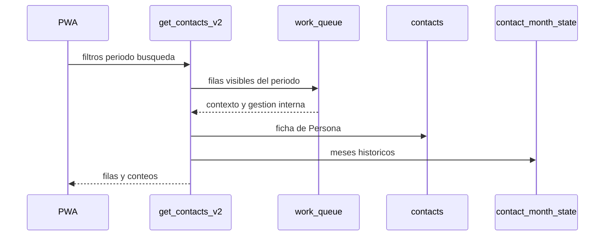

**Diagrama 9 de 22 · Lectura de contactos.**

### Hallazgos verificados

- `get_contacts_v2` usa `work_queue` como conjunto base.
- ignora `p_situation` en su definición actual;
- devuelve `gestionable_actual = true` para toda fila visible;
- un probe seguro sin coincidencias devolvió iguales totales base para “gestionables” y “no gestionables”.
- `get_contacts_filtered_v3` devolvió error `42703` por `cms.estado_gestion` inexistente.

Esto no significa que la interfaz siempre invoque ambas funciones. Significa que las RPC expuestas no ofrecen actualmente dos contratos coherentes.

## 9.2 Escritura de gestión AS-IS

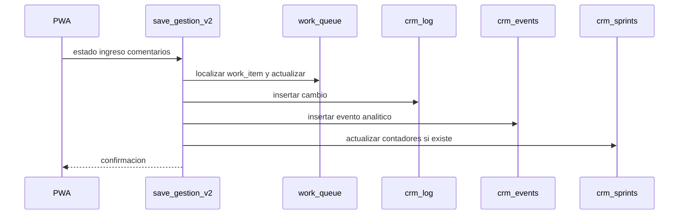

**Diagrama 10 de 22 · Escritura de gestión.**

**Bien:** todas las sentencias dentro de la función comparten transacción implícita.

**Mal:** la operación exige que exista un `work_item_id` o una fila de cola para Persona y período. El hecho de gestión depende de la proyección.

## 9.3 Escritura de recordatorio

`save_reminder_v2` localiza la fila en `work_queue` y actualiza título y fecha. No existe una entidad Recordatorio separada. Además, el frontend puede enviar un payload a un webhook externo de Google Tasks; la gobernanza de datos de ese canal debe auditarse.

## 9.4 Flujo de reconstrucción de `work_queue`

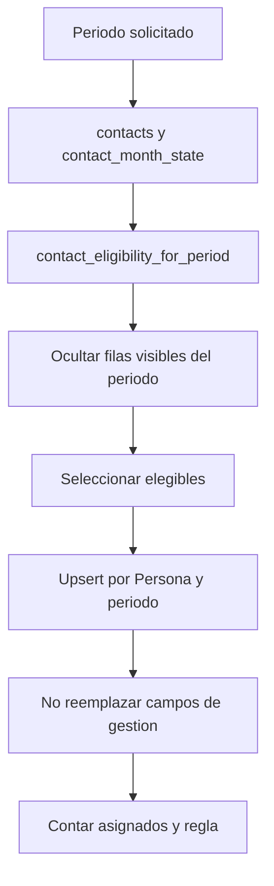

**Diagrama 11 de 22 · Rebuild de `work_queue`.**

La función canónica oculta y reactiva filas sin actualizar los campos internos. Es una mitigación razonable dentro del Legacy, pero no elimina el acoplamiento.

---

# 10. Importaciones TOTAL, ASIGNADO y FIX

## 10.1 Contrato de nombres

```text
OR_AAAAMM_TIPO_NN.xls
NM_AAAAMM_TIPO_NN.xlsx
```

- `OR`: Original recibido.
- `NM`: Normalizado para proceso.
- `AAAAMM`: fecha o período de campaña.
- `TIPO`: `TOTAL`, `ASIGNADO` o `FIX`.
- `NN`: revisión.

El nombre ayuda, pero no prueba contenido. El flujo ideal debe contrastar nombre, metadatos internos, período declarado, hash y revisión.

## 10.2 Semántica

### TOTAL

Representa el universo completo conocido del período. Su ausencia puede tener significado sólo dentro de ese período y contrato completos. Nunca debe borrar Personas ni historia.

### ASIGNADO

Representa apariciones asignadas al asesor. No reemplaza el TOTAL y no implica una gestión interna.

### FIX

Corrección parcial. La ausencia de una fila **nunca significa eliminación**.

**Pendiente de decisión:** si FIX puede crear una aparición inexistente o sólo modificar una aparición ya registrada.

## 10.3 Secuencia TOTAL

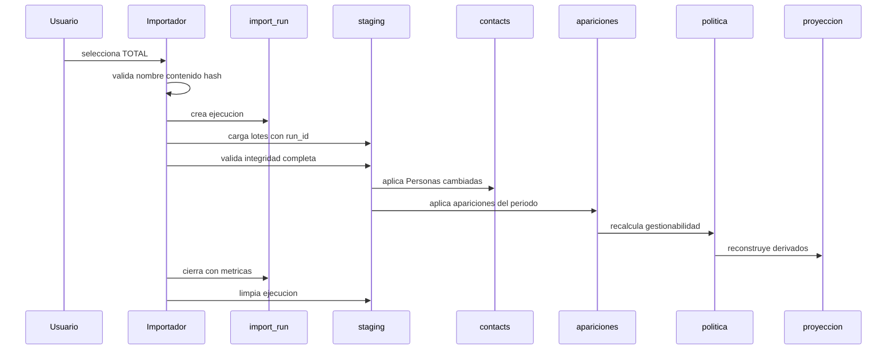

**Diagrama 12 de 22 · Carga TOTAL ideal.**

## 10.4 Secuencia ASIGNADO

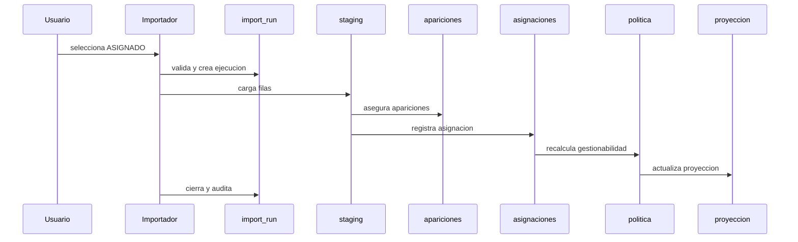

**Diagrama 13 de 22 · Carga ASIGNADO ideal.**

## 10.5 Secuencia FIX

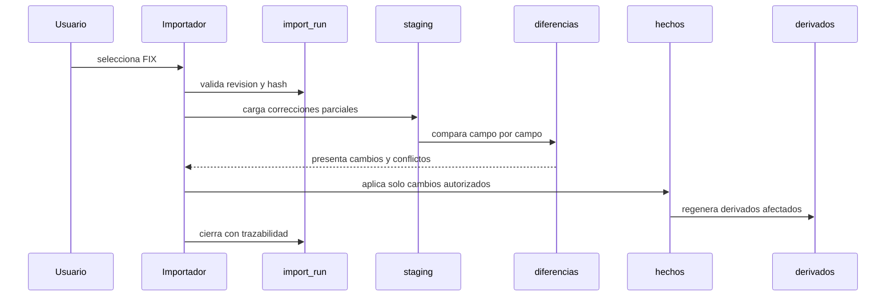

**Diagrama 14 de 22 · Carga FIX ideal.**

## 10.6 Estado de una importación

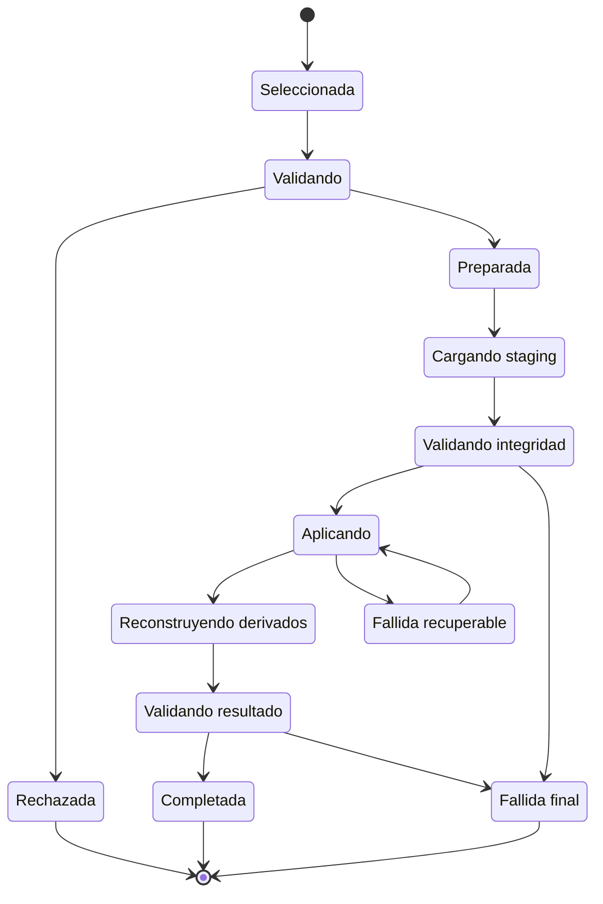

**Diagrama 15 de 22 · Máquina de estados.**

## 10.7 Ciclo de vida de staging

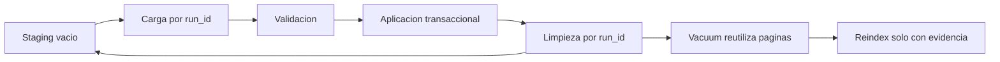

**Diagrama 16 de 22 · Ciclo de staging.**

## 10.8 Flujo ideal de importación

1. selección;
2. validación del nombre;
3. validación interna;
4. hash SHA-256;
5. creación de `import_run` con identidad propia;
6. staging ligado a `run_id`;
7. validación de integridad;
8. comparación de cambios;
9. aplicación transaccional;
10. reconstrucción de derivados;
11. postcheck;
12. cierre;
13. limpieza;
14. métricas y trazabilidad.

## 10.9 Cómo impedir fallos comunes

| Falla | Control recomendado |
|---|---|
| Carga duplicada | `UNIQUE source_hash, load_type, period, revision` según contrato. |
| Período incorrecto | comparar nombre, contenido y período seleccionado. |
| Tipo incorrecto | validar columnas y cardinalidad esperada por tipo. |
| Actualización innecesaria | `IS DISTINCT FROM` campo por campo. |
| Pérdida por parcial | TOTAL sólo aplica tras integridad completa; FIX nunca interpreta ausencia como borrado. |
| Falsa recuperación | checkpoint por `run_id` y hash, no por nombre solamente. |
| Mezcla de sesiones | toda fila staging posee `run_id`; ninguna consulta opera sin él. |
| Timeout opaco | cada lote confirma rango, hash, métricas y siguiente checkpoint. |

---

# 11. Normalización y diseño relacional

## 11.1 Primera forma normal

Cada celda contiene un valor atómico y no grupos repetidos. Los tres teléfonos como columnas fijas son prácticos, pero limitan cardinalidad e historial. Una tabla `person_contact_point` sería más normalizada si el dominio necesita múltiples teléfonos, vigencias, fuentes y validación.

## 11.2 Segunda forma normal

Todo atributo no clave depende de la clave completa. En una tabla con clave compuesta `(contact_id, campaign_id, period)`, el resultado de esa aparición depende de la combinación, no sólo de Persona.

## 11.3 Tercera forma normal

Un atributo no clave no debería depender de otro atributo no clave. Guardar nombre de campaña repetido en cada aparición sería dependencia transitiva; `campaign_id` permite resolverlo en `campaigns`.

## 11.4 Cuándo desnormalizar

Desnormalizar puede ser correcto para:

- búsqueda (`search_text`);
- analítica (`crm_events`);
- proyecciones de lectura;
- snapshots de recuperación.

Requisitos:

1. fuente clara;
2. regla de actualización;
3. forma de detectar divergencia;
4. beneficio medido;
5. costo de escritura aceptado.

`work_queue` falla principalmente en el primer requisito porque ciertos campos dentro de ella sí se volvieron fuente.

## 11.5 Entidad, hecho, estado y proyección

- **Entidad:** Persona.
- **Hecho:** apareció en campaña el período X.
- **Estado:** último resultado interno conocido, derivable de actividades o almacenado con historial.
- **Proyección:** lista de Personas gestionables hoy.

No todo dato calculado debe ser una vista SQL. Puede ser una función, consulta, caché o tabla materializada. Lo importante es que no suplante silenciosamente a los hechos.

---

# 12. Transacciones, idempotencia y concurrencia

## 12.1 ACID

- **Atomicidad:** todo o nada.
- **Consistencia:** restricciones y reglas válidas antes y después.
- **Aislamiento:** transacciones concurrentes no deben producir resultados imposibles.
- **Durabilidad:** tras commit, el cambio sobrevive a fallos normales.

Una función PostgreSQL ejecutada como una sentencia RPC comparte una transacción. Si falla una inserción en `crm_events`, también se revierte el update previo de `work_queue` de esa llamada.

## 12.2 Idempotencia

Una operación es idempotente si repetirla produce el mismo estado final. Un upsert por identidad estable puede ser idempotente; incrementar un contador sin clave de evento no lo es.

**Ejemplo:** cargar dos veces el mismo archivo con distinto nombre no está impedido por la unicidad actual. El hash debe formar parte del contrato.

## 12.3 Upsert

```sql
insert into public.contacts (rut_norm, nombre)
values ('11111111K', 'Persona Ficticia')
on conflict (rut_norm) do update
set nombre = excluded.nombre
where contacts.nombre is distinct from excluded.nombre;
```

El `WHERE` evita una nueva versión de fila cuando nada cambió.

## 12.4 Concurrencia y bloqueos

PostgreSQL bloquea filas actualizadas y puede bloquear tablas en operaciones como `TRUNCATE`, `VACUUM FULL` o algunos DDL. Dos imports concurrentes del mismo período requieren exclusión por clave lógica o advisory lock.

**Propuesta:** adquirir un bloqueo transaccional por `period + load_type`, no un bloqueo global de toda la base.

## 12.5 Procesamiento por lotes

Los lotes reducen duración de transacciones, memoria y timeout. Pero crean obligación de checkpoint y reconciliación. Cada lote debe ser identificable y reejecutable.

## 12.6 Recuperación ante timeout

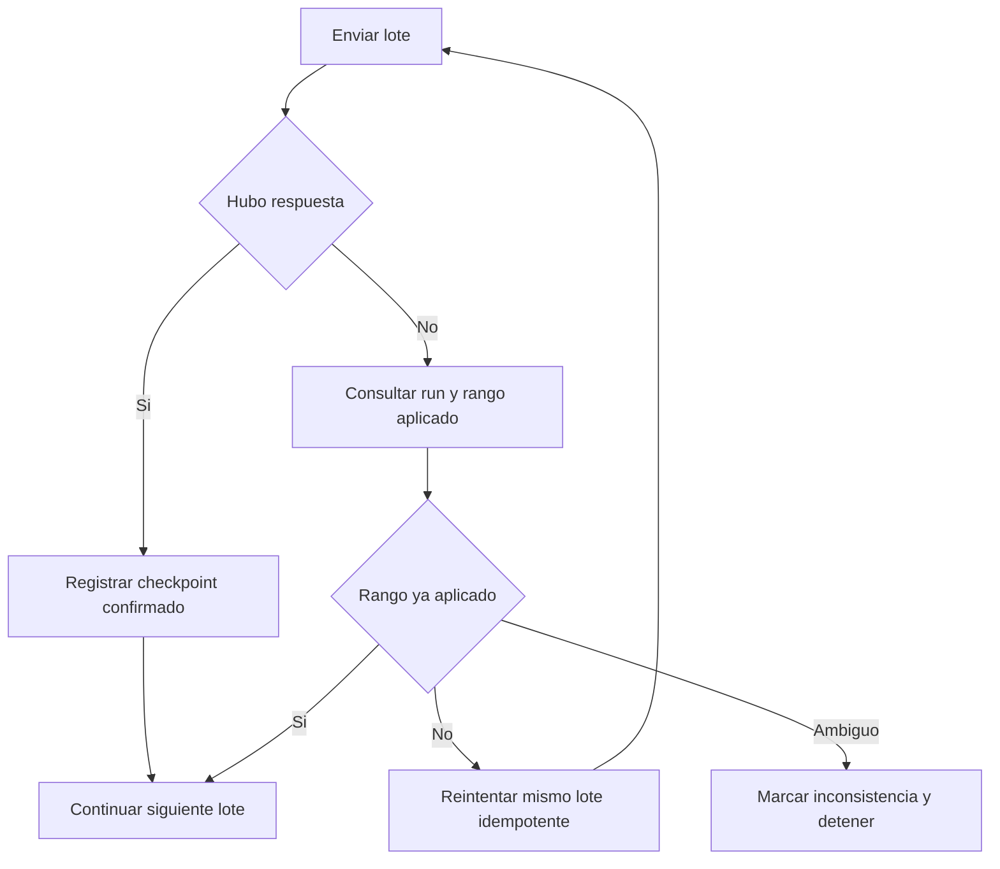

**Diagrama 17 de 22 · Recuperación frente a timeout.**

La regla crucial es no confundir “el cliente no recibió respuesta” con “la base no aplicó el lote”.

---

# 13. MVCC, VACUUM y bloat

## 13.1 MVCC

PostgreSQL no sobrescribe una fila visible para todas las transacciones. Una actualización crea una nueva versión; la anterior permanece hasta que ya no sea necesaria.

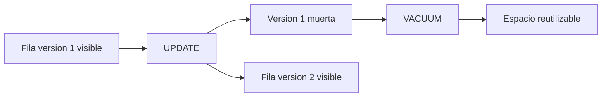

**Diagrama 18 de 22 · MVCC y versiones muertas.**

## 13.2 VACUUM y autovacuum

- `VACUUM` marca espacio reutilizable y actualiza mapas; normalmente no devuelve el archivo al sistema operativo.
- autovacuum lo hace automáticamente según umbrales.
- `VACUUM FULL` reescribe y bloquea intensamente; no es mantenimiento rutinario en PROD.

## 13.3 Bloat

Bloat es espacio físico que ya no representa datos útiles y no se reutiliza eficientemente. Puede afectar heap e índices.

Evidencia actual:

- staging tiene 0 filas y más de 21 MiB físicos;
- ha procesado más de 1,09 millones de inserts y deletes;
- `contact_month_state` mantiene una estimación relevante de filas muertas;
- autovacuum se ejecuta, pero no necesariamente reduce archivos.

## 13.4 REINDEX

- `REINDEX` reconstruye un índice y puede bloquear.
- `REINDEX CONCURRENTLY` reduce bloqueo operativo, pero consume tiempo, I/O y espacio temporal.

No debe ejecutarse por intuición. Antes se necesita:

1. medición de tamaño esperado;
2. ventana y espacio libre;
3. lista de consumidores;
4. rollback operativo;
5. ensayo en DEV o copia representativa.

## 13.5 Heap, TOAST, páginas y fillfactor

- **Heap:** archivo principal de filas.
- **TOAST:** almacenamiento auxiliar para valores grandes.
- **Página:** unidad interna usual de 8 KiB.
- **Fillfactor:** porcentaje objetivo de llenado al crear páginas; dejar espacio puede favorecer updates HOT.
- **HOT update:** actualización que evita tocar índices cuando ninguna columna indexada cambia y existe espacio útil.

---

# 14. Índices y almacenamiento

## 14.1 B-tree

Adecuado para igualdad, rangos y orden. PK, UNIQUE y FK suelen necesitar B-tree.

## 14.2 GIN y trigramas

El índice GIN de `contacts.search_text` ocupa aproximadamente 55.7 MiB. Facilita búsquedas parciales, pero se actualiza cuando cambia el texto agregado.

Sólo 48 escaneos desde el reset estadístico no prueban inutilidad. Puede ser una función crítica usada pocas veces, y el contador no representa el pasado completo.

## 14.3 Índices parciales

`idx_cms_assigned_period` indexa `(period, is_assigned)` sólo donde `visible`. Reduce tamaño si la consulta siempre excluye invisibles.

## 14.4 Índices compuestos y orden

Un índice `(period, visible, display_order)` puede resolver filtro y orden del listado. El orden importa porque el prefijo izquierdo determina qué consultas pueden aprovecharlo con mayor facilidad.

## 14.5 Selectividad

Una columna es selectiva si reduce mucho las filas. Un booleano aislado suele ser poco selectivo; combinado con período puede ser útil.

## 14.6 Solapamientos observados

### `work_queue`

- `(period, visible, display_order)`;
- `(period, visible)`.

El segundo es prefijo del primero, pero registra más de dos millones de scans y es mucho menor. No es candidato automático a eliminación.

### `staging_contacts`

Los índices de sesión y orden se solapan. El rediseño debe partir de `EXPLAIN ANALYZE` de las cuatro operaciones más costosas del importador.

## 14.7 Costo de los índices

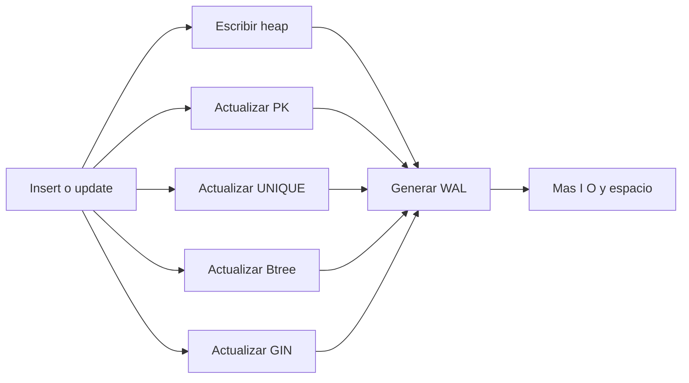

**Diagrama 19 de 22 · Costo de índices.**

## 14.8 EXPLAIN y EXPLAIN ANALYZE

```sql
-- Seguro en DEV o sobre SELECT acotado
explain
select *
from public.work_queue
where period = '2026-07' and visible
order by display_order
limit 50;
```

`EXPLAIN ANALYZE` ejecuta realmente la consulta. Debe usarse con cautela y nunca sobre sentencias destructivas en PROD.

Busque:

- `Seq Scan` razonable o inesperado;
- filas estimadas frente a reales;
- tiempo;
- buffers;
- sort en memoria o disco;
- índice utilizado.

## 14.9 Estrategia bajo límites de Supabase

1. monitorear tamaño semanal y después de imports;
2. registrar heap, índices y tablas de mayor crecimiento;
3. evitar updates sin cambios;
4. limpiar staging por ejecución;
5. medir bloat antes de reindexar;
6. archivar snapshots sólo cuando su contingencia esté cerrada;
7. revisar retención de logs y eventos;
8. reservar espacio temporal antes de `REINDEX CONCURRENTLY`;
9. no usar `VACUUM FULL` en PROD sin protocolo específico.

---

# 15. Funciones, triggers, vistas y RLS

## 15.1 SQL y PL/pgSQL

- función `LANGUAGE sql`: adecuada para una consulta declarativa, como una política derivada.
- `LANGUAGE plpgsql`: permite variables, condicionales, loops y manejo de excepciones.

La complejidad no debe mudarse a PL/pgSQL por conveniencia. Una función larga sigue necesitando contrato, pruebas y versionado.

## 15.2 SECURITY DEFINER

Ejecuta con privilegios del propietario. Es útil para exponer una operación controlada sin dar acceso directo a tablas, pero aumenta el impacto de cualquier error.

Controles recomendados:

- `search_path` fijo incluyendo `pg_temp` de forma segura;
- validación de `auth.uid()` y rol;
- privilegios `EXECUTE` mínimos;
- no concatenar SQL no confiable;
- tests de autorización.

### Riesgo verificado

Las RPC `get_contacts_v2`, `get_contacts_filtered_v3`, `save_gestion_v2` y `save_reminder_v2` son ejecutables por `anon` y `authenticated`. Al ser `SECURITY DEFINER`, la exposición anónima es un riesgo crítico aunque las tablas posean RLS.

`rebuild_work_queue_for_period` no es ejecutable por `anon`, pero sí por cualquier autenticado. Debe restringirse a un rol operacional específico si sigue existiendo.

## 15.3 Row Level Security

Las políticas principales son `ALL TO authenticated USING true WITH CHECK true`. Esto significa que RLS está encendido, pero no separa filas por usuario.

Para una app realmente monousuario puede funcionar como barrera “autenticado versus no autenticado”, pero no es segura para múltiples asesores ni aplica mínimo privilegio.

## 15.4 Triggers

Verificados:

- `contacts`: reconstruye `search_text` en insert/update;
- `contacts`: toca `updated_at`;
- `staging_contacts`: guardrail después de insert por sentencia;
- `work_queue`: toca `updated_at`.

Los triggers son invisibles para quien lee sólo la sentencia. Deben documentarse porque afectan costo y efectos laterales.

## 15.5 Vistas

`crm_contact_day_outcomes_v1` calcula el último cambio significativo por Persona y fecha. Es un buen ejemplo de vista derivada.

Una vista normal no almacena filas. Una vista materializada sí las almacena y debe refrescarse. Para Next, la cola podría ser:

- consulta directa;
- vista;
- vista materializada;
- tabla de proyección regenerable.

La elección depende de latencia, volumen y frecuencia, no de preferencia estética.

## 15.6 Dependencias entre tablas y derivados

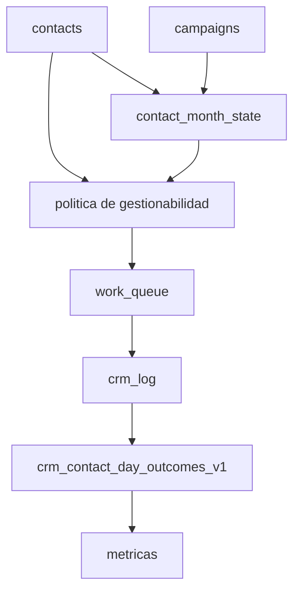

**Diagrama 20 de 22 · Dependencias.**

---

# 16. Recuperación, migraciones y ambientes

## 16.1 DEV, STAGING y PROD

```mermaid
flowchart LR
  Branch[Rama de trabajo]
  DevApp[APP LLAMADOS DEV]
  DevDB[Supabase DEV ficticio]
  Candidate[Version candidata]
  Staging[STAGING]
  ProdApp[PROD GitHub Pages]
  ProdDB[Supabase PROD real]
  Branch --> DevApp
  DevApp --> DevDB
  DevApp --> Candidate
  Candidate --> Staging
  Staging --> ProdApp
  ProdApp --> ProdDB
  DevApp -. nunca .-> ProdDB
  ProdApp -. nunca .-> DevDB
```

**Diagrama 21 de 22 · Despliegue y ambientes.**

**Verificado:** existe DEV aislado y PROD. **Pendiente de validar:** un STAGING operativo completo y estable.

## 16.2 Migraciones

Una migración es un cambio versionado y reproducible del esquema. Debe incluir:

- precondiciones;
- forward;
- validación;
- rollback cuando sea viable;
- compatibilidad con código anterior durante el despliegue;
- evidencia en DEV.

## 16.3 Compatibilidad hacia atrás

Cambiar primero la base y luego el frontend puede romper el cliente vigente. Patrones seguros:

1. agregar nuevo objeto sin retirar el anterior;
2. dual-write temporal controlado;
3. backfill;
4. dual-read y comparación;
5. cambiar consumidor;
6. retirar escritura anterior;
7. observar;
8. retirar compatibilidad.

## 16.4 Backups y restauración

Debe diferenciarse:

- backup administrado por Supabase;
- dump lógico;
- snapshot de tabla para hotfix;
- archivo fuente original;
- rollback de migración;
- procedimiento de restauración probado.

Tener backup no equivale a saber restaurar. Se necesita RPO, RTO y prueba periódica en ambiente no productivo.

## 16.5 Retención

Definir por clase:

- hechos corporativos: largo plazo;
- gestión y actividades: largo plazo según necesidad y regulación;
- eventos analíticos: política explícita;
- logs técnicos: ventana limitada;
- staging: horas o duración de ejecución;
- snapshots de hotfix: hasta cierre de contingencia más período acordado.

## 16.6 Observabilidad

Métricas mínimas:

- tamaño total, heap e índices;
- filas y filas muertas;
- duración por lote;
- filas leídas, cambiadas y rechazadas;
- locks y transacciones largas;
- autovacuum;
- uso de índices desde `stats_reset`;
- divergencia entre hechos y proyecciones;
- errores de RPC;
- ejecuciones anónimas de funciones críticas.

---

# 17. Arquitectura objetivo propuesta para Next

## 17.1 Principios

**Propuesta para Next:**

- DDD para nombrar conceptos reales;
- arquitectura hexagonal para aislar dominio e infraestructura;
- monolito modular para evitar microservicios prematuros;
- imports idempotentes y auditables;
- proyecciones regenerables;
- Strangler Fig para transición gradual.

## 17.2 TO-BE

```mermaid
flowchart TB
  subgraph UI[Adaptadores de entrada]
    Web[Web PWA]
    ImportCLI[Importador]
  end
  subgraph App[Aplicacion]
    UC1[Consultar Personas Gestionables]
    UC2[Registrar Gestion]
    UC3[Importar Archivo]
  end
  subgraph Domain[Dominio]
    PersonaD[Persona]
    CampanaD[Campana y Aparicion]
    AsignacionD[Asignacion]
    GestionD[Gestion Interna]
    EligibilityD[Politica de Gestionabilidad]
  end
  subgraph Ports[Puertos]
    RepoPersonas[Repositorio de Personas]
    RepoGestion[Repositorio de Gestion]
    ImportPort[Puerto de Importacion]
    ProjectionPort[Puerto de Proyecciones]
  end
  subgraph Infra[Adaptadores de salida]
    Postgres[PostgreSQL]
    FileReader[Lector XLSX]
    TasksAdapter[Google Tasks]
  end
  Web --> App
  ImportCLI --> App
  App --> Domain
  App --> Ports
  Ports --> Postgres
  ImportPort --> FileReader
  GestionD --> TasksAdapter
```

**Diagrama 22 de 22 · TO-BE propuesto.**

## 17.3 Modelo candidato

| Concepto | Representación propuesta | Problema que resuelve | Costo y riesgo |
|---|---|---|---|
| Persona | `person` | identidad estable | migrar referencias y autoridad de atributos. |
| Punto de contacto | `person_contact_point` | teléfonos y correos con fuente, vigencia y validez | mayor número de filas y UI más compleja. |
| Campaña | `campaign` | identidad y metadatos | definir si atraviesa períodos. |
| Aparición | `campaign_appearance` | hecho histórico | migración desde `contact_month_state`. |
| Asignación | `appearance_assignment` | historial temporal | decisión pendiente de cardinalidad. |
| Resultado Corporativo | atributo o `corporate_result_event` | conservar fuente y evolución | decidir si sólo importa el último o todo el historial. |
| Actividad de gestión | `management_activity` | hecho interno inmutable | diseñar tipos y estados. |
| Estado actual | vista o proyección | evita mutar historia | requiere cálculo o proyector. |
| Recordatorio | `reminder` | independencia de cola | sincronización externa y estados. |
| Importación | `import_run` + `import_source` | hash, sesión, revisión y auditoría | mayor disciplina operativa. |
| Gestionabilidad | política de dominio | una sola regla | pruebas y rendimiento. |
| Cola | vista o proyección | regenerable | elegir estrategia de refresco. |
| Compatibilidad Legacy | adaptador `legacy_work_queue` | continuidad | doble operación temporal. |

## 17.4 Reemplazar `work_queue` sin perder continuidad

Orden propuesto:

1. inventariar todos sus consumidores;
2. crear almacenamiento de Gestión Interna y Recordatorio;
3. backfill desde `work_queue` con hashes y reconciliación;
4. cambiar RPC de guardado para escribir en nuevos hechos y seguir reflejando Legacy;
5. crear consulta de cola desde política y nuevos estados;
6. dual-read y comparar por Persona;
7. mover UI Next;
8. dejar `work_queue` como adaptador o snapshot de respaldo;
9. congelar escrituras directas;
10. retirar sólo tras evidencia y rollback.

## 17.5 Eventos de dominio

No todo cambio necesita event sourcing. Los eventos tienen valor cuando:

- el hecho ocurrió y debe conservarse;
- varios módulos reaccionan;
- se requiere auditoría temporal;
- se acepta la complejidad de idempotencia y orden.

`management_activity` puede ser un hecho del dominio. `crm_events` actual es más bien una tabla analítica/técnica y no debe declararse automáticamente “event store”.

---

# 18. Transición Legacy a Next

## 18.1 Strangler Fig

La nueva aplicación reemplaza capacidades una por una, manteniendo Legacy operativo.

```text
Primero: Gestionabilidad y lectura
Después: Gestión interna y recordatorios
Luego: Importaciones
Finalmente: retirar adaptadores legacy
```

## 18.2 Diagrama de transición

```mermaid
flowchart LR
  Legacy[Legacy actual]
  Extract[Extraer hechos persistentes]
  Adapter[Adaptador work_queue]
  DualWrite[Dual write controlado]
  DualRead[Dual read y reconciliacion]
  Next[CRM Patrimonial Next]
  Freeze[Congelar work_queue]
  Retire[Retiro posterior]
  Legacy --> Extract --> Adapter --> DualWrite --> DualRead --> Next --> Freeze --> Retire
```

> Este diagrama adicional no se contabiliza entre los 22 mínimos; se incluye para lectura de transición.

## 18.3 Regla de corte

No retirar `work_queue` porque “parece innecesaria”. Retirarla cuando:

- ningún guardado dependa de `work_item_id`;
- recordatorios estén separados;
- métricas no dependan de sus filas;
- importaciones no la escriban;
- la lectura nueva tenga paridad;
- exista rollback ensayado;
- se conserve un snapshot por el período acordado.

---

# 19. Matriz AS-IS y TO-BE

| Responsabilidad | Implementación actual | Problema | Solución transitoria | Solución objetivo | Impacto Legacy | Impacto Next | Prioridad | Evidencia requerida |
|---|---|---|---|---|---|---|---|---|
| Identidad | `contacts` | mezcla fuentes y preferencias | documentar autoridad | Persona + puntos de contacto | bajo | medio | P1 | reglas por atributo |
| Aparición | `contact_month_state` | nombre mutable y conceptos mezclados | preservar como hecho | `campaign_appearance` | bajo | alto | P1 | modelo comercial |
| Asignación | booleano | no conserva historia | no reinterpretar | entidad temporal si aplica | bajo | medio | P2 | cardinalidad real |
| Resultado corporativo | texto libre | nulos e inválidos | normalización fail-closed | tipo controlado e historial según dominio | bajo | medio | P1 | contrato de fuentes |
| Gestionabilidad | helper + cola | divergencia de caminos | una RPC canónica sin rebuild obligatorio | política de dominio | medio | alto | P0 | pruebas y planes |
| Cola | `work_queue` | mezcla derivado y hechos | preservar y reducir consumidores | vista/proyección regenerable | alto | alto | P0 | inventario completo |
| Gestión interna | columnas en cola + logs | depende de proyección | extraer y dual-write | actividad + estado derivado | alto | alto | P0 | backfill y hash |
| Recordatorio | columnas en cola | desaparece con cola | extraer | entidad Reminder | medio | alto | P0 | reconciliación |
| Import run | nombre/tipo/período | sin hash ni run UUID | agregar auditoría paralela | ejecución inmutable | medio | alto | P1 | formato aprobado |
| Staging | tabla compartida | bloat y sesiones | limpiar por run | staging aislado | bajo | medio | P1 | benchmark |
| Lectura v2 | cola visible | ignora situación | corregir contrato en DEV | caso de uso Next | medio | alto | P0 | tests |
| Lectura v3 | RPC rota | columnas inexistentes | retirar permiso o reparar en DEV | endpoint modular | bajo | alto | P0 | consumidor real |
| Seguridad | RPC anónimas definer | bypass potencial de RLS | revocar anon tras prueba | autorización explícita | medio | alto | P0 | smoke autenticado |
| Índices | 277 MiB | costo y bloat | medir | índices por carga real | bajo | medio | P2 | EXPLAIN y bloat |
| Snapshots | tablas temporales | permanencia indefinida | registrar retención | archivos auditados o schema recovery | bajo | bajo | P2 | cierre incidente |

Clasificación:

- **Corrección urgente:** permisos, RPC rota, divergencia de lectura/sync.
- **Deuda técnica:** mezcla de responsabilidades, índices y funciones legacy.
- **Rendimiento:** staging, GIN y queries.
- **Rediseño arquitectónico:** separación de hechos y proyecciones.
- **Aprendizaje:** normalización, MVCC, índices y transacciones.
- **Decisión del dominio:** FIX, historial de Asignación, Resultado Corporativo y autoridad de datos.

---

# 20. Riesgos, decisiones y backlog

## 20.1 Hallazgos verificados

1. `work_queue` mezcla proyección y datos persistentes.
2. el guardado de gestión y recordatorios requiere una fila de cola.
3. `get_contacts_v2` ignora `p_situation`.
4. `get_contacts_filtered_v3` falla por columnas inexistentes.
5. la política canónica y la cola pueden divergir.
6. existen caminos de sync y rebuild distintos.
7. `contact_operational_state` no existe como relación persistente.
8. las RPC sensibles poseen permisos anónimos en varios casos.
9. RLS autenticado es global, no por usuario.
10. staging está vacío pero conserva más de 21 MiB.
11. los índices públicos superan al heap público.
12. import runs y checkpoints no usan hash ni `run_id` como identidad.
13. el upsert actual de Persona ya evita updates cuando el conjunto no cambió.
14. hay snapshots de hotfix pendientes de ciclo de vida.
15. PROD no fue modificado durante este levantamiento.

## 20.2 Hipótesis

1. el frontend productivo usa prioritariamente `get_contacts_v2` y no v3;
2. el sync por lotes puede reintroducir visibilidad distinta al rebuild completo;
3. parte del bloat de staging se concentra en índices y no en heap;
4. la gran cantidad histórica de updates de Persona proviene de versiones anteriores del importador;
5. `crm_events` puede duplicar información que hoy no se regenera formalmente;
6. algunos índices pequeños de analítica fueron creados para consultas futuras y no carga actual.

## 20.3 Decisiones requeridas

1. ¿FIX puede crear apariciones o sólo corregir existentes?
2. ¿Asignación necesita historial con inicio y término?
3. ¿Resultado Corporativo es un atributo final o una secuencia de resultados?
4. ¿Qué fuente gobierna nombre, teléfonos y correo cuando difieren corporativo y asesor?
5. ¿Gestión actual se deriva siempre de actividades o se mantiene además una proyección de estado?
6. ¿Recordatorio puede existir sin gestionabilidad actual?
7. ¿Cuál es la retención de `crm_log`, `crm_events` y guardrails?
8. ¿STAGING existe como ambiente real o sigue pendiente?
9. ¿Qué roles podrán importar y reconstruir derivados?
10. ¿Cuál es el RPO y RTO aceptable?

## 20.4 Backlog priorizado

### P0 · Seguridad y contrato actual

1. revocar `EXECUTE` anónimo de RPC sensibles en DEV y validar login;
2. caracterizar consumidor de v3 y retirarla o repararla;
3. hacer que toda lectura use una política canónica sin depender de visibilidad vieja;
4. impedir que sync por lote aplique una regla distinta;
5. agregar tests de autorización, situación y divergencia.

### P0 · Desacoplar `work_queue`

6. inventariar todos sus campos y consumidores;
7. diseñar almacenamiento de Gestión Interna y Recordatorio;
8. preparar backfill y reconciliación sin ejecutar PROD;
9. crear adaptador dual-write en DEV;
10. crear dual-read y reporte de paridad.

### P1 · Importaciones

11. definir contrato canónico TOTAL, ASIGNADO y FIX;
12. agregar `run_id`, hash, revisión y fuente;
13. asociar staging y checkpoint a ejecución;
14. validar comparación antes de aplicar;
15. asegurar finalización y limpieza.

### P1 · Dominio

16. crear Modelo Comercial y Modelo Operacional pendientes;
17. formalizar Aparición, Asignación, Resultado Corporativo, Gestión y Recordatorio;
18. registrar decisiones en ADR/LCD.

### P2 · Almacenamiento

19. medir bloat de staging e índices;
20. obtener `EXPLAIN ANALYZE` en DEV de imports y lectura;
21. evaluar reindexado concurrente sólo con espacio y ventana;
22. definir retención y cierre de snapshots.

### P2 · Calidad

23. agregar FKs o identificadores estables a logs/eventos cuando no impidan conservación histórica;
24. unificar zona horaria;
25. documentar funciones y comentarios SQL;
26. establecer observabilidad y alertas de divergencia.

---

# 21. Propuesta para el documento canónico futuro

`docs/architecture/database-architecture.md` debería contener sólo decisiones aprobadas y estables:

1. propósito y alcance;
2. principios derivados de Constitución y Arquitectura;
3. contextos de dominio y ownership de datos;
4. modelo canónico de Persona y contacto;
5. Campaña, Aparición, Asignación y Resultado Corporativo;
6. Gestión Interna, Actividad y Recordatorio;
7. política canónica de Gestionabilidad;
8. fuentes de verdad y proyecciones;
9. arquitectura de importaciones;
10. seguridad, roles y RLS;
11. estrategia de IDs, tiempos y auditoría;
12. migraciones y compatibilidad;
13. observabilidad, backup y retención;
14. transición Legacy/Next;
15. ADR relacionados.

No debería incluir:

- tutoriales extensos;
- métricas puntuales que cambian;
- hipótesis no aprobadas;
- nombres de hotfix temporales salvo historial;
- recomendaciones de índices sin carga validada.

---

# 22. Glosario

| Término | Definición |
|---|---|
| ACID | Propiedades de transacciones: atomicidad, consistencia, aislamiento y durabilidad. |
| Bloat | Espacio físico no aprovechado eficientemente tras cambios. |
| B-tree | Índice ordenado general para igualdad, rangos y orden. |
| Checkpoint de importación | Posición confirmada desde la cual una ejecución puede continuar. |
| Clave natural | Identificador proveniente del negocio. |
| Clave sustituta | Identificador técnico sin significado de negocio. |
| Derivado | Dato calculable desde fuentes. |
| Entidad | Concepto con identidad persistente. |
| FK | Restricción que referencia otra fila. |
| GIN | Índice invertido útil para conjuntos, texto y trigramas. |
| Heap | Almacenamiento principal de filas. |
| Idempotencia | Repetición que mantiene el mismo estado final. |
| MVCC | Control de concurrencia mediante múltiples versiones. |
| PK | Clave primaria. |
| Proyección | Vista de lectura calculada para un propósito. |
| RLS | Seguridad a nivel de fila. |
| RPC | Función invocada remotamente como API. |
| SECURITY DEFINER | Función ejecutada con permisos de su propietario. |
| Selectividad | Capacidad de una condición o índice para reducir filas. |
| Staging | Área temporal de entrada y validación. |
| TOAST | Almacenamiento auxiliar de valores grandes en PostgreSQL. |
| Tupla muerta | Versión antigua ya no visible para transacciones normales. |
| Upsert | Insertar o actualizar según conflicto. |
| WAL | Registro previo de escritura usado para durabilidad y recuperación. |

---

# 23. Apéndice de consultas seguras

> Ejecutar en PROD sólo como lectura. `EXPLAIN ANALYZE` debe limitarse a `SELECT` y preferirse DEV.

## 23.1 Tablas y tamaños

```sql
select
  n.nspname as schema_name,
  c.relname as relation_name,
  c.reltuples::bigint as estimated_rows,
  pg_relation_size(c.oid) as heap_bytes,
  pg_indexes_size(c.oid) as index_bytes,
  pg_total_relation_size(c.oid) as total_bytes
from pg_class c
join pg_namespace n on n.oid = c.relnamespace
where n.nspname = 'public'
  and c.relkind in ('r','m')
order by total_bytes desc;
```

## 23.2 Columnas

```sql
select table_name, ordinal_position, column_name, data_type,
       is_nullable, column_default
from information_schema.columns
where table_schema = 'public'
order by table_name, ordinal_position;
```

## 23.3 Restricciones

```sql
select conrelid::regclass as table_name,
       conname,
       contype,
       pg_get_constraintdef(oid) as definition
from pg_constraint
where connamespace = 'public'::regnamespace
order by table_name::text, conname;
```

## 23.4 Índices y uso

```sql
select
  s.relname as table_name,
  s.indexrelname as index_name,
  s.idx_scan,
  pg_relation_size(s.indexrelid) as size_bytes,
  pg_get_indexdef(s.indexrelid) as definition
from pg_stat_user_indexes s
order by size_bytes desc;
```

## 23.5 Estadísticas de tablas

```sql
select relname, n_live_tup, n_dead_tup,
       n_tup_ins, n_tup_upd, n_tup_del, n_tup_hot_upd,
       last_autovacuum, autovacuum_count,
       last_autoanalyze, autoanalyze_count
from pg_stat_user_tables
order by n_dead_tup desc;
```

## 23.6 RLS y políticas

```sql
select schemaname, tablename, policyname, roles, cmd, qual, with_check
from pg_policies
where schemaname = 'public'
order by tablename, policyname;
```

## 23.7 Funciones SECURITY DEFINER

```sql
select p.proname,
       pg_get_function_identity_arguments(p.oid) as arguments,
       p.prosecdef as security_definer,
       p.proconfig as settings
from pg_proc p
join pg_namespace n on n.oid = p.pronamespace
where n.nspname = 'public'
order by p.proname;
```

## 23.8 Triggers

```sql
select event_object_table as table_name,
       trigger_name,
       event_manipulation,
       action_timing,
       action_statement
from information_schema.triggers
where trigger_schema = 'public'
order by table_name, trigger_name;
```

## 23.9 Divergencia de cola y política

```sql
with canonical as (
  select contact_id
  from public.contact_eligibility_for_period('2026-07')
  where is_gestionable
), visible_queue as (
  select contact_id
  from public.work_queue
  where period = '2026-07' and visible
)
select
  count(*) filter (
    where c.contact_id is not null and q.contact_id is null
  ) as canonical_missing,
  count(*) filter (
    where q.contact_id is not null and c.contact_id is null
  ) as queue_not_canonical
from canonical c
full join visible_queue q using (contact_id);
```

## 23.10 Transacciones y locks

```sql
select pid, usename, state, wait_event_type, wait_event,
       now() - xact_start as transaction_age,
       left(query, 200) as query_sample
from pg_stat_activity
where datname = current_database()
  and pid <> pg_backend_pid()
order by xact_start nulls last;
```

## 23.11 Consultas utilizadas en este levantamiento

Se utilizaron variantes de sólo lectura de:

- `pg_class`, `pg_namespace` y funciones de tamaño;
- `information_schema.columns` y `information_schema.triggers`;
- `pg_constraint`;
- `pg_indexes`, `pg_stat_user_indexes` y `pg_stat_user_tables`;
- `pg_policies`;
- `pg_proc`, `pg_get_functiondef` y privilegios efectivos;
- `pg_views`;
- conteos agregados por período;
- probes RPC con búsqueda ficticia sin coincidencias.

No se ejecutó DDL, DML ni funciones de reconstrucción.

---

# 24. Fuentes, cobertura y límites

## 24.1 Fuentes documentales

- Constitución del Proyecto CRM Patrimonial.
- Arquitectura del CRM Patrimonial.
- Diccionario del Dominio del CRM Patrimonial.
- Índice del Modelo del Dominio.
- Bitácora Arquitectónica y ADR-020.
- Registro Maestro de LCD.
- `docs/DATABASE.md`.
- `docs/architecture/current-repository-inventory.md`.
- `docs/architecture/contact-eligibility-policy.md`.
- `docs/architecture/diagrams/`.
- `docs/operations/monthly-status-backfill.md`.
- `docs/operations/validation-run-2026-07-15-eligibility.md`.

## 24.2 Fuentes de implementación

- `index.html` de PROD;
- migraciones `20260715054526`, `20260715060415` y `20260715063727`;
- rollback de gestionabilidad;
- pruebas de caracterización y SQL asociadas;
- catálogo vivo de Supabase PROD;
- definiciones actuales de funciones, triggers, vistas, índices y políticas.

## 24.3 Límites

- La inspección del repositorio combinó inventario versionado, Pull Requests y archivos dirigidos. No se obtuvo mediante el conector un listado recursivo byte por byte de todo el árbol; los directorios ya marcados como pendientes en el inventario siguen pendientes.
- No se inspeccionaron backups administrados ni se ejecutó restauración.
- No se ejecutaron cargas reales ni `EXPLAIN ANALYZE` de procesos pesados.
- No se validó todavía el ambiente STAGING.
- Las cifras de tamaño y uso son una fotografía; cambian con la operación.
- Los contadores de uso de índice sólo son comparables desde `stats_reset`, observado el 2026-06-30.

---

# 25. Validación de Mermaid

El archivo contiene **23 bloques Mermaid**: los 22 diagramas mínimos y un diagrama adicional de transición. La validación se realiza de dos maneras:

1. parseo con la biblioteca oficial `mermaid` sobre cada bloque;
2. comprobación estructural adicional de bloques cerrados, tipos admitidos e identificadores.

El resultado de validación se registra junto al archivo en:

- `database-architecture-and-learning-guide.mermaid-validation.txt`.

Un resultado válido debe informar:

```text
Mermaid blocks: 23
Parsed successfully: 23
Failed: 0
```

---

# Conclusión

APP LLAMADOS no está fallando porque use una base relacional ni porque PostgreSQL sea demasiado complejo. La fragilidad nace de una frontera conceptual incorrecta: `work_queue` pasó de ser una lista temporal a convertirse en lugar de persistencia y llave obligatoria para la operación.

La reparación correcta no es “reconstruir mejor la cola” indefinidamente. Es recuperar la jerarquía del modelo:

1. almacenar Personas y hechos corporativos;
2. almacenar actividades, gestión y recordatorios como conocimiento propio;
3. calcular Gestionabilidad con una sola política;
4. proyectar una bandeja regenerable;
5. mantener Legacy mediante adaptadores durante la transición;
6. retirar dependencias sólo después de demostrar paridad y recuperación.

Ésa es también la lección general de bases de datos: una tabla no es correcta porque permita guardar algo. Es correcta cuando representa con claridad un concepto real, preserva sus invariantes y evita que un dato derivado gobierne los hechos de los que depende.
