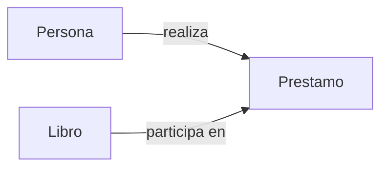
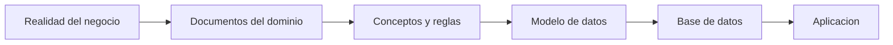
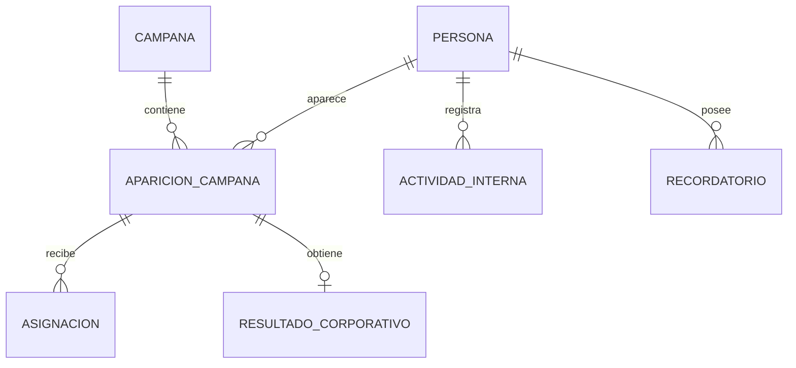
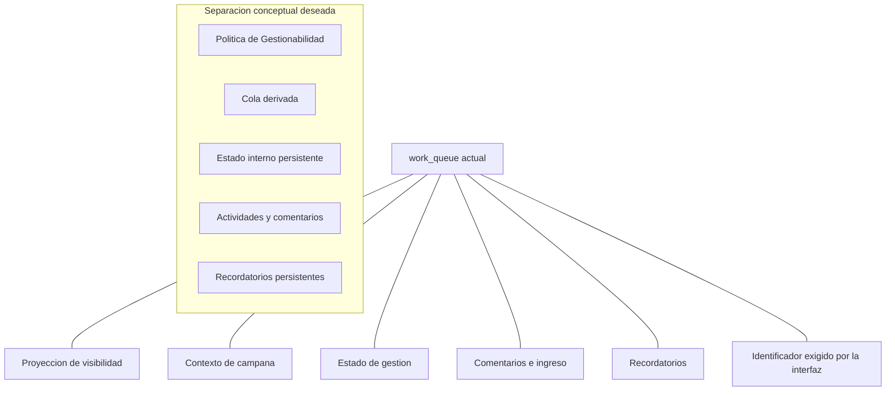

# Introducción a las bases de datos y al diseño del CRM Patrimonial

<strong>LCD-20260716-01 · Estado: Pendiente de revisión</strong>

> <strong>Todo el contenido de este documento pertenece al LCD-20260716-01 y está pendiente de revisión.</strong>

- **Fecha:** 2026-07-16
- **Nivel:** introductorio; no requiere conocimientos previos
- **Propósito:** entregar un modelo mental básico antes de estudiar la base actual de APP LLAMADOS
- **Naturaleza:** material educativo; no constituye arquitectura canónica ni autoriza cambios técnicos
- **Complemento avanzado:** `database-architecture-and-learning-guide.md`

---

## 1. Para qué sirve este documento

Antes de revisar tablas, funciones, índices o errores de APP LLAMADOS, necesitamos responder preguntas más elementales:

- ¿Qué es una base de datos?
- ¿Por qué se divide la información en varias tablas?
- ¿Cómo se decide qué debe almacenarse?
- ¿Qué diferencia existe entre un hecho y un cálculo?
- ¿Por qué el modelo del negocio debe definirse antes que la estructura técnica?
- ¿Cómo se pasa desde los documentos del dominio hasta una implementación en PostgreSQL?

La idea principal es sencilla:

> **Una base de datos no es una colección de planillas. Es una representación organizada de hechos y relaciones del mundo real.**

Si la representación es buena, la aplicación puede evolucionar sin perder coherencia. Si la representación mezcla conceptos distintos, cada cambio funcional obliga a reparar varias piezas al mismo tiempo.

---

# Parte I · Las bases

## 2. Qué problema resuelve una base de datos

Imaginemos una biblioteca pequeña. Al comienzo podríamos usar una sola planilla:

| Libro | Autor | Persona que lo pidió | Fecha del préstamo |
|---|---|---|---|
| El principito | Antoine de Saint-Exupéry | Ana | 10 de julio |
| El principito | Antoine de Saint-Exupéry | Pedro | 15 de julio |

Esto funciona mientras existen pocos datos. Sin embargo, aparecen dificultades:

- el nombre del libro y del autor se repite;
- si corregimos el nombre del autor, debemos corregirlo en muchas filas;
- no sabemos con claridad si cada fila representa un libro, una persona o un préstamo;
- resulta difícil registrar que Ana pidió varios libros;
- resulta difícil distinguir el libro físico del acto de prestarlo.

Una base relacional separa esas realidades:

Así entendemos que:

- **Libro** es una cosa con identidad propia;
- **Persona** es otra cosa con identidad propia;
- **Préstamo** es un hecho que relaciona a una Persona con un Libro durante un período.

Este cambio parece pequeño, pero es el fundamento del diseño de bases de datos.

## 3. Tabla, fila y columna

Una **tabla** reúne elementos del mismo tipo.

Una **fila** representa un elemento concreto.

Una **columna** representa una característica de ese tipo de elemento.

Ejemplo de tabla `personas`:

| persona_id | nombre | correo |
|---|---|---|
| 101 | Ana Pérez | ana@ejemplo.cl |
| 102 | Pedro Soto | pedro@ejemplo.cl |

- La tabla es `personas`.
- Cada persona ocupa una fila.
- `nombre` y `correo` son columnas.
- `persona_id` permite identificar cada fila sin ambigüedad.

## 4. La identidad: claves primarias

Una base necesita saber cuándo dos registros representan la misma cosa.

La **clave primaria** es el identificador interno único de una fila. En el ejemplo, `persona_id`.

Puede existir además un identificador del mundo real, como un RUT. A ese tipo de dato se le suele llamar **clave natural**.

En términos simples:

- la clave primaria dice: “esta es exactamente esta fila”;
- la clave natural dice: “esta fila representa a esta persona del mundo real”.

En un CRM chileno, el RUT puede ayudar a reconocer a una Persona, pero normalmente conviene mantener también un identificador interno estable. El formato del RUT puede normalizarse, corregirse o incluso faltar temporalmente; la identidad interna no debería depender de esos cambios.

## 5. Relaciones y claves foráneas

Las tablas no viven aisladas. Una **clave foránea** permite que una fila se refiera a otra.

Ejemplo:

| prestamo_id | persona_id | libro_id | fecha |
|---|---|---|---|
| 9001 | 101 | 501 | 2026-07-10 |

`persona_id = 101` apunta a Ana. `libro_id = 501` apunta a un libro concreto.

La base puede impedir que se registre un préstamo para una Persona inexistente. Esa protección se llama **integridad referencial**.

## 6. Entidades, hechos y atributos

Para diseñar correctamente conviene distinguir tres cosas:

### Entidad

Algo que posee identidad y continúa existiendo a través del tiempo.

Ejemplos:

- Persona;
- Campaña;
- Oportunidad;
- Producto Contratado.

### Hecho

Algo que ocurrió y que vincula entidades o modifica su historia.

Ejemplos:

- una Persona apareció en una Campaña;
- una Aparición fue asignada a un ejecutivo;
- se realizó una llamada;
- se creó una cotización;
- llegó un aporte de capital.

### Atributo

Una característica de una entidad o de un hecho.

Ejemplos:

- nombre de una Persona;
- fecha de una llamada;
- resultado de una Aparición;
- monto de una cotización.

Una fuente frecuente de errores es convertir un hecho en una simple columna cuando en realidad necesita identidad, fecha o historial propio.

## 7. Hechos almacenados y resultados calculados

No todo lo que vemos en una pantalla debe almacenarse.

La base debería conservar los hechos necesarios para reconstruir una respuesta. Luego la aplicación puede calcular conclusiones.

Ejemplo de biblioteca:

- **Hecho almacenado:** el préstamo comenzó el 10 de julio y terminó el 20 de julio.
- **Cálculo derivado:** el préstamo duró 10 días.
- **Vista derivada:** lista de libros actualmente prestados.

No es necesario almacenar permanentemente “actualmente prestado” si puede deducirse con seguridad desde las fechas. Podría almacenarse por rendimiento, pero seguiría siendo una copia derivada que necesita mantenerse sincronizada.

Esta distinción será muy importante cuando más adelante hablemos de Gestionabilidad y de `work_queue`.

## 8. Qué significa normalizar

**Normalizar** significa organizar los datos para evitar repeticiones innecesarias y dependencias confusas.

No implica dividir todo de manera extrema. Significa que cada dato tenga un lugar coherente.

En la biblioteca:

- el nombre del autor pertenece al Autor;
- el título pertenece al Libro;
- la fecha de devolución pertenece al Préstamo;
- “libros disponibles hoy” es una consulta calculada.

Una regla práctica inicial es:

> **Cada tabla debería poder explicarse con una frase clara: “una fila de esta tabla representa…”**

Cuando la frase necesita varios “y además”, probablemente la tabla mezcla responsabilidades.

---

# Parte II · Antes de diseñar tablas: comprender el dominio

## 9. La tecnología no decide qué existe en el negocio

PostgreSQL permite crear cualquier tabla. Eso no significa que cualquier tabla sea correcta.

Primero debemos comprender el negocio. Después elegimos cómo representarlo técnicamente.

El orden saludable es:

Si comenzamos por la pantalla o por una tabla existente, corremos el riesgo de confundir una solución técnica histórica con un concepto real del negocio.

## 10. Fuentes del conocimiento del proyecto

En CRM Patrimonial existe una jerarquía documental. Cada nivel responde una pregunta distinta.

### Constitución

Responde:

- ¿para qué existe el proyecto?
- ¿qué principios nunca deben perderse?
- ¿qué prioridad tiene la continuidad operativa?

### Arquitectura

Responde:

- ¿cómo se organiza el sistema?
- ¿qué capas deben permanecer separadas?
- ¿qué principios estructurales guían las decisiones?

### Modelo del Dominio

Responde:

- ¿qué cosas existen en el negocio?
- ¿qué significa Persona, Campaña, Asignación u Oportunidad?
- ¿qué relaciones y reglas son verdaderas?

El Modelo del Dominio se distribuye entre documentos especializados, como el Diccionario del Dominio, el Modelo Comercial, el Modelo Patrimonial y el Modelo de Productos.

### Backlog y Roadmap

Responde:

- ¿qué queremos construir o corregir?
- ¿en qué orden?
- ¿qué está pendiente?

### Bitácora Arquitectónica

Responde:

- ¿qué decisiones tomamos?
- ¿por qué?
- ¿qué consecuencias aceptamos?

La base de datos debe representar estas decisiones. No debe sustituirlas.

## 11. Cómo se descubre un modelo de datos

Un método inicial puede ser:

1. leer las fuentes del dominio;
2. subrayar sustantivos importantes;
3. identificar cuáles poseen identidad;
4. identificar hechos que ocurren entre ellos;
5. identificar reglas;
6. separar resultados calculados;
7. recién entonces pensar en tablas.

Ejemplo:

> “Una Persona puede aparecer en una Campaña. Esa Aparición puede quedar asignada temporalmente a un ejecutivo y puede recibir un Resultado Corporativo.”

Podemos descubrir:

- Persona: entidad;
- Campaña: entidad;
- Aparición en Campaña: hecho con identidad histórica;
- Asignación: vínculo temporal;
- Resultado Corporativo: resultado asociado a la Aparición.

Todavía no hemos decidido nombres de tablas, columnas ni tipos SQL. Primero hemos comprendido la realidad.

---

# Parte III · Un modelo conceptual ideal para comenzar

## 12. El núcleo comercial mínimo

Sin diseñar todavía toda la base de CRM Patrimonial, el núcleo puede entenderse así:

### Persona

Es la identidad central. Existe aunque nunca aparezca en una campaña y aunque deje de ser gestionable.

### Campaña

Es una iniciativa o selección corporativa situada en un período.

### Aparición en Campaña

Registra el hecho histórico de que una Persona fue incluida en una Campaña.

### Asignación

Registra quién quedó autorizado o encargado de gestionar esa Aparición y durante qué vigencia.

### Resultado Corporativo

Registra el resultado resumido entregado por la compañía para esa Aparición.

### Actividad Interna

Registra lo que hizo el asesor: llamada, conversación, reunión, nota u otra gestión.

### Recordatorio

Registra una acción futura que el asesor desea realizar. Debe continuar existiendo aunque la Persona deje de aparecer en una cola temporal.

## 13. Gestionabilidad como política

La Gestionabilidad responde una pregunta:

> “Con los hechos conocidos y para una fecha o período determinado, ¿esta Persona puede ser gestionada por este asesor?”

No es necesariamente una tabla. Puede ser una política calculada desde:

- apariciones vigentes;
- asignaciones;
- resultados corporativos anteriores;
- excepciones autorizadas;
- reglas para contactos manuales.

El resultado puede exponerse en una vista o consulta:

| persona | gestionable | motivo |
|---|---:|---|
| Ana | Sí | Asignación vigente |
| Pedro | No | Aparece vigente sin asignación |
| Marta | Sí | Último resultado válido: No Gestionado |

La columna `gestionable` es una conclusión. Los hechos que la justifican son la fuente de verdad.

## 14. La cola de trabajo como vista temporal

La cola responde otra pregunta:

> “¿Qué Personas debo mostrar ahora, en qué orden y con qué contexto?”

Puede incluir:

- Personas gestionables;
- prioridad;
- campaña relevante;
- siguiente acción;
- alertas;
- filtros.

Pero la cola no debería ser el único lugar donde vivan comentarios, recordatorios o actividades. Esos datos pertenecen a la relación persistente con la Persona.

Una cola puede recalcularse, vaciarse o cambiar de período. Los hechos internos no deberían desaparecer con ella.

---

# Parte IV · Recién ahora: mirar APP LLAMADOS Legacy

## 15. Qué representa correctamente el modelo actual

El Legacy ya contiene separaciones valiosas:

- una Persona posee una identidad estable;
- las campañas tienen identidad;
- las apariciones mensuales se conservan históricamente;
- existen registros de eventos y cambios de gestión;
- la política de Gestionabilidad puede calcularse desde hechos corporativos.

Por lo tanto, no estamos partiendo desde cero. Existe conocimiento útil y datos que deben preservarse.

## 16. El problema principal de `work_queue`

En el diseño actual, `work_queue` no cumple una sola función. En una misma fila reúne:

- la decisión de mostrar a una Persona;
- el período y la campaña usados como contexto;
- el origen de su Gestionabilidad;
- el estado interno de gestión;
- comentarios;
- ingreso estimado;
- recordatorios;
- el identificador que la interfaz necesita para guardar.

Podemos representarlo así:

La frase “una fila de `work_queue` representa…” ya no tiene una respuesta simple. Representa una fila visible del período **y además** estado de trabajo, comentarios, recordatorios y compatibilidad con la interfaz.

Ésa es la señal de acoplamiento.

## 17. Por qué obliga a parchar la cola

Cuando cambia un hecho histórico —por ejemplo, el Resultado Corporativo de junio— también puede cambiar la Gestionabilidad calculada para julio.

Si la aplicación obtiene su lista desde una cola materializada, esa cola puede quedar desactualizada. Entonces debe reconstruirse.

Pero reconstruirla es riesgoso porque también contiene información que no es derivada:

- gestión interna;
- comentarios;
- ingreso;
- recordatorios.

Por eso cada reparación necesita demostrar que esos datos se conservaron. El problema no es solamente una función defectuosa: es que una proyección temporal y hechos persistentes viven juntos.

## 18. Qué significa “dejar `work_queue` de lado”

No significa borrarla mañana.

Significa cambiar gradualmente su responsabilidad:

1. identificar qué datos persistentes viven allí;
2. darles un lugar propio;
3. hacer que las nuevas escrituras usen ese lugar;
4. calcular Gestionabilidad desde una política única;
5. generar la cola desde hechos y estado persistente;
6. mantener `work_queue` como compatibilidad temporal;
7. retirarla sólo cuando ningún flujo real dependa de ella.

La meta no es reemplazar una tabla por otra con distinto nombre. La meta es separar conceptos.

---

# Parte V · Cómo continuar aprendiendo y diseñando

## 19. El orden recomendado de estudio

### Etapa 1 · Fundamentos

Comprender:

- tabla, fila y columna;
- identidad;
- relaciones;
- entidad, hecho y atributo;
- fuente de verdad y cálculo derivado.

### Etapa 2 · Dominio

Revisar:

- Constitución;
- Arquitectura;
- Índice del Modelo del Dominio;
- Diccionario del Dominio;
- Modelo Comercial cuando exista;
- ADR relacionados.

### Etapa 3 · Modelo ideal

Construir diagramas conceptuales sin SQL:

- qué entidades existen;
- qué hechos deben conservarse;
- qué historial importa;
- qué reglas producen conclusiones.

### Etapa 4 · Modelo actual

Comparar el ideal con Legacy:

- qué conceptos están bien representados;
- cuáles están mezclados;
- cuáles sólo existen de manera implícita;
- qué datos corren riesgo durante una transición.

### Etapa 5 · Diseño técnico

Recién entonces decidir:

- tablas;
- columnas;
- claves;
- restricciones;
- vistas;
- funciones;
- índices;
- migraciones.

## 20. Preguntas útiles para cualquier futura tabla

Antes de crear o modificar una tabla, conviene responder:

1. ¿Qué representa exactamente una fila?
2. ¿Es una entidad, un hecho, un estado actual o una proyección?
3. ¿Cuál es su identidad?
4. ¿Qué documento del dominio justifica su existencia?
5. ¿Qué información perderíamos si la borráramos?
6. ¿Puede reconstruirse desde otros hechos?
7. ¿Necesita historial?
8. ¿Está mezclando información corporativa con conocimiento interno?
9. ¿Pertenece al negocio o sólo a una pantalla?
10. ¿Qué ocurrirá cuando cambie el período activo?

## 21. Glosario mínimo

| Término | Explicación sencilla |
|---|---|
| Base de datos | Sistema organizado para conservar y consultar información. |
| Base relacional | Base que organiza datos en tablas conectadas mediante relaciones. |
| Tabla | Conjunto de filas del mismo tipo. |
| Fila | Un elemento concreto registrado en una tabla. |
| Columna | Una característica de las filas. |
| Clave primaria | Identificador interno único de una fila. |
| Clave foránea | Referencia desde una fila hacia otra tabla. |
| Entidad | Algo con identidad persistente. |
| Hecho | Algo que ocurrió y merece conservarse. |
| Atributo | Característica de una entidad o hecho. |
| Restricción | Regla que la base hace cumplir. |
| Normalización | Organización que reduce duplicaciones y mezclas confusas. |
| Consulta | Pregunta realizada a la base. |
| Vista | Consulta guardada que presenta datos como si fueran una tabla. |
| Proyección | Resultado preparado para una necesidad de lectura o pantalla. |
| Fuente de verdad | Lugar autoritativo desde el que se reconstruye una respuesta. |
| Migración | Cambio versionado de la estructura o comportamiento de la base. |

---

## 22. Idea final

Aprender bases de datos no comienza memorizando comandos SQL.

Comienza aprendiendo a observar la realidad y a formular preguntas:

- ¿qué cosas existen?
- ¿qué hechos ocurren?
- ¿qué debe conservarse?
- ¿qué puede calcularse?
- ¿qué relaciones deben mantenerse coherentes?

En CRM Patrimonial, el Modelo del Dominio responde primero esas preguntas. La base de datos viene después y debe representar sus respuestas con la menor ambigüedad posible.

Cuando lleguemos al Legacy, no preguntaremos únicamente “¿qué tablas tiene?”. Preguntaremos:

> **¿Qué conocimiento del negocio intenta representar cada tabla, y dónde la implementación dejó de coincidir con ese conocimiento?**

Ésa será la base correcta para comprender el sistema actual y evolucionarlo sin perder datos ni continuidad operativa.
