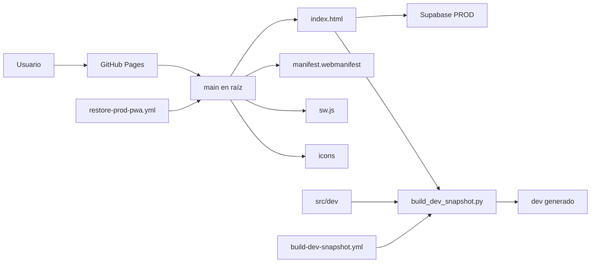

# Superficie crítica de APP LLAMADOS Legacy

- Fecha: 2026-07-14
- Estado: Pendiente de revisión
- LCD: LCD-20260714-02
- Issue: #16

## Propósito

Identificar los archivos, artefactos, servicios y automatizaciones cuya alteración puede afectar la continuidad operativa de APP LLAMADOS.

En este documento, **superficie crítica** significa el conjunto mínimo de elementos que participan en la ejecución, publicación, autenticación, persistencia o recuperación del producto operativo.

## Regla de lectura

- **Fuente:** archivo editado deliberadamente para producir comportamiento.
- **Artefacto:** resultado generado o publicado a partir de una fuente.
- **Infraestructura:** servicio o configuración externa necesaria para operar.
- **Control:** validación o mecanismo que detecta cambios inseguros.
- **No mover:** elemento cuya ubicación actual forma parte del despliegue vigente.

## Mapa resumido



## 1. Publicación productiva

| Elemento | Tipo | Función | Criticidad | Estado de movilidad |
|---|---|---|---:|---|
| `index.html` | Fuente y artefacto publicado | PWA productiva; UI, coordinación y lógica legacy | Crítica | No mover |
| `manifest.webmanifest` | Fuente publicada | Identidad, scope y arranque de la PWA PROD | Crítica | No mover |
| `sw.js` | Fuente publicada | Instalación, caché y actualización de la PWA | Crítica | No mover |
| `icons/icon-192.png` | Recurso publicado | Instalación PWA | Alta | No mover |
| `icons/icon-512.png` | Recurso publicado | Instalación PWA | Alta | No mover |
| `icons/icon.svg` | Fuente gráfica | Origen utilizado por el build DEV | Alta | No mover todavía |
| `.nojekyll` | Configuración de publicación | Evita procesamiento Jekyll en GitHub Pages | Media | No mover |
| `assets/` | Recursos publicados | Recursos estáticos utilizados por la aplicación | Alta | Auditar antes de mover |

### Contrato productivo actual

GitHub Pages publica desde:

```text
rama: main
carpeta: /root
```

Por tanto, la ubicación física de los archivos raíz forma parte del contrato de despliegue vigente.

## 2. Funciones auxiliares legacy

| Elemento | Función observada o esperada | Criticidad | Estado |
|---|---|---:|---|
| `stats.html` | Vista auxiliar de estadísticas | Media | Requiere caracterización detallada |
| `reset.html` | Herramienta auxiliar de recuperación o reinicio | Alta | Requiere caracterización antes de modificar |
| `rescate.html` | Herramienta auxiliar de rescate | Alta | Requiere caracterización antes de modificar |
| `sprint.js` | Lógica auxiliar de sprint | Media | Requiere inventario de consumidores |

Estos archivos no deben eliminarse por parecer redundantes. Primero debe demostrarse si son usados por operación, recuperación o soporte.

## 3. APP LLAMADOS DEV

| Elemento | Tipo | Función | Criticidad |
|---|---|---|---:|
| `src/dev/` | Fuente | Módulos de configuración, errores, storage, Supabase, auth y PWA | Alta |
| `tools/build_dev_snapshot.py` | Generador | Construye el artefacto `dev/` desde PROD y módulos DEV | Alta |
| `tools/patch_dev_assigned_status.py` | Parche de build | Ajusta comportamiento visual del artefacto DEV | Media |
| `tools/enhance_dev_pwa_identity.py` | Parche de build | Diferencia identidad e instalación DEV | Alta |
| `tools/validate_dev_snapshot.py` | Control | Verifica aislamiento y estructura DEV | Alta |
| `tools/validate_dev_assigned_status.py` | Control | Verifica el parche de asignados | Media |
| `tools/validate_dev_pwa_identity.py` | Control | Verifica identidad PWA DEV | Alta |
| `dev/` | Artefacto versionado | Aplicación DEV construida y publicable | Alta |

### Contrato de generación actual

```text
index.html PROD
+
src/dev/
+
herramientas Python
↓
dev/ generado
```

`dev/` no es fuente primaria y no debe editarse manualmente salvo un procedimiento extraordinario documentado.

## 4. Backend e infraestructura

| Elemento | Tipo | Función | Restricción |
|---|---|---|---|
| Supabase PROD | Infraestructura | Auth, PostgreSQL, RLS y RPC con datos reales | No experimentar |
| Supabase DEV | Infraestructura | Laboratorio con datos ficticios | Nunca apuntar a PROD |
| `supabase/` | Fuente versionada | Migraciones, funciones y controles de base | No incluir datos reales ni secretos |
| Claves publicables | Configuración cliente | Permiten inicializar el cliente web bajo RLS | No confundir con secretos privados |
| `service_role`, JWT Secret, claves privadas | Secretos prohibidos | Acceso privilegiado | Nunca versionar ni utilizar desde la app |

## 5. Automatización crítica

### `build-dev-snapshot.yml`

- se activa por cambios acotados en `main` y ramas DEV conocidas;
- construye y valida `dev/`;
- posee permiso `contents: write`;
- puede crear commits automáticos en la rama ejecutada;
- en `main`, puede confirmar el artefacto `dev/` directamente.

### `restore-prod-pwa.yml`

- se activa en `main` y en una rama histórica de restauración;
- valida endpoints y aislamiento;
- aplica un parche determinista de PROD;
- posee permiso `contents: write`;
- en `main`, puede crear un commit productivo directamente.

### Riesgo compartido

Estos workflows no son sólo validadores. También son **workflows mutantes**, es decir, automatizaciones capaces de modificar el repositorio.

No deben cambiarse durante este sublote. Su rediseño exige un ADR y una etapa separada.

## 6. Archivos que no pueden moverse todavía

```text
index.html
manifest.webmanifest
sw.js
icons/
assets/
.nojekyll
```

Tampoco debe moverse todavía la relación entre:

```text
index.html + src/dev + tools → dev/
```

## 7. Controles existentes que deben preservarse

- PROD contiene el endpoint productivo y no el de DEV.
- DEV contiene el endpoint DEV y rechaza el endpoint PROD.
- DEV usa namespace de almacenamiento propio.
- DEV no habilita integraciones externas por defecto.
- PROD y DEV tienen identidades PWA distintas.
- El build DEV sólo puede alterar `dev/`.
- El parche PROD restringe expresamente el conjunto de archivos modificables.
- Los validadores rechazan `service_role`, JWT Secret y claves privadas.

## 8. Hallazgos de esta auditoría

### SC-01 · La raíz es parte del contrato de despliegue

No puede reorganizarse sin una publicación alternativa probada.

### SC-02 · `dev/` es un artefacto versionado

Debe tratarse como salida reproducible, aunque hoy se conserve en Git para GitHub Pages.

### SC-03 · Los workflows pueden escribir en `main`

La validación, el build y la publicación no están completamente separados.

### SC-04 · No existía `.gitignore`

Se agrega una barrera conservadora para secretos y artefactos locales sin ignorar `dev/`, `diagnostics/` ni `releases/`, porque actualmente son elementos versionados que requieren clasificación posterior.

### SC-05 · La gestionabilidad tiene implementaciones divergentes

La fuente canónica usa última aparición corporativa, ausencia en el período activo y excepción por asignación propia. Las RPC de DEV no expresan hoy una única política coherente. Este hallazgo se documenta como bug separado y no se corrige dentro del Issue #16.

## 9. Criterio de salida de esta superficie

Antes de mover cualquier elemento crítico debe existir:

1. prueba de caracterización relevante;
2. build reproducible;
3. smoke test antes y después;
4. rollback documentado;
5. evidencia de que GitHub Pages continúa publicando;
6. confirmación de aislamiento DEV/PROD.
